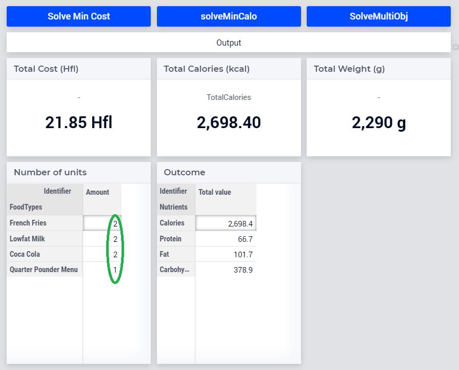
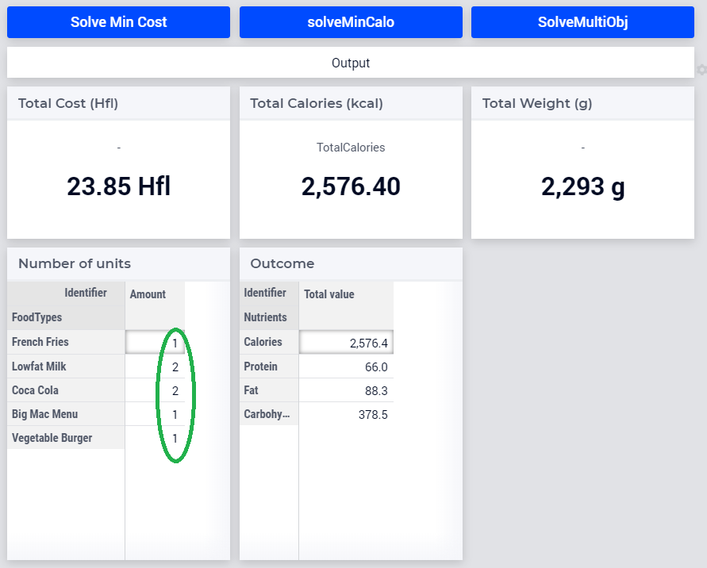

Use a Multi-Objective Approach
========================================

.. meta::
   :description: Compare multi-objective approach to separately solving single objectives.
   :keywords: multi objective, diet, CPLEX, WebUI

In this article we will compare a multi-objective approach to separately solving single objectives.

Let's take for an example a problem trying to find a healthy diet for a reasonable price. First let's define our objectives:

* Minimize calories: I'm trying to lose some weight, so my healthy diet should be low in calories.

* Minimize price: A reasonable price means that it doesn't have to be the absolute minimum, but should be within a close range.

Of course, I want to include minimum/maximum requirements for nutrients such as proteins.

Multi-Objective Approach
-------------------------

Let's use the multi-objective feature available since AIMMS 4.65 and CPLEX 12.9. 

.. code-block:: aimms
    :linenos:

    Procedure SolveMultiObj {
        Body: {
            ep_GMP := gmp::Instance::Generate( DietProblem );
            
            p_retcode := GMP::Column::SetAsMultiObjective(
                GMP      :  ep_GMP, 
                column   :  TotalCost, 
                priority :  2, 
                weight   :  1, 
                abstol   :  0, 
                reltol   :  0.1);
            if not p_retcode then raise error "Unable to set TotalCost as an objective" ; endif ;
            
            p_retcode := GMP::Column::SetAsMultiObjective(
                GMP      :  ep_GMP, 
                column   :  TotalCalories, 
                priority :  1, 
                weight   :  1, 
                abstol   :  0, 
                reltol   :  0.0);
            if not p_retcode then raise error "Unable to set TotalCalories as an objective" ; endif ;
            
            GMP::Instance::Solve( ep_GMP );
        }
    }
    
There are several remarks on the above:

#. Because the ``TotalCost`` objective has a higher priority value, it will be solved first.

#. Because the ``reltol`` argument on line 11 has value 0.1, subsequent solves will not increase the total cost by more than 10%.

Single Objective Approach
-------------------------

To be able to compare the multi-objective procedure to traditional single objective solves, there are also two solution procedures in this application:

#. ``MainExecution``, a traditional single objective solve minimizing total cost.

#. ``SolveMinCalo``, a traditional single objective solve minimizing total calories.

Comparing Results
------------------

The application has both WinUI and WebUI interfaces, but WebUI is featured in the following screenshots.

    Results after minimizing total cost
    

    Results after minimizing total calories
    

    Results after running multi objective
    
The objectives are summarized in the table below:

+--------------------------+-------------+----------------+
|                          | Cost        | Calories       |
+--------------------------+-------------+----------------+
| Minimize total cost      |  21.85      |  2698.40       |
+--------------------------+-------------+----------------+
| Minimize total calories  |  29.80      |  2546.40       |
+--------------------------+-------------+----------------+
| Multi objective          |  23.85      |  2576.40       |
+--------------------------+-------------+----------------+

As you can see, the multi-objective values are not as good as either of the individual objective values, but the multi-objective approach provides a good balance.

You may also find the CPLEX log interesting, as found in the file ``log/cplex 12.9.sta``. 
(See also :doc:`../13/13-Solver-Logging-IDE`.)

.. code-block:: none
    :linenos:

    Solve problem 'DietProblem' with 9 rows, 15 columns (0 binaries, 9 generals), and 83 nonzeros.
    
    MIP - Integer optimal solution:  Objective = 2.1849999998e+01
    Solution time = 0.09 sec.  Iterations = 20  Nodes = 0
    
    
    Solve problem 'MinCaloDietProblem' with 9 rows, 15 columns (0 binaries, 9 generals), and 83 nonzeros.
    
    MIP - Integer optimal solution:  Objective = 2.5464000000e+03
    Solution time = 0.02 sec.  Iterations = 13  Nodes = 0
    
    
    Solve problem 'DietProblem' with 8 rows, 14 columns (0 binaries, 9 generals), and 73 nonzeros.
    
    Multi-objective solve log . . .
    
    Starting optimization #1 with priority 2.
    
    
    
    Finished optimization #1 with priority 2.
    Objective =  2.1849999998e+01,  Nodes = 0,  Time = 0.05 sec. (0.45 ticks)
    Cumulative statistics:  Nodes = 0,  Time 0.05 sec. (0.45 ticks)
    
    
    Starting optimization #2 with priority 1.
    
    
    
    Finished optimization #2 with priority 1.
    Objective =  2.5764000000e+03,  Nodes = 0,  Time = 0.02 sec. (0.43 ticks)
    Cumulative statistics:  Nodes = 0,  Time 0.06 sec. (0.89 ticks)
    
    
    
    MIP - Multi-objective optimal
    Solution time = 0.08 sec.  Iterations = 43  Nodes = 0

A breakdown of above log:

#. lines 1 - 4 for the first solve (minimize total cost)

#. lines 7 - 10 for the second solve (minimize total calories)

#. lines 13 - 37 for the multi objective solve.

Project download
------------------

The project can be downloaded below.

    :download:`DietProblem.zip <model/DietProblem.zip>` 

.. include:: /includes/form.def