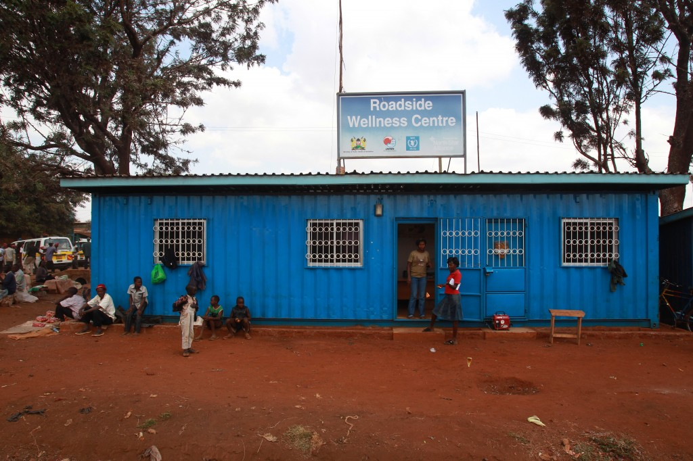
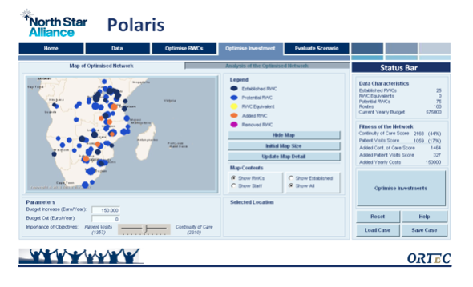

Using operations research to solve pressing global issues: the mathematical story behind North Star Alliance’s POLARIS
==========================================================================================================================

.. meta::
   :description: Distributing HIV medication
   :keywords: HIV, medication, distribution, supply chain, 

.. note::

    This article was originally posted to the AIMMS Tech Blog.

.. <link>https://berthier.design/aimmsbackuptech/2013/11/26/using-operations-research-to-solve-pressing-global-issues-the-mathematical-story-behind-north-star-alliances-polaris/</link>
.. <pubDate>Tue, 26 Nov 2013 14:07:30 +0000</pubDate>
.. <guid isPermaLink="false">http://blog.aimms.com/?p=3302</guid>
        
..  <![CDATA[

.. figure:: http://3.bp.blogspot.com/-7C_D0mKMy-4/UvIlsBYB62I/AAAAAAAAE_0/VB2IlLsVLxo/s0/Supply+Chain+Power+50+Badge.png
    :align: center

    Among the best supply chain blogs of `2014 <http://www.supplychainopz.com/2014/02/best-supply-chain-blogs-2014.html>`_

More than 35 million people worldwide are infected with HIV or are living with AIDS, and approximately 70% live in Sub-Saharan Africa. Mobile populations, such as long distance truck drivers, are particularly at risk of contracting and transmitting the virus. In 2007, TNT Express and the United Nations World Food Programme joined forces to form North Star Alliance (North Star) - a public-private partnership that is working to increase access to health services along major transport corridors in sub-Saharan Africa. ORTEC, a longstanding AIMMS partner, joined North Star in 2008 to design their award-winning Corridor Medical Transfer System (COMETS), which enables North Star staff to access and monitor patient health data across boarders and throughout its network of clinics. ORTEC has also contributed to North Star by developing POLARIS, an innovative application built on the AIMMS optimization platform that helps the organization improve their planning and decision-making on the ground. In this blog post, we will explore the POLARIS Supply Chain Model developed by Harwin de Vries while at ORTEC.

    A North Star Alliance Roadside Wellness Centre, located in Emali, Kenya. (Photography by Dave Chidley)

North Star converts shipping containers into roadside clinics, called Roadside Wellness Centers, and places them at trucking stops and boarders across Africa. This “containerized approach” ensures that new clinics can be rapidly produced and deployed to ensure communities in need can access essential health services. In 2011, a new program called POLARIS was developed to help North Star determine the optimal location for current and future clinics as well as the number of employees required at each site. North Star currently operates 30 Roadside Wellness Centres in 13 countries across Africa that reached over 215,000 people in 2012 alone.

    ORTEC and North Star's Polaris

To ensure POLARIS is able to pinpoint the optimal location for a given clinic, the program pulls data from a number of sources including traffic flows, boarder wait times, and COMETS data, to balance two key objectives: First, each clinic must be placed at a point where the number of truck drivers able to access it is maximized. Second, these clinics must form part of a larger continuum of care, so drivers moving along the corridor can reasonably access additional clinics along their route.  This is essential as it enables drivers to access ongoing treatment and medication refills along their route.

After a thorough literature review, Harwin de Vries notes in his MSc thesis‎ that the mathematical model used by POLARIS was not studied in the literature before. The mathematical model that comes closest to the POLARIS’ mathematical model is the so-called “Refueling Problem”.  In the Refueling Problem the objective is to place refueling stations along routes, such that vehicles can be refueled in time. The objective of the Refueling Problem is to minimize the number of refueling stations to be placed. However, North Star is faced with a fixed limited number of Roadside Wellness Centres, and this number falls far below the number necessary to provide all truck drivers with continued medical care. Therefore, the mathematical model used in POLARIS is different from the Refueling Problem. The POLARIS model places a fixed number of Roadside Wellness Centres to maximize a combination of (1) the number of truck drivers that can obtain occasional medical care and (2) the number of truck drivers that obtain continued medical care.

Because of the uniqueness of the mathematical model, the POLARIS system requires the application of specific constraints. To quickly and robustly develop and test such an advanced and unique mathematical model, a modeling language is essential. This allows the algebraic formulation of the mathematical model to be directly transcribed into the constraints in the modeling language.

For more details on the mathematical model, please refer to the "Medium Econometrische Toepassingen" of the faculty Econometrics of Erasmus University Rotterdam.

Harwin de Vries is the main author of the POLARIS model, and he is now a Ph.D student in “Humanitarian Aid Logistics” at the Erasmus University Rotterdam. During his stay at ORTEC he closely cooperated with Frans van Helden and Timon van Dijk. ORTEC continues to support the POLARIS application for North Star Alliance.

The author thanks Gloria Quintanilla from `Chirppoint <https://www.chirppoint.com/>`_, Harwin de Vries, and Jean Paul Bervoets (`North Star <http://www.northstar-alliance.org/>`_) for providing significant feedback on earlier versions of this blog post.

.. include:: /includes/form.def