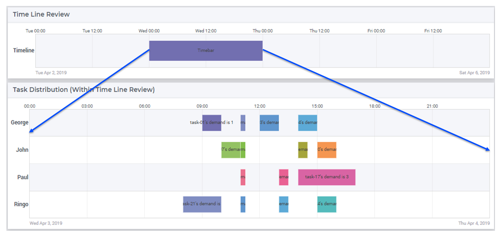

Zoom and Scroll in a Gantt Chart
====================================================

.. meta::
   :description: An AIMMS tip to create scroll and zoom functionality in a Gantt chart.
   :keywords: Gantt chart, scroll, zoom, timebar

This article presents an elegant trick to use one Gantt Chart to control the scrolling and zooming of another Gantt Chart. The result is shown in the image below.

Creating a single bar
----------------------

The Gantt chart used to create the scrolling and zooming functionality is only one bar, 
but we still have sets to cover the resources (one) and jobs (one), parameters for start and duration, 
element parameters to denote this one bar, and two string parameters to specify the viewport. 

In our example this is achieved with the code below: 

.. code-block:: aimms 
    :linenos:

    Set s_TimebarResourceSet {
        Index: i_tb_res;
        Parameter: ep_tb_selectedResource;
        Definition: data {Timeline};
    }
    Set s_TimebarJobSet {
        Index: i_tb_job;
        Parameter: ep_tb_selectedJob;
        Definition: data {Timebar};
    }
    StringParameter sp_TimebarDuration_text {
        IndexDomain: (i_tb_res,i_tb_job);
    }
    Parameter p_TimebarTimeStart {
        IndexDomain: (i_tb_res,i_tb_job);
        Unit: hour;
    }
    Parameter p_TimebarDuration {
        IndexDomain: (i_tb_res,i_tb_job);
        Unit: hour;
        webui::ItemTextIdentifier: sp_TimebarDuration_text;
    }
    StringParameter sp_TimebarViewportStart;
    StringParameter sp_TimebarViewportEnd;

These identifiers are initialized in the following procedure:

.. code-block:: aimms
    :linenos:

    Procedure pr_InitializeTimebarGanttChart {
        Body: {
            ! The view port of the Timebar Gantt Chart should allow for the maximum 
            ! view port of the actual Gantt Chart.
            sp_today := CurrentToString("%c%y-%m-%d");
            sp_yesterday := MomentToString(
                Format        :  "%c%y-%m-%d", 
                unit          :  [day], 
                ReferenceDate :  sp_today, 
                Elapsed       :  -1[day]);
            sp_twoDaysAfterTomorrow := MomentToString(
                Format        :  "%c%y-%m-%d", 
                unit          :  [day], 
                ReferenceDate :  sp_today, 
                Elapsed       :  3[day]);

            sp_TimebarViewportStart := sp_yesterday            + " 00:00";
            sp_TimebarViewportEnd   := sp_twoDaysAfterTomorrow + " 00:00";
            
            ! There is only one resource/job so the element parameters are always set to this one.
            ep_tb_selectedResource := first( s_TimebarResourceSet );
            ep_tb_selectedJob      := first( s_TimebarJobSet );
            
            ! The start/duration of the only job in the timebar Gantt Chart 
            ! should be initialized the same as the controlled Gantt Chart Viewport was initialized.
            ! In this example we assume for the sake of simplicity that the second day is ok.
            p_TimebarTimeStart( ep_tb_selectedResource, ep_tb_selectedJob) := 1[day];
            p_TimebarDuration(  ep_tb_selectedResource, ep_tb_selectedJob) := 1[day];
            sp_TimebarDuration_text(  ep_tb_selectedResource, ep_tb_selectedJob) := "Timebar";
        }
        StringParameter sp_today;
        StringParameter sp_yesterday;
        StringParameter sp_twoDaysAfterTomorrow;
    }

Defining the viewport
----------------------
The beginning of the timebar defines the beginning of viewport of the lower Gantt Chart (``sp_SelectedViewPortStart``), 
and similarly, the end the timebar defines the end of the viewport of the lower Gantt Chart (``sp_SelectedViewPortEnd``). 
These two string parameters are defined as follows:

.. code-block:: aimms
    :linenos:

    Parameter bp_useUTCforSelectedViewport {
        Range: binary;
    }
    ElementParameter ep_timezoneForSelectedViewport {
        Range: AllTimeZones;
        Definition: {
            if bp_useUTCforSelectedViewport then
                'UTC'
            else
                webui::WebApplicationTimeZone
            endif
        }
    }
    StringParameter sp_SelectedViewPortStart {
        Definition: {
            MomentTostring("%c%y-%m-%d %H:%M%TZ(ep_timezoneForSelectedViewport)", 
                [hour], sp_TimebarViewportStart, 
                p_TimebarTimeStart(ep_tb_selectedResource,ep_tb_selectedJob));
        }
    }
    StringParameter sp_SelectedViewPortEnd {
        Definition: {
            MomentTostring("%c%y-%m-%d %H:%M%TZ(ep_timezoneForSelectedViewport)", 
                [hour], sp_TimebarViewportStart, 
                p_TimebarTimeStart(ep_tb_selectedResource,ep_tb_selectedJob)+
                p_TimebarDuration(ep_tb_selectedResource,ep_tb_selectedJob));
        }
    }

Here ``bp_useUTCforSelectedViewport`` is initialized using the following code:

.. code-block:: aimms
    :linenos:

    block 
        bp_ogv := OptionGetValue("Use UTC forcaseandstartenddate", 
            p_optLow, p_optCur, p_optDef, p_optUpp );
        if p_optCur then
            bp_useUTCforSelectedViewport := 1 ;
        else
            bp_useUTCforSelectedViewport := 0 ;
        endif ;
    endblock ;

Example project
------------------
The example can be downloaded below.

    :download:`GanttChartTimebar.zip <model/GanttChartTimebar.zip>` 

.. spelling:word-list::

    timebar
