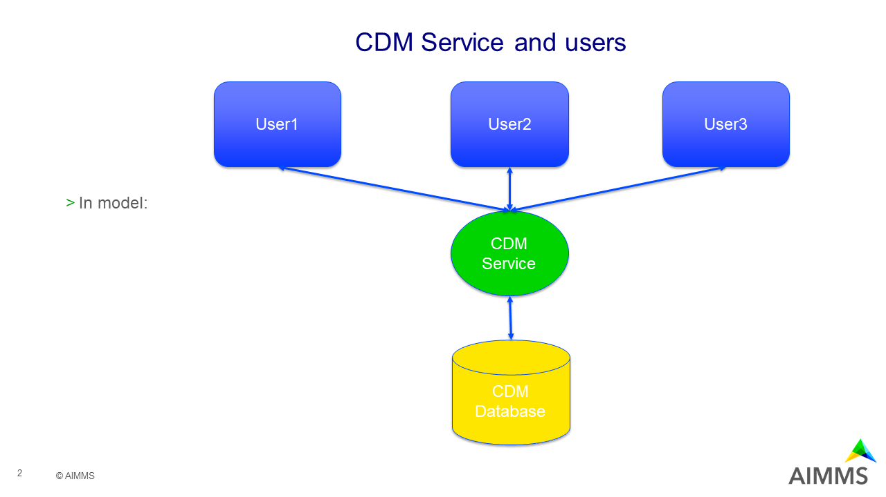
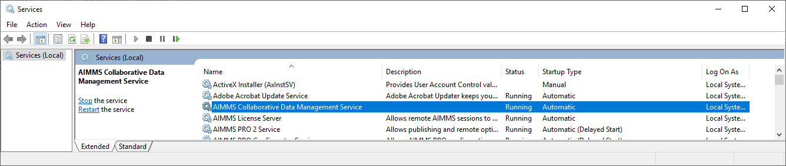
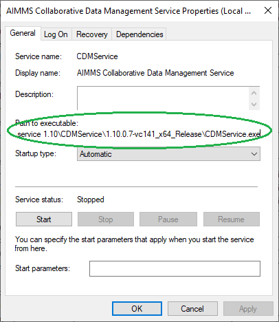

How to install CDM Service
===========================

.. meta::
   :description: Installing a CDM service to allow collaboration between multiple users of a single AIMMS model.  
   :keywords: CDM, service, port, 19999, data sharing, collaboration, versioning, application testing and deployment

During the development of an application using CDM, the embedded CDM server is ideal, as mistakes and restarts are easily captured by manually switching and/or clearing the database that stores the CDM data.

.. sidebar:: **Advantage of using CDM in an AIMMS Cloud** 
    
    When publishing applications in an AIMMS cloud, you do not have to install a CDM service.  The appropriate CDM service is started on demand, and stops itself after some idle time.

When testing or deploying an application with multiple collaborating users a CDM service needs to be installed that handles commits by storing the data and informing other users of these commits.
The architecture that we want to achieve looks as follows:

We will first focus on the central part of the above, namely to get a CDM service installed, next we will link it to a database and finally, we will illustrate an application directly connected to a CDM service.

Installation of CDM Service
-----------------------------------

Uninstalling an older version of the CDM service
^^^^^^^^^^^^^^^^^^^^^^^^^^^^^^^^^^^^^^^^^^^^^^^^^^^^^^^^

First make sure there is no other (older) CDM service installed on the target machine. 
If it is, you will need to uninstall that first before you can install the new version.
You can check whether the CDM service is installed by starting the Windows Service Manager/Windows 10 services app.

When the service is installed, you will need to identify the installation folder by right clicking on the service and selecting properties.  This will show the following dialog and tell you from which folder it is installed:

#. Open a command prompt with elevated rights (run as administrator), 

#. cd to that folder, and 

#. execute ``CDMService.exe --uninstall``.

Download the new CDM service executable
^^^^^^^^^^^^^^^^^^^^^^^^^^^^^^^^^^^^^^^^^^^^^^^^^^^^^^

.. sidebar:: CDM Protocol

    Every major/minor version number of CDM defines a new CDM protocol. These are the first two numbers in the library overview:

    .. image:: images/LibraryVersionCDM.png

    When loading a CDM Library via the repository, you can select a protocol as illustrated in the picture below:
    
    .. image:: images/VariousCMDLibraries.png
    
    You want to make sure this protocol corresponds to protocol of the CDM service that you are going to connect to.

    Nb. For every CDM protocol there is a CDM service available in the cloud. So then you can simply use the latest.

    
Let's start with downloading the executable on the machine that should run the CDM service. Depending on the protocol of choice this download can be:

+----------------------------------------------------------------------------------------+
| https://library-repository.aimms.com/bin/CDMService-1.5.0.0-vc120_x64_Release.exe      |
+----------------------------------------------------------------------------------------+
| https://library-repository.aimms.com/bin/CDMService-1.6.0.0-vc120_x64_Release.exe      |
+----------------------------------------------------------------------------------------+
| https://library-repository.aimms.com/bin/CDMService-1.7.0.0-vc120_x64_Release.exe      |
+----------------------------------------------------------------------------------------+
| https://library-repository.aimms.com/bin/CDMService-1.8.0.22-vc141_x64_Release.exe     |
+----------------------------------------------------------------------------------------+
| https://library-repository.aimms.com/bin/CDMService-1.9.0.12-vc141_x64_Release.exe     |
+----------------------------------------------------------------------------------------+
| https://library-repository.aimms.com/bin/CDMService-1.10.0.7-vc141_x64_Release.exe     |
+----------------------------------------------------------------------------------------+

Perhaps the protocol is updated after the last update of this article. To make sure, you want to check the value of the string parameter ``cdm::WindowsServiceDownloadLocation`` which contains the URL for the download that corresponds to the protocol of your library. 

Installing a new CDM service
^^^^^^^^^^^^^^^^^^^^^^^^^^^^^^^^^^^^^^

Now that we've uninstalled an old CDM service, if any, and downloaded the new executable, we can install it.

#. First run the executable, it will just unpack itself and create new folder.

#. Move the created folder to an appropriate place.

#. Open a command prompt with elevated rights (run as administrator).

#. cd to the created folder

#. Execute the command ``CDMService.exe --install``

#. Open the Windows Service Manager/Windows 10 services app

#. Open the properties of the CDM service

#. Make sure the start up type is ``automatic``, and the service is started.

Ensure the CDM service is accessible
^^^^^^^^^^^^^^^^^^^^^^^^^^^^^^^^^^^^^^^^^^^^

Make sure that the port chosen, typically 19999, is open on the machine that hosts the CDM service. 
You can check whether this port is open using the command ``netstat`` on a CMD prompt.

.. todo:: how to safely open port 19999

Linking the CDM service to a database
---------------------------------------------

The configuration file ``CDMConfig.xml`` contains the database type and optionally the database location, and optionally the authorization information.

The default configuration file uses ``SQLite`` and stores the data in the folder ``C:\CDM``.

Adapt the ``CDMConfig.xml`` to the appropriate database:

Examples of configurations for other databases can be found in the folder ``ConfigExamples``. 
The default configuration uses SQLite that creates its schemas as separate files in the folder ``C:\\CDM``.
As alternative, you can use one of the following database vendors:

#. **PostGreSQL**.  Copy and adapt the example file ``ConfigExamples/CDMConfig - PostgreSQL.xml``. 

#. **MySQL**.  Copy and adapt the example file ``ConfigExamples/CDMConfig - MySQL.xml``. 

#. **SQL Server**.  Copy and adapt the example file ``ConfigExamples/CDMConfig - SQLServer.xml``. 

To copy and adapt the example means to copy example file 
over the file ``CDMConfig.xml`` and replace the elements host, port, database, servername, instancename, user, and password 
with actual contents. The ``{}`` and ``[]`` should be removed. A ``{}`` is mandatory, a ``[]`` is optional.

.. note:: When the CDM service is running, and you want to change the configuration, 
          you will need to stop and restart the service using the Windows Service Manager/Windows 10 services app.

Link an AIMMS application to a running CDM service
----------------------------------------------------------------

Here ``cdm::serverURI`` should be set to ``tcp://CDMServiceHostName:19999`` where 19999 is the port number.  
This port number may be chosen differently, as long as it matches the <listenport> entry in the xml configuration file.

Example CDM startup code that connects to an existing shared CDM service, whether the application is opened as a deployed application or as an application in the AIMMS IDE.

.. code-block:: aimms
    :linenos:
    :emphasize-lines: 4

    cdm::ApplicationDatabase := "CDM-Example-DB";
    cdm::DataSchemaVersion := "1";
    
    cdm::ServerURI := "tcp://serverNameThatHostsCDMService:19999";

    cdm::CallTimeout := 300000;
    
    cdm::ServiceLogLevel := 'TRACE';
    
    cdm::ConnectToApplicationDB;
    
    ! Make this app auto-commit and auto-pull
    cdm::ListenToDataChanges := 1;
    cdm::AutoCommitCategory(cdm::cat) := 1;
    cdm::AutoPullCategory(cdm::cat) := 1;
    cdm::StartListeningToDataChanges;

The download :download:`available <model/CDM-Connected-via-URI.zip>` is a variation of the standard example for CDM.

.. include:: /includes/form.def

