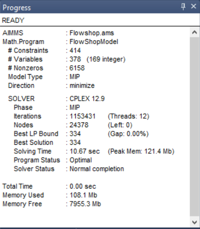
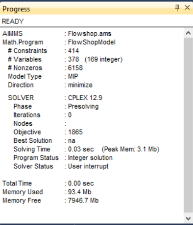
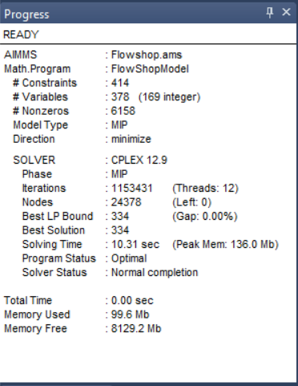

Switching to GMP when Mathematical Program has callbacks
==========================================================

.. meta::
   :description: Converting SOLVE code to GMP code.
   :keywords: solve, mathematical program, solver session, callback, GMP

As an experienced model builder, you may want to convert from solving using the **SOLVE** statement, to using GMP functionality, which enables you for instance to:

#. Speed up Monte Carlo analysis

#. Work with multiple solutions

#. Use multi objective, both weighted and lexicographic

#. Solve in parallel

There is one caveat however, when callbacks are used on the mathematical program, the callbacks procedures need to be modified and activated differently. 

This article presents the essence of converting from Solve statements to using GMP. In addition, it presents how to adapt the existing callbacks, and how to adapt their activation.

Original situation
------------------

We have a flow shop model that is solved by the following procedure ``pr_DoSolve`` with body:

.. code-block:: aimms
    :linenos:

    Empty AllVariables;
    pr_GenerateData();
    empty s_Timepoints ;
    FlowShopModel.CallbackTime := 'pr_TimeCallback'; ! Solve style callback.
    block where progress_time_interval := 1 ;
        solve FlowShopModel;
    endblock ;
    pr_prepInterface;

On line 4 a callback is activated for the flowshop model by setting the corresponding suffix for the mathematical program.

The callback procedure itself is:

.. code-block:: aimms
    :linenos:

    Procedure pr_TimeCallback {
        Body: {
            pr_updateGap(FlowShopModel.bestbound, FlowShopModel.Incumbent);
        }
    }

As you can see, it uses the suffixes ``.bestbound`` and ``.Incumbent`` which are set before this procedure is invoked. 

An example solve results in the following progress window

As you can see optimality is reached.
If you want to replay this yourself, please download and run 
:download:`the first AIMMS project <model/1.flowshop-solve-solve-cb.zip>` 
and press the solve button in the lower right corner.

First conversion step to using GMP
----------------------------------

The Generated Mathematical Programs are objects stored in AIMMS internally. Each object is given an identification as an element in the predeclared set ``AllGeneratedMathematicalPrograms``. We use an element parameter to store such an element after generating, such that we can reference it in later manipulations such as solving. The declaration is:

.. code-block:: aimms
    :linenos:

    ElementParameter ep_GMP {
        Range: AllGeneratedMathematicalPrograms;
    }

With this declaration, we can simply convert.  

.. code-block:: aimms
    :linenos:
    :emphasize-lines: 6,7

    Empty AllVariables;
    pr_GenerateData();
    empty s_Timepoints ;
    FlowShopModel.CallbackTime := 'pr_TimeCallback'; ! Solve style callback.
    block where progress_time_interval := 1 ;
        ep_GMP := gmp::Instance::Generate( FlowShopModel );
        gmp::Instance::Solve( ep_GMP );
    endblock ;
    pr_prepInterface;

The only difference in coding the solution procedure is then on lines 6,7 highlighted above. Running that procedure gives the unexpected result:

As you can see optimality is not reached; instead you'll get the following:

.. warning:: After zero iterations CPLEX 12.9 found an integer solution to FlowShopModel. The minimum found for TimeSpan is 1865.

If you want to replay this yourself, please download and run 
:download:`the second AIMMS project <model/2.flowshop-gmp-solve-cb.zip>` 
and press the solve button in the lower right corner.

It turns out this is caused by the different interface for callbacks. Let's handle that in the next section.

Adapt callbacks for GMP usage
------------------------------

GMP style callback procedures have the input argument ``ep_session`` which is an element parameter in the set ``AllSolverSessions``. This permits to obtain solver session specific information. The return value of the callback procedure should be 0 or 1, indicating stop solving, and continue solving respectively.  It is best practice to have an explicit return statement as the last statement of a callback procedure. This results in the following replacement of the ``pr_TimeCallback`` procedure.

.. code-block:: aimms
    :linenos:

    Procedure pr_TimeCallback {
        Arguments: (ep_session);
        Body: {
            p_BestBound := GMP::SolverSession::GetBestBound( ep_session );
            pr_updateGap(p_BestBound, p_BestIncumbent);
            
            return 1 ; ! Indicate to the solver to continue.
        }
        ElementParameter ep_session {
            Range: AllSolverSessions;
            Property: Input;
        }
        Parameter p_BestBound;
    }
    
The solver session allows to obtain various information from the session directly, but the incumbent is not one of them. Instead, we register the latest incumbent value ourselves when the solver finds a new incumbent solution. This results in the following additional procedure:

.. code-block:: aimms
    :linenos:

    Procedure pr_IncumbentCallback {
        Arguments: (ep_session);
        Body: {
            p_BestIncumbent := GMP::SolverSession::GetObjective( ep_session );
            
            return 1 ; ! Indicate to the solver to continue.
        }
        ElementParameter ep_session {
            Range: AllSolverSessions;
            Property: Input;
        }
    }

These two callback routines are activated as illustrated in the following version of the procedure ``pr_DoSolve``

.. code-block:: aimms
    :linenos:
    :emphasize-lines: 7-12

    Empty AllVariables;
    pr_GenerateData();
    p_BestIncumbent := 1000;
    empty s_Timepoints ;
    block where progress_time_interval := 1 ;
        ep_GMP := gmp::Instance::Generate( FlowShopModel );
        gmp::Instance::SetCallbackTime(
            GMP      :  ep_GMP, 
            callback :  'pr_TimeCallback');
        GMP::Instance::SetCallbackNewIncumbent(
            GMP      :  ep_GMP, 
            callback :  'pr_IncumbentCallback');
        gmp::Instance::Solve( ep_GMP );
    endblock ;
    pr_prepInterface;

Running the adapted model gives again:

If you want to replay this yourself, please download and run 
:download:`the third AIMMS project <model/3.flowshop-gmp-gmp-cb.zip>` 
and press the solve button in the lower right corner.

