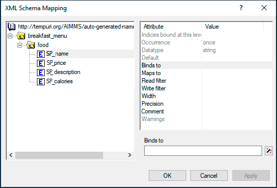
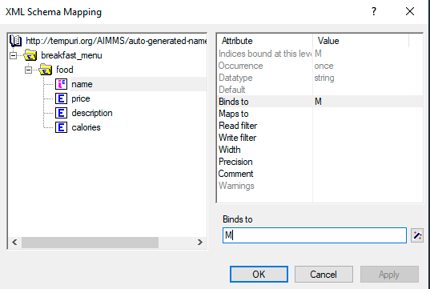
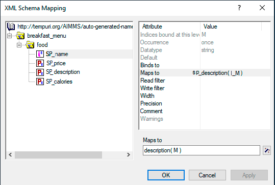
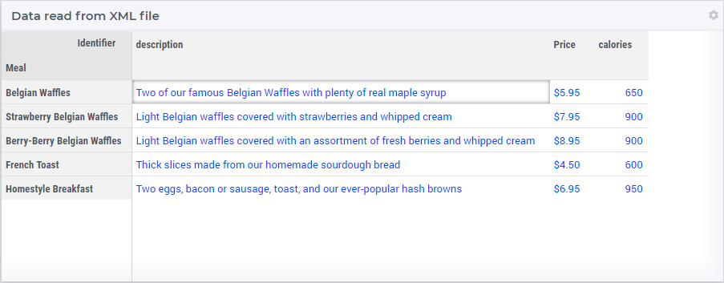

Extract Data from an XML File
==================================================

.. meta::
   :description: Using AIMMS XML schema mapping tool to extract data.
   :keywords: xml, schema, xsd, axm

In this article, we will learn how to extract data from an XML file using the AIMMS XML schema mapping tool.

File formats related to XML
^^^^^^^^^^^^^^^^^^^^^^^^^^^

* **XML** (EXtensible Markup Language) is a format optimized to transport data with a given hierarchical structure. It can be seen as a tree containing elements. Those elements can contain child elements, data, and parameters. Each parameter contains one piece of information about the element.

* **XSD** (XML Schema Definition) is a file used as a schema for an XML file. It defines the elements and attributes which can be used, their hierarchy, data types, and can also define fixed values.

* **AXM** is used in AIMMS as a mapping file. It specifies links between the XML elements and AIMMS objects.

Use Case
----------

In this example, we will extract data from a breakfast menu containing data about meals, their price, the number of calories, and a small description. (From an example provided at `W3Schools <https://www.w3schools.com/xml/simple.xml>`_)

.. code-block:: xml

    <?xml version="1.0" encoding="UTF-8"?>
    <breakfast_menu>
    <food>
        <name>Belgian Waffles</name>
        <price>$5.95</price>
        <description>Two of our famous Belgian Waffles with plenty of real maple syrup</description>
        <calories>650</calories>
    </food>
    <food>
        <name>Strawberry Belgian Waffles</name>
        <price>$7.95</price>
        <description>Light Belgian waffles covered with strawberries and whipped cream</description>
        <calories>900</calories>
    </food>
    <food>
        <name>Berry-Berry Belgian Waffles</name>
        <price>$8.95</price>
        <description>Light Belgian waffles covered with an assortment of fresh berries and whipped cream</description>
        <calories>900</calories>
    </food>
    <food>
        <name>French Toast</name>
        <price>$4.50</price>
        <description>Thick slices made from our homemade sourdough bread</description>
        <calories>600</calories>
    </food>
    <food>
        <name>Homestyle Breakfast</name>
        <price>$6.95</price>
        <description>Two eggs, bacon or sausage, toast, and our ever-popular hash browns</description>
        <calories>950</calories>
    </food>
    </breakfast_menu>

Extracting XML Data
---------------------
We will extract the data from the XML into AIMMS, so that all the data from the XML will be converted into AIMMS objects.

If you followed the procedure to :doc:`Extract an XML File from a Server <../294/294-Online-XML-HTTP-library>`, your XML file will be in the root directory of your project (or in any directory specified in the ``OutputFile`` string). Otherwise you'll need to specify the path to your XML file in a string parameter before you begin.

The procedure is as follows:  

#. `Generating XSD file`_
#. `Creating AIMMS objects`_
#. `Generating the AXM file`_
#. `Reading XML data`_

Generating XSD file
^^^^^^^^^^^^^^^^^^^^^^^^^^^^^^

To properly use the XML schema mapping tool in AIMMS, you'll need an XSD file corresponding to your XML.

If you do not have an XSD file, you can simply use a free online XSD generator tool in most cases.
Here, we will use a generator from `FreeFormatter.com <https://www.freeformatter.com/xsd-generator.html>`_.

Once you've generated the XSD, save it in the root directory of your project.

Creating AIMMS objects
^^^^^^^^^^^^^^^^^^^^^^^^^^^^^^

Create the AIMMS objects to be linked with the XML contents. 

In this case, we will create the following:

.. code::

    Set Meal {
        Index: M;
    }
    StringParameter Price {
        IndexDomain: M;
    }
    StringParameter Desription {
        IndexDomain: M;
    }
    Parameter Calories {
        IndexDomain: M;
    }

Generating the AXM file
^^^^^^^^^^^^^^^^^^^^^^^^^^^^^^

AIMMS is equipped with a tool called *XML schema mapping*. 

Using this tool and an XSD file, you'll be able to generate your own mapping for your XML file and link your data with objects you create in AIMMS.

#. Access the tool from the menu *Tools > XML schema mappings*. 
#. Select your XSD file. 
#. If a dialog warns there is no AXM file, click *OK*.

.. image:: images/Calque.png
    :align: center
    
Based on your XSD file, the XML schema mapping tool generates an AXM file of the same name in the root directory of your project  (``XYZ.xsd`` will generate ``XYZ.axm``).

This window should now be open:

    
The elements tree of your XML file is displayed on the left. 

Data can be stored in an element, in child elements, or in the element's parameters.
In this example there aren't child elements nor parameters, but the process is the same.

Click on an element or a parameter folder in the elements tree to view a list of attributes.

* ``binds-to``: This attribute links an element to an index. The data of the element will belong to the chosen index domain. It also links the parent node from the bound element and any child attributes to the index, so their data can be used as parameters of the index based on their ``maps-to`` attribute.

* ``maps-to``: This attribute links an element's value to an AIMMS identifier (e.g., sets, parameters).

* ``read filter``: This attribute specifies if you want to read the data of this element or branch. The default value  ``1`` means it will be read. Set it to ``0`` if you don't want AIMMS to read the data. When reading an XML with an element bound or mapped to an index/identifier, AIMMS will add the value of this element to your index/identifier.

* ``write filter``: This attribute specifies if you want to overwrite the data from your XML file using the value of the AIMMS identifier the element has been mapped to. Set the value ``0`` if you don't want AIMMS to overwrite, or ``1`` if you do.

First we need to set the element to bind to the index ``M`` of the ``Meal`` set. Here, ``M`` is bound to the element ``Name``. 

Click on the attribute you want to change and enter the value you want to put in the text field. (You can use the wizard tool for auto-completion.)

Click *Apply*. Because ``Name`` is in the same branch as ``Price``, ``Description``, and ``Calories``, we have now access to their data to fill ``Meal`` parameters.

Repeat this process with the other elements and map them to their respective parameters using the ``maps-to`` attribute.

Our example has the following mapping:

 
.. note:: 

    If some objects from your XML aren't used (parameters or elements), set their ``read-filter`` to ``0`` to avoid error messages.

Reading XML data
^^^^^^^^^^^^^^^^^^^^^^^^^^^^^^

Now we can read the data into AIMMS.

Execute the following code in a procedure to obtain your data.

.. code-block:: aimms

    READXML(OutputFile,"NameOfYourAXM.axm");

If you followed the procedure to :doc:`Extract an XML File from a Server <../294/294-Online-XML-HTTP-library>`, ``OutputFile`` still contains the directory. Otherwise you'll need to specify the string parameter containing the path to your XML.

Congratulations, you should now have all your XML data accessible in AIMMS!

    
Example project
------------------

You can download the example AIMMS project below: 

* :download:`HttpFood.zip <download/HttpFood.zip>` 

    
Related topics
------------------

* **AIMMS How-To**: :doc:`../294/294-Online-XML-HTTP-library`

* **AIMMS Documentation**: `Read and write XML <https://download.aimms.com/aimms/download/manuals/AIMMS3LR_XMLReadWrite.pdf>`_

* **W3Schools**: `What is XML <https://www.w3schools.com/xml/xml_whatis.asp>`_

* **W3Schools**: `What is XSD <https://www.w3schools.com/xml/schema_intro.asp>`_

