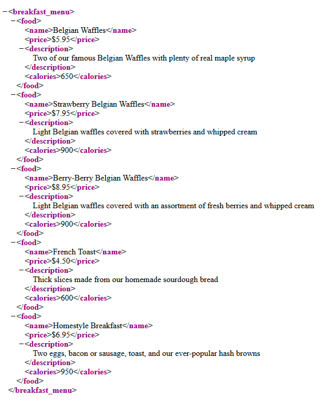

Extracting data from an XML file using AIMMS
==================================================

In this article, we will learn how to extract data from an XML file using the AIMMS XML schema mapping tool.

**Use Case**

Here, our goal is to extract data from a breakfast menu.
This breakfast menu presents various meals with their price, the number of calories they contain and a small description.
The idea is to inject these data into AIMMS .

    
*you can find a version of this document following this URL : <https://www.w3schools.com/xml/simple.xml>*

.. note:: **Reminder about XML**

    * **XML** is a format optimized to transport data. It can be seen as a tree containing elements. Those elements can contains child elements, data and parameters. Each parameter contains one information about the element.

    * **XSD** is a file used as a schema for an XML file, it represents the structure of the .XML. This file represents a single general structure of an XML,and not the structure of every XML.

    * **AXM** is used in AIMMS as a mapping file. It will specify the links between the XML file and AIMMS objects.

Extracting the data from the XML into AIMMS.
-----------------------------------------------

At the end of this part, we will have access to all the data from the XML in AIMMS objects .

Generating .xsd file.
^^^^^^^^^^^^^^^^^^^^^^^^^^^^^^

To properly use the Mapping tools for XML files in AIMMS, you'll need the specific schema file of your XML.
If you already have access to your XML file, you can find online .xsd generators for free. Those tools aren't to be used in every situation but will do the job here.
Here, we will use `this generator <https://www.freeformatter.com/xsd-generator.html>`_ from freeformatter.com.
You can find your XML file at the root of your project, or in any directory specified in the OutputFile string.
Once you've generated your xsd code, just copy it in a blank .xsd file and save it at the root of your project folder.

2) Creating objects.
^^^^^^^^^^^^^^^^^^^^^^^^^^^^^^

We need to create the AIMMS objects to be linked with the XML file. 
Those are a set *Meal* with an index M, string parameters *Price(M)*, *Description(M)* and a parameter *Calories(M)*.

3) Generating the .axm file.
^^^^^^^^^^^^^^^^^^^^^^^^^^^^^^

AIMMS is equipped with a tool called XML schema mapping. Using this tool and a .xsd file, you'll be able to generate your own mapping for your .xml file and link your data with whatever you want.
you can access this tool using the **Tools** list at the top of your window and selecting *XML schema mappings*, then select your xsd file using the file explorer and click on ok if a display tells you It couldn't find any .axm file.

.. image:: images/Calque.png
    :align: center
    
You should now have this window opened:

.. figure:: images/schemaMapping_blank.png
    :align:  center
    
On the left is displayed the elements tree of your XML file. each elements can store data (or not) in itself, in child elements or in element's parameters and all these objects will be displayed on that tree.
It's then up to you to know where to find the data you're searching for in your XML file.
In this example, we don't have any child elements nor parameters, but the process stays the same.

On the right, after clicking on a folder, an element or a parameter, you'll have a list of attributes appearing.
Let's review some of them.

.. image:: images/AXMgeneratorBindsTo.png
    :align: center

* **binds-to**    : the binds-to attribute is used to link an element to an index. Then, the data of the element will belongs to the chosen index domain. The bind-to will also link the parent node from the bound element and any child attributes to the index,which means their data can be used as parameters of the index thanks to their maps-to attribute.

* **maps-to**     : the maps-to attribute is used to link an element's value to an AIMMS identifier(sets,parameters...).

* **read filter** : this attribute can take the value 0 if you don't want AIMMS to read the data in a specific element or branch, and 1 otherwise. (by default set at 1). When reading an XML with an element bound or mapped to an index/identifier, AIMMS will add the value of this element to your index/identifier

* **write filter**: this attribute can take the value 0 if you don't want AIMMS to overwrite the data from your XML file using the value of the identifier the element has been mapped to, or 1 otherwise.

The first thing we want to set up is the element the index of the Meal's set (M) will be bound to. Here, M is bound to the element "Name". To do so, just click on the attribute you want to change and enter the value you want to put in the text field. You could also use the wizard tool for auto-completion.
then, click on the apply button. Because ``Name`` is on the same branch as ``Price``, ``Description`` and ``Calories``, we have now access to their data to fulfill Meal parameters

From now, we just have to repeat this process with the different other elements and map them to their respective parameters using the maps-to attribute.

You should then have this mapping

.. image:: images/Mapping_final.png
    :align: center
 
.. Warning:: If some objects from your XML aren't used (parameters or elements), it's strongly advised to set their read-filter to 0. Else, you could have an error message.

4) Reading data.
^^^^^^^^^^^^^^^^^^^^^^^^^^^^^^

Finally, everything is ready for the data reading to start.

We have our XML file represented by an .xsd file. This .xsd file has been used to create a plan of the XML for the XML schema mapping tool. With this plan and attributes, AIMMS generated in the root of your project an .axm file using the same name as the .xsd file(XYZ.xsd will generate XYZ.axm).

now just execute the following code line to obtain your data.

Outputfile still contains the directory to your XML file extracted from the server.

.. code-block:: aimms
    :linenos:

    READXML(OutputFile,"NameOfYourAXM.axm");

Congratulation, you should now have all your XML data accessible in AIMMS!

.. image:: images/theOtherEndOfTheArticleAsWeKnowIt.png
    :align: center
    
The project :download:`AIMMS project download <download/HttpFood.zip>` 

    
Related topics
------------------

**external links**

`about XML <https://www.w3schools.com/xml/xml_whatis.asp>`_

`about XSD <https://www.w3schools.com/xml/schema_intro.asp>`_

**AIMMS documentation**

`about XML reading and writing in AIMMS <https://www.google.com/url?sa=t&rct=j&q=&esrc=s&source=web&cd=3&ved=2ahUKEwjrrazf26rjAhVFy6QKHRiQAvgQFjACegQIABAC&url=https%3A%2F%2Fdownload.aimms.com%2Faimms%2Fdownload%2Fmanuals%2FAIMMS3LR_XMLReadWrite.pdf&usg=AOvVaw37iBhEynwwPU9k3ecKSX3q>`_

:doc:`../294/294-Online_XML_HTTP_library`
