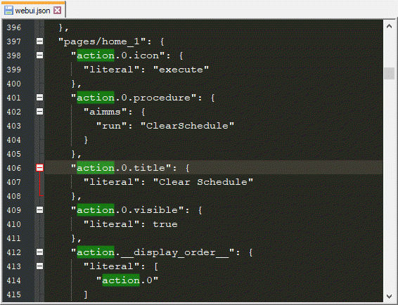

Upgrade WebUI Page Actions
=========================================
.. meta::
   :description: A brief guide to upgrading Page Actions in your WebUI app.
   :keywords: deprecation, webui, page action, convert, upgrade, update

Overview
---------

In AIMMS 4.68 we released the `Page Actions <https://manual.aimms.com/webui/page-settings.html#page-actions>`_ feature. This was previously offered as an experimental feature before its official release. 

The new version gives several benefits over the experimental version, including the following capabilities:

* Primary action icon can be adjusted
* Inactive/Hidden state for each action
* Set of 1600 icons to choose from 
* Custom icon set can be added with a parameter

Timeline
---------

If you activated Page Actions (V1) as an experimental feature, they will still appear when using AIMMS 4.68 and higher until you activate Page Actions (V2) by adding an identifier to the model with the appropriate index.

AIMMS releases on or after **October 1, 2019** will not support projects using the older version of this feature.

To use AIMMS versions released after that date, you will need to be sure that any pages in your WebUI app using Page Actions have been upgraded.

Upgrading your project
----------------------

To convert Page Actions from V1 to V2, you'll need to do the following:

1. Open your project in AIMMS 4.68 or later
#. Put data for the existing Page Actions properties in string parameters. 

A quick way to get this data is to use the ``webui.json`` file.

a. Locate and open the file ``\MainProject\WebUI\webui.json``. 
b. Search for the text “actions" in the file.

c. Copy the values to string parameters.

.. Which values specifically? Ask Pratap if we can use the image from his email.

Once the string parameters are configured with index ``webui::indexPageActionSpec``, the Page Actions V1 will be overridden by the Page Actions V2 specified in the string parameter.

Please refer to `AIMMS Documentation: Page Actions <https://manual.aimms.com/webui/page-settings.html#page-actions>`_ for further details about this feature.