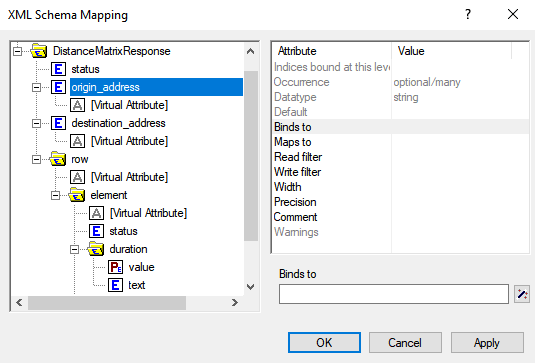
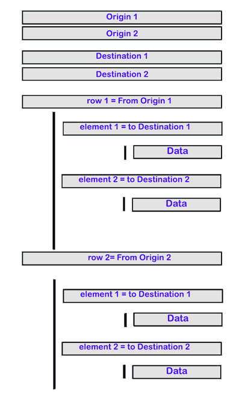
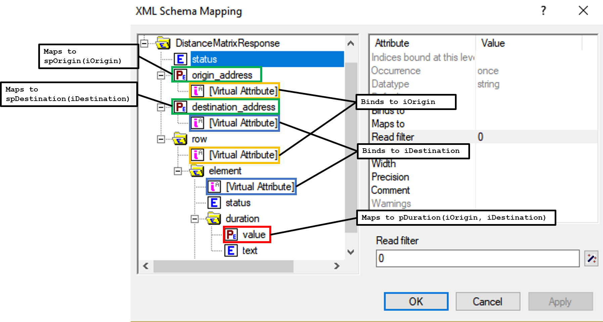

Retrieve Geographic Data with Google Maps API
==================================================================================================

.. meta::
   :description: Using Google Maps API to return geographic data to an AIMMS project.
   :keywords: google, 

In this article, we will learn how to use the HTTP Library to obtain distance data from a Google Maps API. 

Let's say we're planning a road trip in Europe and we want to visit sites in different cities. We can use the Distance Matrix API from Google Maps to calculate important information for our trip. 

We want to know:

* Distances between locations

* Travel time from one location to another

.. _prereqs:

Prerequisites
--------------

Before we begin, there are a couple things you'll need to have in place.

* Install the HTTP library, please read `AIMMS Documentation: Adding the HTTP Client Library <https://documentation.aimms.com/httpclient/library.html#adding-the-http-client-library-to-your-model>`_.

* Get a Google API key. Get one from `Google Maps Platform: Get an API Key <https://developers.google.com/maps/documentation/geolocation/get-api-key>`_.

API requirements
-----------------------------------------------
We need information about the authentication required and the request format. As indicated in `Google Maps Developer Guide: Required Parameters <https://developers.google.com/maps/documentation/distance-matrix/intro#required-parameters>`_, these are required parameters for the request:

.. removed image (images/MandatoryParameters.png)

* ``origins`` — The starting point for calculating travel distance and time. You can supply one or more locations separated by the pipe character (|), in the form of an address, latitude/longitude coordinates, or a place ID.
* ``destinations`` — One or more locations to use as the finishing point for calculating travel distance and time. The options for the destinations parameter are the same as for the origins parameter, described above.
* ``key`` — Your application's API key. This key identifies your application for purposes of quota management.

Specify these parameters by putting them at the end of the request URL: 

.. removed image (images/RequestFormat.png)
    
As indicated in `Google Maps Developer Guide: Distance Matrix Requests <https://developers.google.com/maps/documentation/distance-matrix/intro#DistanceMatrixRequests>`_ the format should look like this:

.. raw:: html

    

Note that while the Google Maps API supports both JSON and XML outputs, AIMMS only supports XML, so ``outputFormat`` will be ``xml``.

With the mandatory parameters, the URL would look like this:

.. raw:: html

    
https://maps.googleapis.com/maps/api/distancematrix/xml?destinations=DESTINATIONS&key=KEY&origins=ORIGINS

The API contains plenty of other optional parameters, such as the distance unit or the method to calculate travel duration. Learn about the available options for your request in the `Google Maps Developer Guide <https://developers.google.com/maps/documentation/distance-matrix/intro>`_.

Example project
------------------

You need to complete two steps to be able to use the distance data retrieved from the API in your AIMMS model. 

#. Create a request to the API to get an XML response file
#. Import the data from the XML file to your AIMMS identifiers

You can download the example AIMMS project here: :download:`Google API Example.zip <GoogleAPIExample.zip>` 

Creating the request
^^^^^^^^^^^^^^^^^^^^^^^

Lines 1 through 15 in the procedure ``GetDistances`` represent an example request to the API. You must replace the "*YOUR_API_KEY*" in Line 1 with your Google API key from :ref:`prereqs`.

.. code-block:: aimms
   :linenos:
    
   APIkey := "YOUR_API_KEY";
   responseFile:="Output.xml";
   ListOrigins:="Eiff Tower, Paris | The atomium is in Brussels | AIMMS Haarlem | Roma Italy Coliseum | The alhambra, granada spain";
   ListDestinations:="Eiffel Tower, Pari | The atomium, Brussels | AIMMS Haarlem | Coliseum, Roma Italy | The alhambra, granada spain";
   !Set the values for the parameters we want to use
   requestparameters := { 'key': APIkey, 'origins': ListOrigins, 'destinations' : ListDestinations };
   !Set the request
   web::query_format(requestparameters,formattedparameters);
   URL:="https://maps.googleapis.com/maps/api/distancematrix/xml?"+formattedparameters;
   !Create and submit the request
   web::request_create(requestId);
   web::request_setMethod(requestId,"GET");
   web::request_setURL(requestId,URL);
   web::request_setResponseBody(requestId,'File',responseFile);
   web::request_invoke(requestId,responsecode);

Most of this code is common for every HTTP request sent using the HTTP Client Library, and will not be reviewed in this article. Read more about how to formulate an HTTP request in AIMMS in :doc:`../294/294-Online-XML-HTTP-library`.

``GetDistances`` has the below locally declared identifiers. 

.. removed, redundant image .. image:: images/RequestObjects.png

.. code-block:: aimms

    Set TotalParameters {
        Index: tp;
        InitialData: {
            DATA{origins,destinations,address,key,mode,language,region,avoid,units,arrival_time,departure_time,traffic_model,transit_mode,transit_routing_preference};
        }
    }
    StringParameter requestId {
    
    }
    StringParameter requestparameters {
        IndexDomain: tp;
    }
    Parameter responsecode {
    
    }
    StringParameter APIkey {
    
    }
    StringParameter ListOrigins {
    
    }
    StringParameter URL {
    
    }
    StringParameter responseFile{
    
    }
    StringParameter formattedparameters {
    
    }
    
The set ``TotalParameters`` contains all possible parameters available for the API, required or optional.

Following the API documentation, we create two strings storing the different origins and destinations separated by "|" characters in Lines 3 and 4. The choice to use location names instead of coordinates is arbitrary. We want the total distance matrix between locations, so each location is in ``ListOrigins`` and ``ListDestinations``. 

.. code-block:: aimms
    
    !Set the Locations
    ListOrigins:="**Eiff** Tower, Paris | The atomium is in Brussels | AIMMS Haarlem | Roma Italy Coliseum | The alhambra, granada spain";
    ListDestinations:="Eiffel Tower, **Pari** | The atomium, Brussels | AIMMS Haarlem | Coliseum, Roma Italy | The alhambra, granada spain";

.. tip::

    There is no need to be meticulous in these location definitions. Purposely, we've included some errors and format variations in the location names to illustrate that Google Maps can guess the corrections needed in most cases. 

.. todo: When talking about advantage, and doing other comparisons, it is required for scientific articles to be explicit as to what you are comparing to.  For "How To" articles, it is not required, but I think it is good practice. Anyway, I do not see the purpose of a comparison here. Perhaps you can reformulate to something like: "Google API helps you here because it is resilient against typos".

.. important:: 

    The API has tiers of billing plans with various usage limits. See `Google Maps Developer Guide: Usage and Billing <https://developers.google.com/maps/documentation/distance-matrix/usage-and-billing#distance-matrix>`_

We specify which parameters to use in ``requestparameters`` and assign them values in Line 6. Here, we only specify the required parameters, but you can add optional parameters in the same way.

.. code-block:: aimms
    
   !Set the values for the parameters we want to use
   requestparameters := { 'key': APIkey, 'origins': ListOrigins, 'destinations' : ListDestinations };

Now that we have set up our parameters, we will translate them into a URL using the ``web::query_format`` method and to put the resulting string ``formattedparameters`` at the end of our URL in Lines 7 to 9.

.. code-block:: aimms

   !Set the request
   web::query_format(requestparameters,formattedparameters);
   URL:="https://maps.googleapis.com/maps/api/distancematrix/xml?"+formattedparameters;
    
Once this URL is generated, you just need to create a ``GET`` request and submit it to the API. This is done in lines 10 through 15. 

.. code-block:: aimms

   !Create and submit the request
   web::request_create(requestId);
   web::request_setMethod(requestId,"GET");
   web::request_setURL(requestId,URL);
   web::request_setResponseBody(requestId,'File',responseFile);
   web::request_invoke(requestId,responsecode);

Executing this code will download the response XML file in the root folder of your project, or any other location as specified in ``responseFile``.

.. MOHAN please check: Once this URL is generated, send it with a ``GET`` request. 
.. When you execute the procedure, you can download the response XML file at the root of your project, or at any destination specified in ``OutputFile``.

Mapping the data 
^^^^^^^^^^^^^^^^^^

Now we have access to the XML response file. We need to map the data from this XML file into AIMMS using the XML schema mapping tool. By taking a look at the XML file, we can identify the important data to export in AIMMS.    
    
The ``origin_address`` and ``destination_address`` are elements that contain the exact locations guessed by Google using your request location strings. For each travel, there is a ``duration`` and a ``distance`` folder containing ``value`` and ``text`` elements. The ``value`` contains the duration (or distance) as a number while the ``text`` contains it as a string.
    
Now that we know what we want from the XML file, we will need an XSD file. This XSD file provides the structure for an XML file. Read more about XML Mapping and creating XSD files in :doc:`../293/293-extracting-data-from-XML`.

When you select an element, the mapping tool gives you access to a list of attributes.

* ``Binds-to`` : links an index with an element having an attribute ``occurrence`` equals to "once", and that is not in the root node. It also links the parent node from the bound element and any child elements to the index, so their data can be used as parameters of the index based on their ``maps-to`` attribute.
* ``Maps-to``  : links an element's value to an AIMMS identifier (e.g., sets, parameters).

Here, we can't bind the elements ``origin_address`` or ``destination_address`` to a set because their ``occurrence`` attribute equals "optional/many" and their position in the root node. Meanwhile, if we bind an index to the ``status`` element from the Element folder, we would not be able to map the ``origin_address`` to a parameter of this index.
Therefore, we cannot use ``origin_address`` and ``destination_address`` as indices to have parameters ``Distance(origin_address, destination_address)`` and ``Duration(origin_address, destination_address)`` with this XML file. 

Instead, we will use virtual attributes. These attributes aren't part of the XML file but can be simulated. The virtual attributes are an enumeration of contents of the root element. For example, the second element in ``destination_address`` will have a virtual attribute value of 2 and the third element will have a value 3. Thus, 2 will become the ID for the 2\ :sup:`nd`\  destination_address: "The atomium".

Given the structure of the XML, the virtual attribute for ``row`` will also correspond to the origin ID for the travel and the virtual attribute for ``element`` will correspond to the travel destination ID.

Here is an example schema for the XML:

As we are creating a distance (time) matrix for the given set of locations, we will use a set ``sAddresses`` with two indices - ``iOrigin`` and ``iDestination``. Then, ``origin_address`` and ``destination_address`` will be string parameters indexed over this set. The elements in ``sAddresses`` will be numbers 1, 2, .. and the values of ``origin_address`` and ``destination_address`` will be the corresponding addresses. 

Declare the below identifiers in your project:

.. code-block:: aimms

   Set sAddresses {
      Index: iOrigin, iDestination;
   }

   StringParameter spOrigin {
      IndexDomain: iOrigin;
   }

   StringParameter spDestination {
      IndexDomain: iDestination;
   }

   Parameter pDuration {
      IndexDomain: (iOrigin, iDestination);
   }
   
   Parameter pDistance {
      IndexDomain: (iOrigin, iDestination);
   }

.. .. image:: images/MappingObjects.png

Using the XML Mapping Tool, create the following mapping:

* ``origin_address`` virtual attribute **binds to** ``iOrigin``
* ``destination_address`` virtual attribute **binds to** ``iDestination``
* ``row`` virtual attribute **binds to** ``iOrigin``
* ``element`` virtual attribute **binds to** ``iDestination``

* ``Duration/value`` **maps to** ``pTime(iOrigin, iDestination)``
* ``Distance/value`` **maps to** ``pDistance(iOrigin, iDestination)``
* ``origin_address`` **maps to** ``spOrigin(iOrigin)``
* ``destination_address`` **maps to** ``spDestination(iDestination)``

.. important:: Don't forget to set the attribute ``Read-filter`` to 0 for every unused element or parameter in the mapping (two each of ``status`` and ``text`` elements) . The ``Read-filter`` attribute is accessible by selecting the element or parameter.

Now, you just have to read the XML file data.

.. code-block:: aimms

   READXML(responseFile,"YOUR_XSD_FILE_NAME.axm");

You can use ``spOrigin`` or ``spDestination`` as the ``webui::ElementTextIdentifier`` for the set ``sAddresses`` to get the final tables as below. 

.. image:: images/outputtable.png
   :align: center

Related Topics
-----------------------------------------------
* **AIMMS How-To**: :doc:`../294/294-Online-XML-HTTP-library`
* **AIMMS How-To**: :doc:`../293/293-extracting-data-from-XML`
* `Google Maps Developer Guide <https://developers.google.com/maps/documentation/distance-matrix/intro>`_. 

.. spelling::

    atomium
	