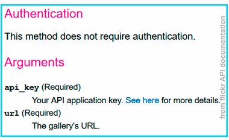
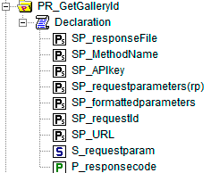
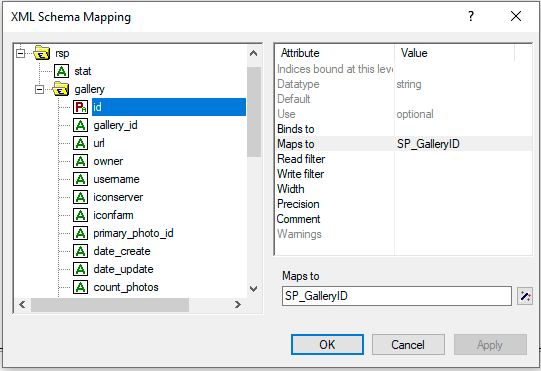
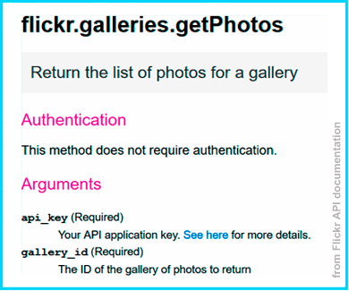
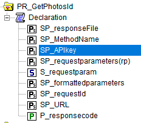
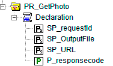
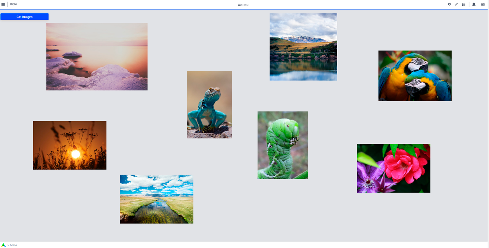

.. warning:: 
   Please note that the documentation you are currently viewing is for an older version of our technology. 
   While it is still functional, we recommend upgrading to our latest and more efficient option to take advantage of all the improvements we've made.
   
Extract Photos Using the Flickr API
=====================================================

.. meta::
   :description: Using the Flickr API to obtain images.
   :keywords: xml, http library, Flickr, images, API

In this article, we'll learn how to use the Flickr REST API. 

The process to deal with a REST API in AIMMS is very similar, however you can find details of the differences in `AIMMS Documentation: HTTP Client Library <https://documentation.aimms.com/httpclient/index.html>`_. Here, we use a concrete example of this process to supplement the documentation.

Use case
~~~~~~~~~~~~~~~~~~~~~~~~~~~~

This use case is inspired by an `idratherbewriting <https://idratherbewriting.com/learnapidoc/docapis_flickr_example.html>`_ tutorial.

Flickr is an image and video hosting social network with a database of millions of photos.
Our mission will be to extract the photos from a `Flickr gallery <https://www.flickr.com/photos/flickr/galleries/72157647277042064/>`_.

Prerequisites
--------------
Before you begin, make sure you have done the following:

* Install the `AIMMS HTTP Client Library <https://documentation.aimms.com/httpclient/library.html#adding-the-http-client-library-to-your-model>`_

* Obtain an `API Key <https://www.flickr.com/services/apps/create/apply/>`_

Example Project
------------------

You can download the example project for this tutorial from the link below:

* :download:`Flickr_Project.zip <download/Flickr Project.zip>` 

Required Information
---------------------------------------------

Information about the URL format where we can address our request and the authentication system to use can be found in `Flickr API documentation <https://www.flickr.com/services/api/>`_, specifically the sections labeled `URLs <https://www.flickr.com/services/api/misc.urls.html>`_, `Overview <https://www.flickr.com/services/api/misc.overview.html>`_ and `User Authentication <https://www.flickr.com/services/api/auth.oauth.html>`_.

.. note::

    According to Flickr's documentation, the main authentication system used for this API is a complex OAuth protocol, but some methods can still be used with a simple API key. We'll use the API key method here.

The request format is specified as a URL endpoint followed by these parameters: 

* ``method`` (REQUIRED) - specify the calling method
* ``api_key`` (REQUIRED) - specify your API Key
* ``format`` (optional) - specify a response format

The arguments, responses, and error codes for each method are listed on the method's spec page, found on the `Flickr API index page <https://www.flickr.com/services/api/>`_.

To download an image using a ``GET`` request, we need a photo URL. 

To access a photo, we need the following: 

* ``the farm_id`` (optional - the server will provide it if you don't)
* ``the server_id``
* ``id`` 
* ``secret``

The URL format is specified in the Flickr documentation:

.. raw:: html

    https://farm{farm-id}.staticflickr.com/{server_id}/{id}_{secret}.jpg

To get this information about particular photos, we can use the method `flickr.galleries.getPhotos <https://www.flickr.com/services/api/flickr.galleries.getPhotos.html>`_ to return the information required for creating the individual photo URLs.

First, we need the ``id`` of the gallery. We'll use the `flickr.urls.lookupGallery <https://www.flickr.com/services/api/flickr.urls.lookupGallery.html>`_ to get that.

Gathering Required Information
-------------------------------
The process to gather the required information can be summarized as follows:

#. Create a request to obtain the gallery ``id`` using **flickr.urls.lookupGallery**
#. Create a request to obtain gallery photos using **flickr.galleries.getPhotos**
#. Construct the photos URLs and do a **GET request** to obtain the files.

Getting the Gallery ``id``
^^^^^^^^^^^^^^^^^^^^^^^^^^^^

The code for this request is the following one.
 
.. code-block:: aimms
    :linenos:

    SP_responseFile:="Output.xml";
	SP_APIkey:="Your_api_key";
    SP_requestparameters:={
        'method': "flickr.urls.lookupGallery",
        'api_key': SP_APIkey,
        'url': "https://www.flickr.com/photos/flickr/galleries/72157647277042064/"
    };
    web::query_format(SP_requestparameters,SP_formattedparameters);
    SP_URL:="https://www.flickr.com/services/rest/?"+SP_formattedparameters;
    
    !set the request
    web::request_create(SP_requestId);
    web::request_setMethod(SP_requestId,"GET");
    web::request_setURL(SP_requestId,SP_URL);
    web::request_setResponseBody(SP_requestId,'File',SP_responseFile);
    web::request_invoke(SP_requestId,P_responsecode);
    
    !extract data from the XML.
    READXML("Output.xml","GetGallery.axm");
    
The HTTP Request
~~~~~~~~~~~~~~~~~~~~~~~~~~~~

For details about how to formulate an HTTP request, please follow the article :doc:`../294/294-Online-XML-HTTP-library`.

Our goal is to use the ``flickr.urls.lookupGallery`` method from the API using a GET request and to extract the gallery ``id`` from the answer file.
Let's check what the `Flickr documentation <https://www.flickr.com/services/api/flickr.urls.lookupGallery.html>`_ has to tell us about this method.

The request requires two arguments, API key URL. The URL of the gallery is as follows: ``https://www.flickr.com/photos/flickr/galleries/72157647277042064/``

.. Note:: 

    Using the example project, you can extract photos from any gallery by setting the ``SP_url`` to the URL of the wanted gallery.

For this request, you'll need several objects:

.. code-block:: aimms
    :linenos:

    Set S_requestparam {
        Index: I_rp;
        InitialData: {
            DATA{api_key,method,url};
        }
    }
    StringParameter SP_requestId {
    
    }
    StringParameter SP_requestparameters {
        IndexDomain: I_rp;
    }
    Parameter P_responsecode {
    
    }
    StringParameter SP_APIkey {
    
    }
    StringParameter SP_MethodName{
    
    }
    StringParameter SP_URL {
    
    }
    StringParameter SP_responsefile{
    
    }
    StringParameter SP_formattedparameters {
    
    }

We can specify the direction for the output file using the ``SP_OutputFile`` string parameter.

.. code-block:: aimms

    
    SP_responseFile:="Output.xml";

The parameters of the request must be put at the end of the endpoint URL ``https://www.flickr.com/services/rest/?`` after being formatted by the ``web::query_format`` method.

.. code-block:: aimms
    :linenos:
    
    SP_requestparameters:={
        'method': "flickr.urls.lookupGallery",
        'api_key': SP_APIkey,
        'url': "https://www.flickr.com/photos/flickr/galleries/72157647277042064/"
    };

    web::query_format(SP_requestparameters,SP_formattedparameters);
    SP_URL:="https://www.flickr.com/services/rest/?"+SP_formattedparameters;

We can then set our request as usual.

.. code-block:: aimms
    :linenos:
    
    web::request_create(SP_requestId);
    web::request_setMethod(SP_requestId,"GET");
    web::request_setURL(SP_requestId,SP_URL);
    web::request_setResponseBody(SP_requestId,'File',SP_responseFile);
    web::request_invoke(SP_requestId,P_responsecode);

We should now have our XML file accessible at the root of the project, or wherever it is specified to go.

Extracting Data
~~~~~~~~~~~~~~~~~~~~~~~~~~~~

For details of how to extract data from an XML file in AIMMS, check this step-by-step article: :doc:`../293/293-extracting-data-from-XML`

With this new XML file, we can now create an XSD file in order to use the XML schema mapping tool from AIMMS.

To generate this XSD file, you can use an online generator such as the one provided by `FreeFormatter <https://www.freeformatter.com/xsd-generator.html>`_. Once it's obtained, just put the XSD file at the root of your project.

Now create a string parameter ``SP_GalleryID`` made for containing the gallery ID information and using the XML schema mapping tool, map it to the ``rsp/gallery/id`` element of the XML file (not the ``rsp/gallery/Gallery_id`` element).

.. Warning:: 

    Be sure to set every ``read-filter`` attribute of unused elements from the XML schema mapping tools to "0".

Finally, by using the ``READXML`` method, we can get the gallery ID we're searching for.
 
.. code-block:: aimms
    
    READXML("Output.xml","NAME_OF_YOUR_XSD.axm");
    

Getting Photo Information
^^^^^^^^^^^^^^^^^^^^^^^^^^^^^

We now want to create another procedure to get all the ``id`` information we need about the gallery photos.
For that, we'll use the ``flickr.galleries.getPhotos`` method from the Flickr API. The code for this procedure is as follows:

.. code-block:: aimms
    :linenos:
    
    SP_responseFile:="Output2.xml";
    SP_APIkey:= "Your_api_key";
    SP_MethodName:="flickr.galleries.getPhotos";
    SP_requestparameters:= {
        'method' : SP_MethodName,
        'api_key' : SP_APIkey,
        'gallery_id' : SP_GalleryID
    };

    web::query_format(SP_requestparameters,SP_formattedparameters);
    SP_URL:="https://www.flickr.com/services/rest/?"+SP_formattedparameters;
    web::request_create(SP_requestId);
    web::request_setMethod(SP_requestId,"GET");
    web::request_setURL(SP_requestId,SP_URL);
    web::request_setResponseBody(SP_requestId,'File',SP_responseFile);
    web::request_invoke(SP_requestId,P_responsecode);
    READXML("Output2.xml","NAME_OF_YOUR_XSD.axm");
    
Set the HTTP Request
~~~~~~~~~~~~~~~~~~~~~~~~~~~~

This request takes the parameters ``api_key`` and ``gallery_id``, and we want from the answer the ``farm`` ID, the ``server ID``, the ``ID`` and the ``secret`` for each photo in the gallery.
But before extracting these, we need to get the XML file containing this information from an HTTP request.

The process is almost the same as in the last request, the only thing changing here is the DATA of the set ``S_requestparam`` and the method used:

You need to create these objects: 

.. code-block:: aimms
    :linenos:
    
    Set S_requestparam {
        Index: I_rp;
        Definition: {
            DATA{api_key,method,gallery_id};
        }
	}
    StringParameter SP_requestId {
    
    }
    StringParameter SP_requestparameters {
        IndexDomain: I_rp;
    }
    Parameter P_responsecode {
    
    }
    StringParameter SP_APIkey {
    }
    StringParameter SP_MethodName{
    
    }
    StringParameter SP_URL {
    
    }
    StringParameter SP_responsefile{
    
    }
    StringParameter SP_formattedparameters {
    
    }

Then execute this code:

 .. code-block:: aimms
    :linenos:
    
    SP_responseFile:="Output2.xml";
    SP_APIkey:= "Your_api_key";
    SP_MethodName:="flickr.galleries.getPhotos";
    SP_requestparameters:= {
        'method' : SP_MethodName,
        'api_key' : SP_APIkey,
        'gallery_id' : SP_GalleryID
    };

    web::query_format(SP_requestparameters,SP_formattedparameters);
    SP_URL:="https://www.flickr.com/services/rest/?"+SP_formattedparameters;
    web::request_create(SP_requestId);
    web::request_setMethod(SP_requestId,"GET");
    web::request_setURL(SP_requestId,SP_URL);
    web::request_setResponseBody(SP_requestId,'File',SP_responseFile);
    web::request_invoke(SP_requestId,P_responsecode);
    
You should now have access to the XML answer file in the direction ``SP_responseFile``, and you can generate your second XSD file or :download:`download it <./download/GetPhotos.zip>`.

Extracting Data
~~~~~~~~~~~~~~~~~~~~~~~~~~~~

Before extracting the data from the XML file using the AIMMS XML schema mapping tool, you need to create objects to contain this information:

.. image:: flickr/GetidsObjects.png

.. code-block:: aimms
    
     Set S_Photos {
        Index: I_p;
    }
    StringParameter SP_farm(I_p) {
        IndexDomain: I_p;
    }
    StringParameter SP_server(I_p) {
        IndexDomain: I_p;
    }
    StringParameter SP_id(I_p) {
        IndexDomain: I_p;
    }
    StringParameter SP_secret(I_p) {
        IndexDomain: I_p;
    }

Using the XML mapping tool, you then need to make the following mapping:

* ``rsp/photos/photo/title`` **binds-to** ``S_Photos``.
* ``rsp/photos/photo/id`` **maps-to** ``SP_Id``.
* ``rsp/photos/photo/farm`` **maps-to** ``SP_farm``.
* ``rsp/photos/photo/server`` **maps-to** ``SP_server``.
* ``rsp/photos/photo/secret`` **maps-to** ``SP_secret``.

Then execute:

.. code-block:: aimms

    READXML("Output2.xml","NAME_OF_YOUR_XSD.axm");
    
You should now have a set ``S_Photos`` containing photo titles of the gallery and having for parameters the ``id``, ``farm`` id, ``server`` id and ``secret`` of a photo.

Getting the Photos
^^^^^^^^^^^^^^^^^^^^^^^^

We know from the `Flickr API Documentation: URLs <https://www.flickr.com/services/api/misc.urls.html>`_ the format a photo URL must have. This URL is different from the one displayed on your browser when you select the photo. This isn't the URL of the page where we can find the photo but the URL of the photo itself.

.. raw:: html
    
    https://farm{farm-id}.staticflickr.com/{server_id}/{id}_{secret}.jpg

|

Now we'll set a GET request to the URL corresponding to each photo contained in the gallery, to obtain the photos.
For that, we need some new objects:

.. code-block:: aimms
    
    StringParameter SP_requestId {
    }
    Parameter P_responsecode {
    }
    StringParameter SP_URL {
    }
    StringParameter SP_responsefile{
    }

The code of this procedure is as follows:

.. code-block:: aimms
    :linenos:
    
    for p in S_Photos Do
        !set direction for the photos
        SP_OutputFile:="MainProject/WebUI/resources//images/"+SP_id(I_p)+".jpg";
        !create URLs
        SP_URL:="https://farm"+SP_farmId(p)+".staticflickr.com/"+SP_serverId(p)+"/"+SP_Id(p)+"_"+SP_secretId(p)+".jpg";
        !send request
        web::request_create(SP_requestId);
        web::request_setMethod(SP_requestId,"GET");
        web::request_setURL(SP_requestId,SP_URL);
        web::request_setResponseBody(SP_requestId,'File',SP_OutputFile);
        web::request_invoke(SP_requestId,P_responsecode);
    endfor;

The choice to set the names of photo files using the ``SP_id(I_p)`` parameter is arbitrary. The result is that every file name is the ID of the concerned photo in Flickr. (If you chose to use title of photos, for example, unsupported special characters may be included.)

The choice of the destination ``MainProject/WebUI/resources/images/`` refers to the use of `WebUI Image Widget <https://documentation.aimms.com/webui/image-widget.html>`_.

Congratulations, we finally reached our goal!

Now we can use the photos in AIMMS:

|

Further Information
---------------------------------------------

The Flickr API also allows you to search for photos using tags with the `flickr.photos.search method <https://www.flickr.com/services/api/flickr.photos.search.html>`_.

It will then send you back a list of photos identified by those tags with all the IDs you need to recreate their URL.
And by mapping the data into AIMMS and making a GET request to the newly created URLs, you can get the photos.
You will find the related code in the example project.

.. note::

    Please note that you can only specify 20 tags at the same time, and the answer will contain only one page of results (max 500 photos).

.. seealso::
    .. hlist::
        :columns: 2

        * :doc:`../294/294-Online-XML-HTTP-library`
        * :doc:`../293/293-extracting-data-from-XML`
        * :doc:`../296/296-obtaining-geographic-data-through-the-google-api`
        * `WebUI image widget tutorial <https://documentation.aimms.com/webui/image-widget.html>`_
        * `Flickr API documentation <https://www.flickr.com/services/api/>`_
        * `idratherbewriting tutorial <https://idratherbewriting.com/learnapidoc/docapis_flickr_example.html>`_

