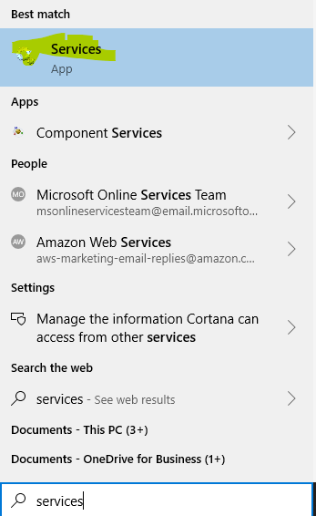

How do I change the account AIMMS PRO is running on?
=====================================================

IMPORTANT: since the end goal is that you’re running on another account then the system account, it might be possible that this new account does not allow you access to resources you previously could; please consult with your system administrator if this is the case.

Stop AIMMS PRO services
------------------------

Log in as an admin on the AIMMS PRO service and stop the services

.. image:: images/StopService1.png
    :align: center

Start Services app
----------------------------------------

Open up the services window, e.g. by hitting the windows button and typing ‘Services’

Select AIMMS PRO 2 service
-----------------------------------------

.. image:: images/piet.png
    :align: center

Actually change account
-----------------------------------------

.. image:: images/piet.png
    :align: center

see also: `service account <https://docs.microsoft.com/en-us/windows/security/identity-protection/access-control/service-accounts>`_

