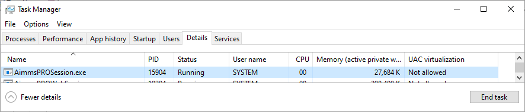
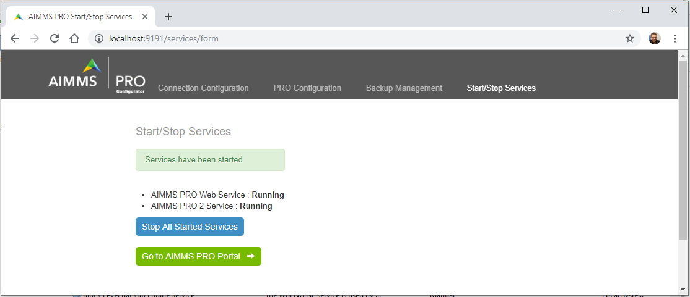
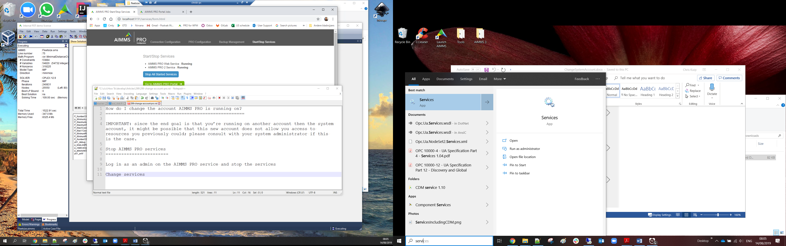
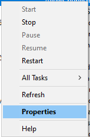
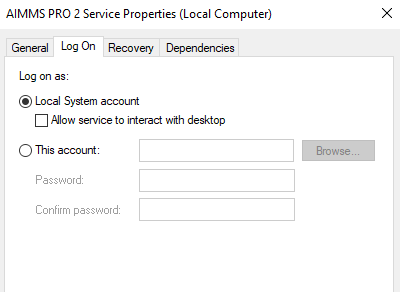
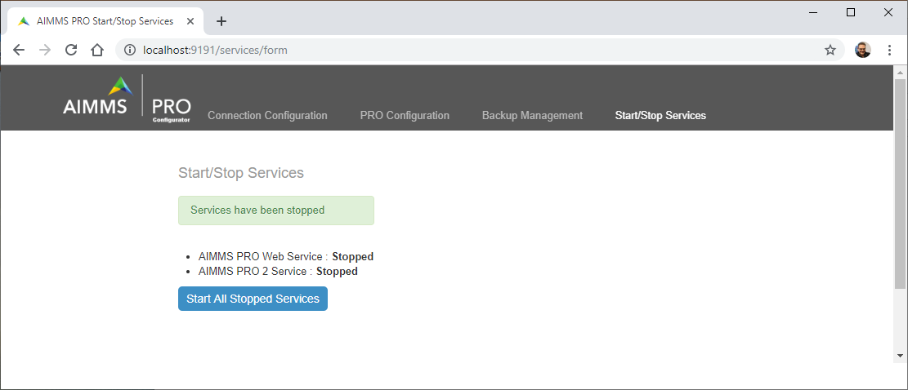
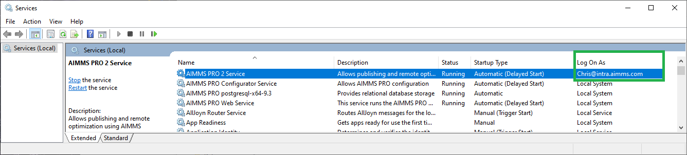
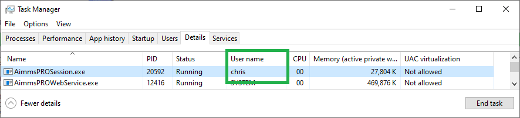

How do I change the account AIMMS PRO is running on?
=====================================================

By running a process using a particular account, resources can be acquired that are particular to that account. AIMMS jobs are started using the AIMMS PRO service, and use the same account on which the AIMMS PRO service is running; to make AIMMS jobs use such a particular account, we need to make the AIMMS PRO service run using that account. This article provides a detailed and verifiable step by step procedure to achieve just this.

.. note:: Since the end goal is that you’re running on another account then the system account, it might be possible that this new account does not allow you access to resources you previously could; please consult with your system administrator if this is the case.

Start situation
---------------

AIMMS jobs are run on a the AIMMS PRO server with the name ``AimmsPROSession.exe``. 

The default account for these jobs is ``SYSTEM``.

Stop AIMMS PRO services
------------------------

Before making changes to the service, it is a good idea to stop those services.
Log in as an admin on the AIMMS PRO service and stop the services

Start Services app
----------------------------------------

Open up the services window, e.g. by hitting the windows button and typing ‘Services’

Select AIMMS PRO 2 service
-----------------------------------------

.. image:: images/SelectAIMMSPROService1.png
    :align: center
    
As you can see, by default, the ``SYSTEM`` account is used for this service.
    
Select properties
-----------------------------------------

By selecting the properties of the process

Actually change account
-----------------------------------------

And then selecting the tab ``Log On``, we are able to select the account on which the AIMMS PRO 2 service will use next time it is started.

    
Here you can fill in another account, such as a service account.  See also: `service account <https://docs.microsoft.com/en-us/windows/security/identity-protection/access-control/service-accounts>`_

Start the service again
------------------------

Log in again as an admin on the AIMMS PRO service and start the services again:

Verify via Services
----------------------------------------

Open up the services window, e.g. by hitting the windows button and typing ‘Services’

The service is now using the account ``chris``

Verify by starting job
----------------------------------------

Starting the same job again, and opening up the task manager, details tab:

The account used for this AIMMS job is now ``chris``.

Materials
----------------

To create this article, this :download:`WinUI model <model/WaitABit.zip>` was used. After publishing and launching this app, just press the huge button, to start an AIMMS job that waits for five minutes on the AIMMS PRO server.

