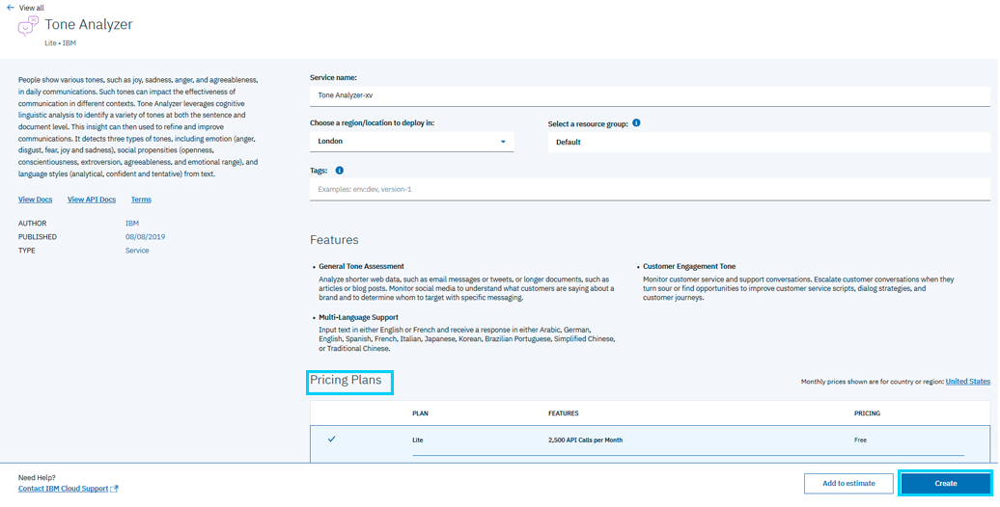
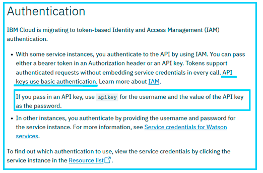

Convert Audio File with IBM API
================================================

.. meta::
   :description: An overview of using IBM APIs with AIMMS in the context of converting audio files to text.
   :keywords: IBM, API, audio, speech, text, http

This article contains an overview of IBM APIs, and a short example using the Speech-to-Text API.

Introduction to IBM APIs
-----------------------------------------------

IBM is known for their hardware and software, but they also provides a lot of APIs on the IBM Cloud. This API provides a variety of services, some free and some paid.

Their `IBM Cloud Docs: APIs <https://cloud.ibm.com/apidocs>`_ provides all the specifications for each API. 

You may want to start with reading the `Creating Apps tutorial <https://cloud.ibm.com/docs/apps/tutorials?topic=creating-apps-tutorial-starterkit>`_.

The HTTP request
^^^^^^^^^^^^^^^^

To use these APIs, you will need to formulate HTTP requests. The documentation provides you some request examples for each API.
To see a complete example about formulating CURL requests in AIMMS, see :doc:`../301/301-Image-Recognition`.

Authentication
^^^^^^^^^^^^^^

To access these APIs, it's required to authenticate in the request.

The system used is Identity and Access Management (`IAM <https://cloud.ibm.com/docs/services/watson?topic=watson-iam>`_) authentication, a token-based system. The authentication is then done through the ``Authentication`` request header using a token or an API key. 

If you use an API key, you must follow the format of a `Basic Access Authentication <https://en.wikipedia.org/wiki/Basic_access_authentication>`_.

Answers
^^^^^^^

The result sent back from a IBM API is usually a JSON file.
You'll need to convert this JSON file into an XML file to extract the data into AIMMS.

Example
-----------------------------------------------
We will here use the Speech-To-Text API from IBM. By sending an audio file, we'll be able to obtain the script of this video.

Prerequisites  
^^^^^^^^^^^^^^^^^^^^^^^^^^^^^^

* Obtain an API key: Go to `IBM Cloud Docs: Speech-to-Text API <https://cloud.ibm.com/catalog/services/speech-to-text>`_ and click *Sign up* in the top corner to create an IBM account.

* Install the AIMMS HTTP Client Library: See `AIMMS Documentation: Adding the HTTP Client Library <https://documentation.aimms.com/httpclient/library.html#adding-the-http-client-library-to-your-model>`_ for details.

Example project
^^^^^^^^^^^^^^^^^^^^^^^^^^^^^^

You can find the completed project example below. Note that you'll need to specify your own API key.

* :download:`SpeechToText.zip <download/SpeechToText.zip>`

You'll also need to download the audio file used in the example and unzip it at the root of your project folder.

* :download:`Space_Shuttle_Enterprise.zip <download/Space Shuttle Enterprise.zip>` 

Speech-to-Text conversion code
^^^^^^^^^^^^^^^^^^^^^^^^^^^^^^

The final code is shown below:

.. code-block:: aimms
    :linenos:
    
    ! indicate source and destination file
    SP_requestFileName := "Space Shuttle Enterprise.mp3";
    SP_responseFileName := "answer.json";
    SP_apikey:="YOUR_API_KEY";

    !given on the IBMCloud website
    SP_requestURI := "https://gateway-lon.watsonplatform.net/speech-to-text/api/v1/recognize?continuous=true";

    web::request_create(SP_requestId);
    web::request_setURL(SP_requestId, SP_requestURI);
    web::request_setMethod(SP_requestId, "POST");
    web::request_getHeaders(SP_requestId, SP_myHttpHeaders);
    !Authentication for the server
    web::base64_encode( "apikey" + ":" + SP_apikey, SP_authorization);
    SP_myHttpHeaders[ 'Authorization' ] := "Basic " + SP_authorization;
    web::request_setHeaders(SP_requestId, SP_myHttpHeaders);
    web::request_setRequestBody(SP_requestId, 'File', SP_requestFileName);
    web::request_setResponseBody(SP_requestId, 'File', SP_responseFileName);
    web::request_getOptions(SP_requestId,SP_Coption);
    SP_Coption['requestTimeout'] := "50"; 
    web::request_setOptions(SP_requestId, SP_Coption);
    web::request_invoke(SP_requestId, P_responseCode);

We'll need to set the identifiers:

.. code-block:: aimms
    :linenos:

    Parameter P_responseCode;
    StringParameter SP_Coption {
        IndexDomain: op;
    }
    Set S_Clientop {
        Index: op;
    }
    StringParameter SP_requestId;
    StringParameter SP_requestURI;
    StringParameter SP_myHttpHeaders {
        IndexDomain: web::httpHeader;
    }
    StringParameter SP_responseFileName;
    StringParameter SP_requestFileName;
    StringParameter SP_apikey;
    StringParameter SP_authorization;

In this article, we will analyze only selections of the code. You can read more generally about HTTP requests in AIMMS in :doc:`../294/294-Online-XML-HTTP-library`.

Authentication header
^^^^^^^^^^^^^^^^^^^^^^

Following `Basic Access Authentication <https://en.wikipedia.org/wiki/Basic_access_authentication>`_, we need to set our ``Authentication`` header to ``basic username:password``. Here, the username is "apikey" and the password the key value. Both of these strings must be base64-encoded.

To do so, we use the following code:
 
.. code-block:: aimms
    :linenos:

    SP_apikey:="YOUR_API_KEY";

    !getting the headers
    web::request_getHeaders(SP_requestId, SP_myHttpHeaders);
    
    !encoding the string "apikey : {API_KEY}" in base64
    web::base64_encode( "apikey" + ":" + SP_apikey, SP_authorization);

    !setting the Authorization header to "basic"+ encoded string
    SP_myHttpHeaders[ 'Authorization' ] := "Basic " + SP_authorization;

    !set back the new header for the request
    web::request_setHeaders(SP_requestId, SP_myHttpHeaders);

Options
^^^^^^^^^^^^

You can also use options to set characteristics for the request.

From `AIMMS Documentation: HTTP Client Library <https://manual.aimms.com/httpclient/api.html>`_ we learn that we can set ``requestTimeout``.
In some cases, like in this example, the API treatment is too long for the ``requestTimeout`` to be respected. In that case, you can set more time for the request to execute using this option.

.. code-block:: aimms
    :linenos:
    
    web::request_getOptions(SP_requestId,SP_Coption);
    SP_Coption['requestTimeout'] := "50"; 
    web::request_setOptions(SP_requestId, SP_Coption);

By executing the complete code you should be able to retrieve your JSON file in the ``SP_responseFileName`` direction or at the root of your project.

Converting JSON to XML
^^^^^^^^^^^^^^^^^^^^^^^^^^^^^^

We now have data in JSON format, but we need to convert it to XML to make it compatible with AIMMS. This process is detailed in :doc:`../283/283-convert-json-to-xml`.

To extract the data from your newly created XML file, follow the process described in :doc:`../293/293-extracting-data-from-XML`.

Related Topics
-----------------------------------------------

* **AIMMS How-To**: :doc:`../294/294-Online-XML-HTTP-library`
* **AIMMS How-To**: :doc:`../301/301-Image-Recognition`
