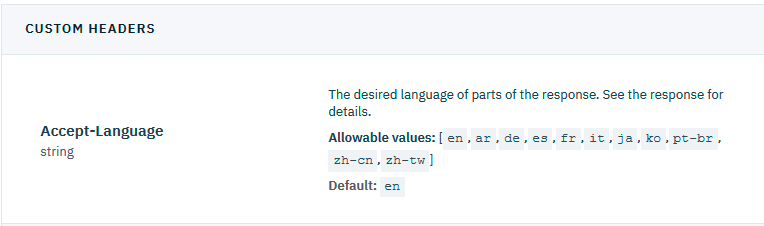
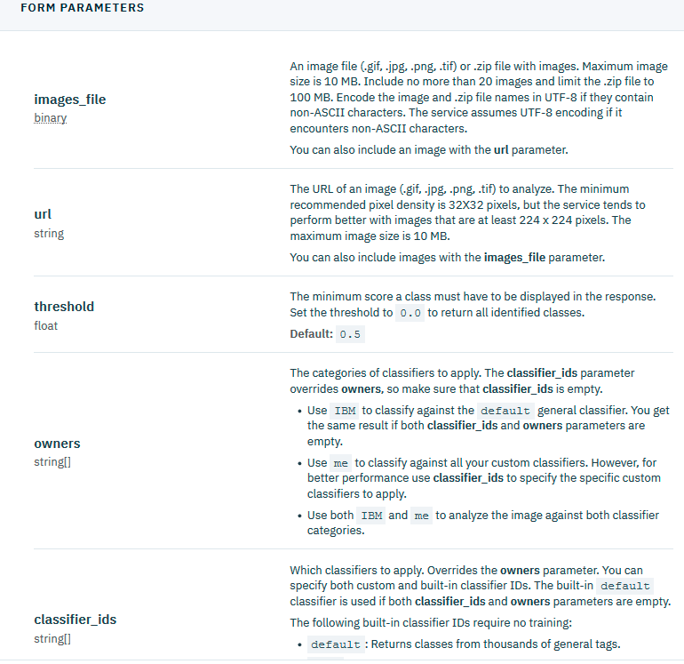
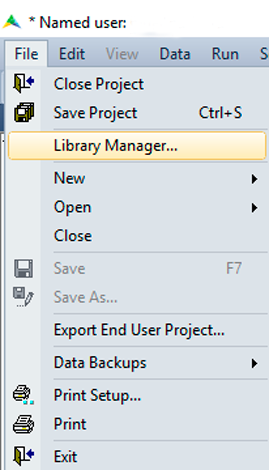
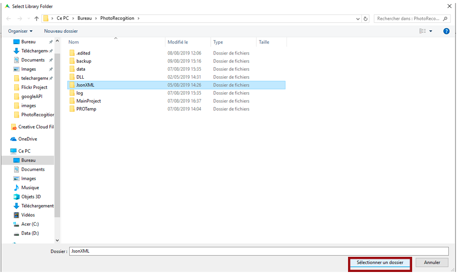
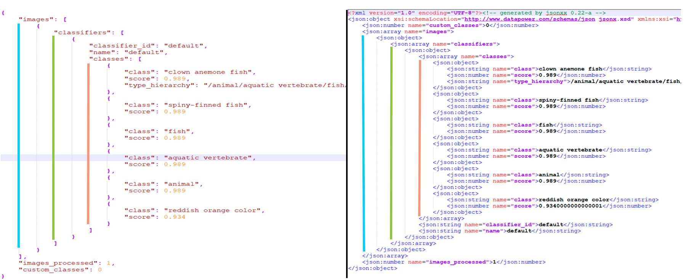

Use the IBM image recognition API.
==================================================================================================

In this article, we will show how to use the image recognition API from IBM to identify an image.
This APi takes an image (jpg,png,gif...) and gives back a JSON file explaining the result of the machine learning algorithm trying to recognize it.
But AIMMS doesn't support JSON files,so this article will also be the occasion for us to talk about JSON to XML conversion.

Prerequisites
-----------------------------------------------

* :download:`download this photo <download/clownfish.zip>` and unzip it a the root of your project folder.
* Obtain your own API key following `this reference <https://cloud.ibm.com/docs/services/visual-recognition?topic=visual-recognition-getting-started-tutorial>`_. You can stop after obtaining your API key, you don't have to worry about curl commands.
* install the AIMMS HTTP Client library following `this tutorial <https://documentation.aimms.com/httpclient/library.html#adding-the-http-client-library-to-your-model>`_ .

Exploring the documentation.
-----------------------------------------------

You can find in  the IBM Cloud website the `documentation of this API <https://cloud.ibm.com/apidocs/visual-recognition#classify-images>`_

The Authentication system we'll be using is a simple API key.
The request to classify an image can be a GET request using the url of a photo or a POST request where we'll send to the server the document to analyze. Here, we'll be using the POST request.

You can find informations about the used method in the subsection **Classify images** from the **Methods** section.

There are 3 different kinds of parameters we can set for this method.

**The first type are the headers**:

    
    
There is only one here which is used to set the language for the answer file,we will set it to "en" for english.

**The second one are the query parameters**:

    .. image:: images/queryparam.png
        :align: center
        
This one is the version of the API we want to use, and will here be 2018-03-19.

**The last one are the form parameters**:

        
we'll be using the images_file parameters that is used to set the photo we want to analyze. We'll also, as an example, set the parameters ``threshold`` and ``Classifiers_ids``.

The documentation is quite complete but it gives examples using cURL, which is a client for formulating HTTP request. Our goal will be to translate this into AIMMS and to see how we can set the different kind of parameters.

Example project
^^^^^^^^^^^^^^^^^^^^

You can download the example project here: :download:`AIMMS project <download/PhotoRecognition.zip>` 

Get the JSON file
-----------------------------------------------

The code at the end of this part will be this one:

.. code-block:: aimms
    :linenos:
    
    SP_requestFileName:="clownfish.JPG";
    SP_responseFileName := "Answer.json";
    SP_apikey:="YOUR_API_KEY";
    
    SP_Requestparam:={
        'version' : "2018-03-19",
        'threshold' : "0.6",
        'classifier_ids' : "default"
    };
    web::query_format(SP_Requestparam,SP_formattedRequestParam);
    
    !endpoint given on the IBMCloud documentation
    SP_requestURI := "https://gateway.watsonplatform.net/visual-recognition/api/v3/classify?"+SP_formattedRequestParam;
    
    !initialize request
    web::request_create(SP_requestId);
    
    !Set Headers and add a new one.
    web::HttpHeaders:= DATA{ Accept, Accept-Encoding, Authorization, Cache-Control, Content-Length, Content-Type, Transfer-Encoding, Location ,Accept-Language};
    web::request_getHeaders(SP_requestId, SP_myHttpHeaders);
    SP_myHttpHeaders[ 'Accept-Language' ] := "en";
    
    !Authentication
    web::base64_encode( "apikey" + ":" + SP_apikey, SP_authorization);
    SP_myHttpHeaders[ 'Authorization' ] := "Basic " + SP_authorization;
    web::request_setHeaders(SP_requestId, SP_myHttpHeaders);
    
    !Set request
    web::request_setURL(SP_requestId, SP_requestURI);
    web::request_setMethod(SP_requestId, "POST");
    web::request_setRequestBody(SP_requestId, 'File', SP_requestFileName);
    web::request_setResponseBody(SP_requestId, 'File', SP_responseFileName);
    web::request_getOptions(SP_requestId,SP_requestOption);
    SP_requestOption['requestTimeout'] := "30";
    web::request_setOptions(SP_requestId, SP_requestOption);
    web::request_invoke(SP_requestId, P_responseCode);

And you'll need these identifiers:

.. code-block:: aimms
    :linenos:
    
    StringParameter SP_requestFileName;
    StringParameter SP_responseFileName;
    StringParameter SP_requestURI;
    Parameter P_responseCode;
    StringParameter SP_requestId;
    StringParameter SP_requestOption {
        IndexDomain: web::co;
    }
    StringParameter SP_apikey;
    StringParameter SP_myHttpHeaders {
        IndexDomain: web::httpHeader;
    }
    StringParameter SP_authorization;
    Set S_Param {
        Index: i_p;
        InitialData: DATA{version,threshold,classifier_ids};
    }
    StringParameter SP_Requestparam {
        IndexDomain: i_p;
    }
    StringParameter SP_formattedRequestParam;

In this article, we'll not develop every part of this code because most of it is common for every HTTP request in AIMMS, but if you want to know more about it, you can check this How-to :doc:`../294/294-Online-XML-HTTP-library` article.

The parts we will talk about are:

* How to specify the query parameters
* How to specify the form parameters
* How to specify the request headers

Query parameters
^^^^^^^^^^^^^^^^^^^^

To begin, we need to know how to specify the **query parameters**.
Let's check the example of the documentation using cURL.

.. image:: images/Curl1.png

Here, the URL is specified at the end of the request and the query parameters are added at the end of the endpoint of the URL.
We can do the same thing in AIMMS:

.. code-block:: aimms
    :linenos:
    
    SP_Requestparam:={
        'version' : "2018-03-19",
    };
    web::query_format(SP_Requestparam,SP_formattedRequestParam);
    SP_requestURI := "https://gateway.watsonplatform.net/visual-recognition/api/v3/classify?"+SP_formattedRequestParam;

Form parameters 
^^^^^^^^^^^^^^^^^^^^

.. image:: images/Curl2.png

In the given example, the form parameters are specified by writing "-F parameter= value". Obviously, it'll not work like that in AIMMS.
What we can do is check the `CURL documentation <https://curl.haxx.se/docs/httpscripting.html#The_HTTP_Protocol>`_ . 

There, we can learn in the **4.2 : GET** subsection of the section **4 : HTML Forms** that when you specify this kind of parameters in cURL, the client then redirect to another url composed of the basic url where we add the formatted form parameters at the end.
We can also do this in AIMMS. Let's transform the previous code to make one stone two birds and configure at the same time form parameters and query parameters.

.. code-block:: aimms
    :linenos:
    
    SP_Requestparam:={
        'version' : "2018-03-19",
        'threshold' : "0.6",
        'classifier_ids' : "default"
    };
    web::query_format(SP_Requestparam,SP_formattedRequestParam);
    SP_requestURI := "https://gateway.watsonplatform.net/visual-recognition/api/v3/classify?"+SP_formattedRequestParam;

The ``threshold`` and ``classifier_ids`` parameters can be set in the request URL but the ``images_file`` hasn't for value a text or a float we can put in the URL, so it needs to be set elsewhere.
For that, we can use the ``web::request_setRequestBody`` method to put the file to analyze in the body of the request which is used to send file to the server.

.. code-block:: aimms
    :linenos:
    
    SP_requestFileName:="clownfish.JPG";
    web::request_setRequestBody(SP_requestId, 'File', SP_requestFileName);

Specify headers.
^^^^^^^^^^^^^^^^^^^^

We want to specify the **headers** of the request.
More specificly, we want to specify a header called ``Accept-Language``. The HTTP client library already have methods to set headers, but this is not a native header of the HTTP client library, so we need to add it to the list of headers.

.. code-block:: aimms
    :linenos:
    
    web::HttpHeaders:= DATA{ Accept, Accept-Encoding, Authorization, Cache-Control, Content-Length, Content-Type, Transfer-Encoding, Location ,Accept-Language};

And then we can set the headers to their proper values.

.. code-block:: aimms
    :linenos:
    
    web::request_getHeaders(SP_requestId, SP_myHttpHeaders);
    SP_myHttpHeaders[ 'Accept-Language' ] := "en";
    web::request_setHeaders(SP_requestId, SP_myHttpHeaders);
    
Authentication
^^^^^^^^^^^^^^^^^^^^

.. image:: images/Curl3.png
 
    
In the documentation example, it is done by writing down "-u apikey:{your_api_key}".
In AIMMS, what we'll use is the ``Authentication`` header and we'll set a basic authentication as referred in this `Wikipedia article <https://en.wikipedia.org/wiki/Basic_access_authentication>`_.
Here, the user id is "apikey" and the password is your api key.

 
.. code-block:: aimms
    :linenos:
    
    web::base64_encode( "apikey" + ":" + SP_apikey, SP_authorization);
    SP_myHttpHeaders[ 'Authorization' ] := "Basic " + SP_authorization;
    web::request_setHeaders(SP_requestId, SP_myHttpHeaders);    

Executing the complete code, we're now able to obtain our JSON file in the ``SP_responseFileName`` direction.

Conversion to XML
-----------------------------------------------
In order to use the data from the IBM APIs in AIMMS, we need to convert JSON files in XML files. 
For that, download :download:`this archive <download/JSONXML.zip>`. Then, extract the two folders at the root of your project.
It contains a conversion AIMMS library between XML and JSON files.
Here is how to install it:

* open the Library Manager.

* click on **add existing library**

.. image:: images/step2.png

* select the JSONXML folder and click on **select a folder**

* Click on **ok** to leave the library manager.

.. image:: images/step4.png

Then by calling the method ``jxml::ConvertFromJsonToXML`` you should be able to obtain your data into an XML file.

.. code-block:: aimms
    :linenos:

    jxml::ConvertFromJsonToXML(SP_InputFile,"Answer.xml");

During the conversion, the general structure of the JSON file is conserved. For every json element{}, an xml <element> is created. Be careful, if the json element had a name then it will be set as a **parameter** of the corresponding xml element.

If you want to know how to extract the XML data into AIMMS, feel free to check this article : :doc:`../293/293-extracting-data-from-XML`

Related topics.
-----------------------------------------------
* **AIMMS How-To**: :doc:`../294/294-Online-XML-HTTP-library`
* **AIMMS How-To**: :doc:`../300/300-ibm-overview`
