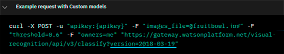
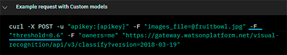
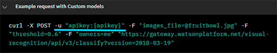

Use the IBM Image Recognition API
==================================================================================================

.. meta::
   :description: An overview of using IBM APIs with AIMMS in the context of image recognition.
   :keywords: IBM, API, image, recognition, http

In this article, we will show how to use the Image Recognition API from IBM to identify an image.

This API takes an image (JPG, PNG, GIF, etc) and returns a JSON file explaining the result of the machine learning algorithm trying to recognize it.

Prerequisites
-----------------------------------------------
Before we begin, make sure you have done the following:

* Download and unzip the photo from the link below, and place it at the root of your project folder. 

    :download:`Clownfish photo <download/clownfish.zip>`

* Read the IBM tutorial and obtain your own API Key from the link below. (The CURL section is not relevant for this case.)

    `IBM APIs: Visual Recognition Tutorial <https://cloud.ibm.com/docs/services/visual-recognition?topic=visual-recognition-getting-started-tutorial>`_

* Install the AIMMS HTTP Client Library according to `AIMMS Documentation: Adding the HTTP Client Library <https://documentation.aimms.com/httpclient/library.html#adding-the-http-client-library-to-your-model>`_.

Basics of IBM Cloud APIs
-----------------------------------------------

You can find information about this API in `IBM Cloud API Docs: Visual Recognition <https://cloud.ibm.com/apidocs/visual-recognition/visual-recognition-v3#classify>`_.

The Authentication system we'll be using is a simple API key.
You can use a GET request using the URL of a photo, or a POST request to send the document to analyze to the server. (Here, we'll be using the POST request, explained in IBM docs in section *Methods > Classify images*.)

There are 3 kinds of parameters we can set for this method.

* **Headers**:

    .. image:: images/customparam.png
        :align: center
        
        
    We'll set the language for the answer file to ``en`` for English.

* **Query parameters**:

    .. image:: images/queryparam.png
            :align: center
            
    We'll specify the version of the API we want to use, in this case ``2018-03-19``.

* **Form parameters**:

    .. image:: images/formparam.png
        :align: center
            
    We'll be using the ``images_file`` parameters that is used to set the photo we want to analyze. We'll also set the parameters ``threshold`` and ``Classifiers_ids`` as an example.

The IBM documentation gives examples using CURL, a client for formulating HTTP requests. Here we'll find out how to translate the CURL requests into AIMMS and set the parameters.

Example project
----------------

You can download the example project here: :download:`AIMMS project <download/PhotoRecognition.zip>` 

We'll first show how to get the JSON file.

Then we will talk about how to specify the following:

* Query parameters
* Form parameters
* Request headers

Getting the JSON file
^^^^^^^^^^^^^^^^^^^^^^

The final code will be:

.. code-block:: aimms
    :linenos:
    
    SP_requestFileName:="clownfish.JPG";
    SP_responseFileName := "Answer.json";
    SP_apikey:="YOUR_API_KEY";
    
    SP_Requestparam:={
        'version' : "2018-03-19",
        'threshold' : "0.6",
        'classifier_ids' : "default"
    };
    web::query_format(SP_Requestparam,SP_formattedRequestParam);
    
    !endpoint given on the IBMCloud documentation
    SP_requestURI := "https://gateway.watsonplatform.net/visual-recognition/api/v3/classify?"+SP_formattedRequestParam;
    
    !initialize request
    web::request_create(SP_requestId);
    
    !Set Headers and add a new one.
    web::HttpHeaders:= DATA{ Accept, Accept-Encoding, Authorization, Cache-Control, Content-Length, Content-Type, Transfer-Encoding, Location ,Accept-Language};
    web::request_getHeaders(SP_requestId, SP_myHttpHeaders);
    SP_myHttpHeaders[ 'Accept-Language' ] := "en";
    
    !Authentication
    web::base64_encode( "apikey" + ":" + SP_apikey, SP_authorization);
    SP_myHttpHeaders[ 'Authorization' ] := "Basic " + SP_authorization;
    web::request_setHeaders(SP_requestId, SP_myHttpHeaders);
    
    !Set request
    web::request_setURL(SP_requestId, SP_requestURI);
    web::request_setMethod(SP_requestId, "POST");
    web::request_setRequestBody(SP_requestId, 'File', SP_requestFileName);
    web::request_setResponseBody(SP_requestId, 'File', SP_responseFileName);
    web::request_getOptions(SP_requestId,SP_requestOption);
    SP_requestOption['requestTimeout'] := "30";
    web::request_setOptions(SP_requestId, SP_requestOption);
    web::request_invoke(SP_requestId, P_responseCode);

Additionally, you'll need these identifiers:

.. code-block:: aimms
    :linenos:
    
    StringParameter SP_requestFileName;
    StringParameter SP_responseFileName;
    StringParameter SP_requestURI;
    Parameter P_responseCode;
    StringParameter SP_requestId;
    StringParameter SP_requestOption {
        IndexDomain: web::co;
    }
    StringParameter SP_apikey;
    StringParameter SP_myHttpHeaders {
        IndexDomain: web::httpHeader;
    }
    StringParameter SP_authorization;
    Set S_Param {
        Index: i_p;
        InitialData: DATA{version,threshold,classifier_ids};
    }
    StringParameter SP_Requestparam {
        IndexDomain: i_p;
    }
    StringParameter SP_formattedRequestParam;

In this article, we will analyze only selections of the code. You can read more generally about HTTP requests in AIMMS in :doc:`../294/294-Online-XML-HTTP-library`.

Query parameters
^^^^^^^^^^^^^^^^^^^^

To begin, we need to know how to specify the **query parameters**.
Let's check the example of the documentation using CURL.

Here, the URL is specified at the end of the request, and the query parameters are added at the end of the endpoint of the URL. We can do the same thing in AIMMS:

.. code-block:: aimms
    :linenos:
    
    SP_Requestparam:={
        'version' : "2018-03-19",
    };
    web::query_format(SP_Requestparam,SP_formattedRequestParam);
    SP_requestURI := "https://gateway.watsonplatform.net/visual-recognition/api/v3/classify?"+SP_formattedRequestParam;

Form parameters 
^^^^^^^^^^^^^^^^^^^^

In the given example, the form parameters are specified by writing ``-F parameter= value``. 

From the `CURL documentation <https://curl.haxx.se/docs/httpscripting.html>`_  (in section **4.2 : GET** ) we learn that when you specify this kind of parameters in CURL, the client then redirects to another URL, i.e., the base URL plus the formatted form parameters.

We can also do the same thing in a different way in AIMMS. Let's transform the previous code and configure the form and query parameters.

.. code-block:: aimms
    :linenos:
    
    SP_Requestparam:={
        'version' : "2018-03-19",
        'threshold' : "0.6",
        'classifier_ids' : "default"
    };
    web::query_format(SP_Requestparam,SP_formattedRequestParam);
    SP_requestURI := "https://gateway.watsonplatform.net/visual-recognition/api/v3/classify?"+SP_formattedRequestParam;

The ``threshold`` and ``classifier_ids`` parameters can be set in the request URL but the ``images_file`` doesn't have a text value or a float we can put in the URL, so it needs to be set elsewhere.
For that, we can use the ``web::request_setRequestBody`` method to put the file to be analyzed in the body of the request which sends the file to the server.

.. code-block:: aimms
    :linenos:
    
    SP_requestFileName:="clownfish.JPG";
    web::request_setRequestBody(SP_requestId, 'File', SP_requestFileName);

Specifying headers
^^^^^^^^^^^^^^^^^^^^

We want to specify the **headers** of the request.
More specifically, we want to specify a header called ``Accept-Language``. We need to add it to the list of headers, as is not a native header of the HTTP Client Library.

.. code-block:: aimms
    :linenos:
    
    web::HttpHeaders:= DATA{ Accept, Accept-Encoding, Authorization, Cache-Control, Content-Length, Content-Type, Transfer-Encoding, Location ,Accept-Language};

And then we can set the headers to their proper values.

.. code-block:: aimms
    :linenos:
    
    web::request_getHeaders(SP_requestId, SP_myHttpHeaders);
    SP_myHttpHeaders[ 'Accept-Language' ] := "en";
    web::request_setHeaders(SP_requestId, SP_myHttpHeaders);
    
Authentication
^^^^^^^^^^^^^^^^^^^^

 
    
In the documentation example, it is done by writing ``-u apikey:{your_api_key}``.

In AIMMS, we'll use the ``Authentication`` header and set a basic authentication as referenced in `Basic Access Authentication <https://en.wikipedia.org/wiki/Basic_access_authentication>`_.

(Here, the user ID is "apikey" and the password is your API key.)

 
.. code-block:: aimms
    :linenos:
    
    web::base64_encode( "apikey" + ":" + SP_apikey, SP_authorization);
    SP_myHttpHeaders[ 'Authorization' ] := "Basic " + SP_authorization;
    web::request_setHeaders(SP_requestId, SP_myHttpHeaders);    

Executing the complete code, our JSON file will be returned in the ``SP_responseFileName`` direction.

Converting JSON to XML
-----------------------------------------------
In order to use the data from the IBM APIs in AIMMS, we need to convert JSON files to XML files. 
You can follow the conversion process using a custom AIMMS library in :doc:`../283/283-convert-json-to-xml`.

Finally, to learn how to extract the XML data into AIMMS, read :doc:`../293/293-extracting-data-from-XML`.

Related Topics
-----------------------------------------------
* **AIMMS How-To**: :doc:`../294/294-Online-XML-HTTP-library`
* **AIMMS How-To**: :doc:`../300/300-ibm-api-speech-to-text`
