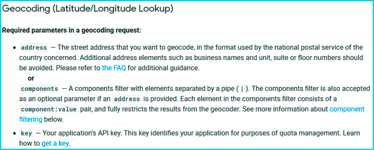
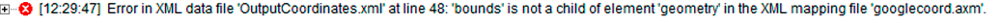

Retrieve Geographic coordinates with Google Maps API
==================================================================================================

.. meta::
   :description: Using Google Maps API to return geographic coordinates to an AIMMS project.
   :keywords: google, API, XSD

In this article, we will learn how to obtain coordinates using a HTTP request. We'll use the Geocoding API from Google Maps, which returns coordinates for a given location.

Prerequisites
--------------

Before we begin, there are a couple things you'll need to have in place.

* Install the HTTP library, please read `AIMMS Documentation: Adding the HTTP Client Library <https://documentation.aimms.com/httpclient/library.html#adding-the-http-client-library-to-your-model>`_.

* Get a Google API key. Get one from `Google Maps Platform: Get an API Key <https://developers.google.com/maps/documentation/geolocation/get-api-key>`_.

Example project
------------------

You can download the example AIMMS project here: :download:`Google API Example.zip <downloads/GoogleAPIExample.zip>` 

Informations about the request
-----------------------------------------------
Scrolling the `Google Maps API documentation <https://developers.google.com/maps/documentation/geocoding/intro>`_, we can learn precious information about how to formulate our request.
The Authentication is made using an API key and the URL should take the following shape:

.. raw:: html

    

To provide output in a format compatible with AIMMS, we will specify XML rather than JSON in our request.
We can also find the list of required parameters for the request:

Here, we will use the key and the address parameters.
The `Google Maps API documentation <https://developers.google.com/maps/documentation/geocoding/intro>`_, lists several optional parameters to further specify your request.

Creating the request
-----------------------------------------------

To create the request, the code is as follows:

.. code-block:: aimms
	:linenos:
	
	SP_responseFile:="OutputCoordinates.xml";
	SP_key:="YOUR_API_KEY";
	SP_location:="AIMMS Haarlem";
	SP_requestparameters:= DATA{key,address};
	SP_requestparameters['key']:=SP_key;
	SP_requestparameters['address']:=SP_location;
	web::query_format(SP_requestparameters,SP_formattedparameters);

	SP_URL:="https://maps.googleapis.com/maps/api/geocode/xml?"+SP_formattedparameters;
	web::request_create(SP_requestId);
	web::request_setMethod(SP_requestId,"GET");
	web::request_setURL(SP_requestId,SP_URL);
	web::request_setResponseBody(SP_requestId,'File',SP_responseFile);
	web::request_invoke(SP_requestId,P_responsecode);

You'll also need the following AIMMS identifiers:

.. code-block:: aimms
   :linenos:
	
	Parameter P_Lat;
   Parameter P_Long;
   StringParameter SP_responseFile;
   Set S_reqpar {
      Index: rp;
      InitialData: DATA{key,address};0001
   }
   StringParameter SP_requestparameters {
      IndexDomain: rp;
   }
   StringParameter SP_URL;
   StringParameter SP_requestId;
   Parameter P_responsecode;
   StringParameter SP_key;
   StringParameter SP_location;
   StringParameter SP_formattedparameters;

.. note:: 

	* Learn more about the basics of HTTP request in AIMMS in :doc:`../294/294-Online-XML-HTTP-library`.
	* Learn more about HTTP requests for Google APIs in :doc:`../296/296-obtaining-geographic-data-through-the-google-api`.

Retrieving and mapping XML data
--------------------------------
We want to know the location of the AIMMS office in Haarlem. After executing the request procedure, we get in the ``SP_responseFile`` direction the XML answer from the API.

Using the `XSD generator from Freeformatter.com <https://www.freeformatter.com/xsd-generator.html>`_, we can get the XSD file required to use the AIMMS XML schema Mapping tool. Let's put this XSD file in the root of our project, with the name "googlecoord.xsd". 

The XML Schema mapping tool generates an AXM file from an XSD file to map the data into AIMMS identifiers.

For a tutorial about XML mapping, read :doc:`../293/293-extracting-data-from-XML`.

We want to do the following mapping:

* ``Geometry/location/lat`` **Maps-to** ``P_lat``
* ``Geometry/location/lng`` **Maps-to** ``P_long``
* put **every Read-filter attribute to 0** except for the objects used (lat,lng,geometry,location,result)

Then, by using the ``READXML`` method, we can extract the coordinates we want into AIMMS.

.. code-block:: aimms
	
	READXML(SP_responseFile,"googlecoord.axm");

Complete the XSD
------------------

After completing these steps, you may expect that modifying the ``SP_location`` gives us access to the coordinates of any location we want.

But, if you change the value of ``SP_location`` to *Amsterdam*, you'll have the following error message after executing the complete procedure:

The reason is that the Google API sends back an XML file that has a slightly different shape depending on the location you're asking for; some elements are added or deleted. This means that some elements of the XML file from the request are not in the XSD file, which causes an error.

To solve this problem, we would need need to know all possible XML answer formats from this API, which Google doesn't provide.
Therefore we can only expand our current XSD file with the missing information after each error encountered.

The error refers to a 'bound' element missing from our current XSD file. Let's check where it is.

.. image:: images/comparison.PNG

The ``bound`` is set after the ``viewport`` node in the Amsterdam XSD file, so let's copy/paste the block in the original XSD file.
Then, again using the XML schema mapping tool to set the ``bound`` read-filter attribute to ``0`` and executing the procedure, we can get the proper coordinates.

We're providing an XSD file to get you started: :download:`googlecoord.zip <downloads/googlecoord.zip>`

However, this file may be incomplete, so be prepared to make your own additions to the XSD file while using this API.

Related Topics
-----------------------------------------------
* **AIMMS How-To**: :doc:`../294/294-Online-XML-HTTP-library`
* **AIMMS How-To**: :doc:`../293/293-extracting-data-from-XML`
* **AIMMS How-To**: :doc:`../296/296-obtaining-geographic-data-through-the-google-api`