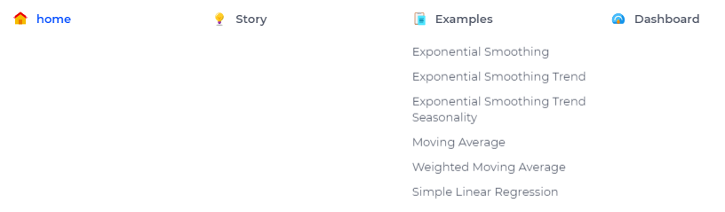
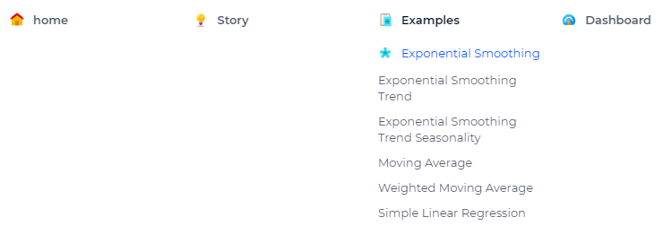

Adding an Icon on your Menu Bar
=================================

This article illustrates how to add an icon on the menu bar of your project while using an AIMMS WebUI application. 
Please use the `Demand Forecasting <https://how-to.aimms.com/Articles/550/550-demand-forecasting.html>`_ example to experiment with this feature.

Example
--------

To add icons into the menu as shown on the following image, you need to follow a few steps. 

.. image:: images/end.png
    :align: center

Step 1
~~~~~~~~~
Add a ``css`` file named ``menu.css`` in the folder ``./MainProject/WebUI/resources/stylesheets``. If you are using the Demand Forecasting project, you will realize that this file already exists. 

Step 2
~~~~~~~~~
Note that there are some icons already in place into this menu bar. 

|

Those were done by the code below, if you are using the Demand Forecasting example, this code is already in the ``css`` file.  

.. code-block:: css
    :linenos:

    a.page-link[href$="Story"]:before {
        content: "";
        display: block;
        background: url("img/idea.png") no-repeat;
        width: 20px;
        height: 20px;
        float: left;
        margin: 0 6px 0 0;
    }

    a.page-link[href$="Dashboard"]:before {
        content: "";
        display: block;
        background: url("img/dash.png") no-repeat;
        width: 20px;
        height: 20px;
        float: left;
        margin: 0 6px 0 0;
    }

    a.page-link[href$="home"]:before {
        content: "";
        display: block;
        background: url("img/home.png") no-repeat;
        width: 20px;
        height: 20px;
        float: left;
        margin: 0 6px 0 0;
    }

    a.page-link[href$="Examples"]:before {
        content: "";
        display: block;
        background: url("img/example.png") no-repeat;
        width: 20px;
        height: 20px;
        float: left;
        margin: 0 6px 0 0;
    }

Now we will add an icon also for the subpages below 'Examples'. For that, go to any icon website and select your favorite icon *(16px x 16px)* to use. Here we will be using :download:`this <images/asterisk-16.png>`: 
 

Step 3
~~~~~~~~~

Let's start by adding the icon for the *Exponential Smoothing* page first, similar to the code above, to add an icon to *Exponential Smoothing*, the ``css`` code is:

.. code-block:: css
    :linenos:

    a.page-link[href$="Exponential Smoothing"]:before {
        content: "";
        display: block;
        background: url("img/asterisk-16.png") no-repeat;
        width: 20px;
        height: 20px;
        float: left;
        margin: 0 6px 0 0;
    }

|

Remarks:
- *href* is the name of your page. 
- *background* is the icon already on 16px x 16x.

Step 4
~~~~~~~~~

Use the same idea and continue doing for the other 5 pages. Your result will be:

.. image:: images/end.png
    :align: center

.. spelling::
    aimms
    uri