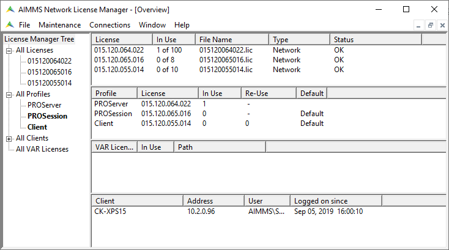

How do I transfer the license server for AIMMS PRO?
=======================================================

Obviously, we're not transfering the program, but transfering the corresponding AIMMS Licenses from one server to the next.
In the following, we will call these servers the **source** host and the **target** host respectively.

We do this in three steps, detailed in the sections below:

#. Deactivating the licenses on the source host

#. Installing the license server on the target host

#. Activating the licenses on the target host

Deactivating the licenses on the source host
------------------------------------------------

Before deactivating the licenses we should carefully jot down the information in those licenses, because we are going to need them later on.
For an AIMMS PRO server, you have actually three licenses:

#. **PROServer** The license for the AIMMS PRO system itself, visualized by the portal.

#. **PROSession** The license to start solver sessions. This license limits the number of solver sessions that are handled in parallel.

#. **Client** The license to start client sessions (seats). This license limits the number of users that can be logged on to the AIMMS PRO server at the same time.

    
At a later stage you will need to know for each profile, to which license it is linked.
An easy way is to create a screen shot of the license server like the one above.

To actually start de-activating the licenses from the source computer:

*    In AIMMS Network License Manager, go to *Maintenance > Maintenance mode*.

    .. image:: images/maintenance-mode.png
        :align: center

*   Go to *Maintenance > License > License Configuration*.

    .. image:: images/license-config.png
        :align: center

*   For each of the three licenses, deactivate it by following the dialogue started by the *deactivate* button.

    .. image:: images/LicenseDeactivate.png
        :align: center

Installing and starting the license server on the target host
------------------------------------------------------------------

Download the `license server <https://www.aimms.com/english/developers/downloads/download-aimms/aimms-network-license-server>`_  here.
Installing the downloaded ``.msi`` file requires elevated privilage.

Once installed, you can start the license manager using

#. Start menu - Category AIMMS - select *AIMMS License Manager*, or

#. Start menu icon - start typing ``license`` and select the *AIMMS License Manager*

    .. image:: images/StartingLicenseManagerFromCommandPrompt.png
        :align: center

Now we can start the license manager to specify the licenses on the target host as detailed in the next section:

Activating the licenses on the target host
----------------------------------------------

#. Starting to add licenses:

    .. image:: images/StartingWithFirstLicense.png
        :align: center
        
    This will start a dialogue where you have to enter the activation code as supplied by AIMMS. 
    In addition, you'll have to choose for machine node lock protection:

    .. image:: images/NodelockProtectionSwitchToMachineNodelock.png
        :align: center

#. Add next licenses:

    The other two licenses can be added by pressing the *Install license...* button:

    .. image:: images/InstallNextLicense.png
        :align: center

#. Rename profile

    After adding the licenses, each of the licenses will get an abstract name. You will need to rename the profiles.
    There is only one way to rename these profiles.  This is as follows:

    In the left panel of the license manager: 
    
    #. open "All Profiles" by clicking on the "+", 
    
    #. click on the profile name, and (a second later) click again on the profile name. 
    
    You will thus be able to change the name of the profile.
    
    .. image:: images/RenamingProfile.png
        :align: center
    
