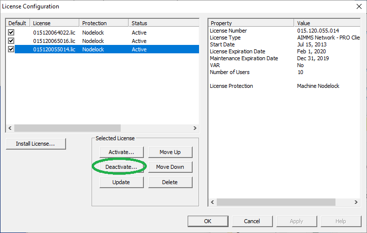
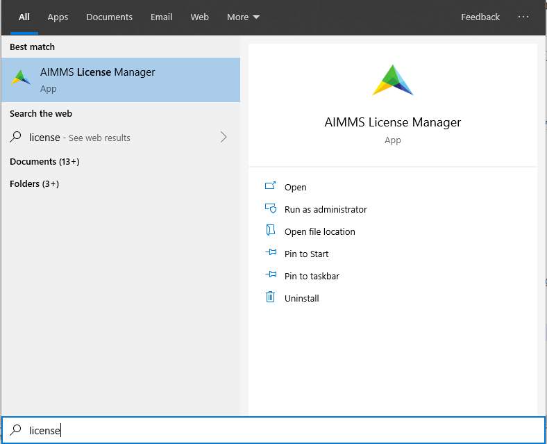
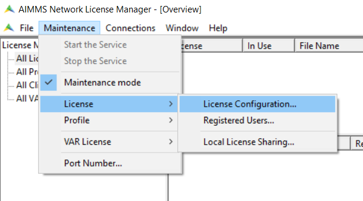
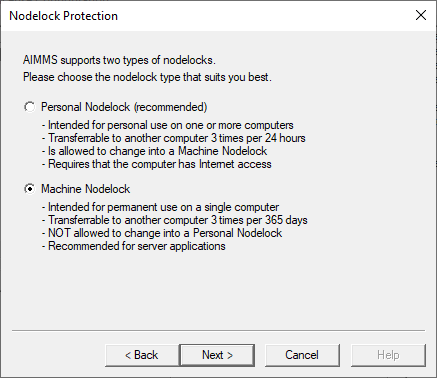
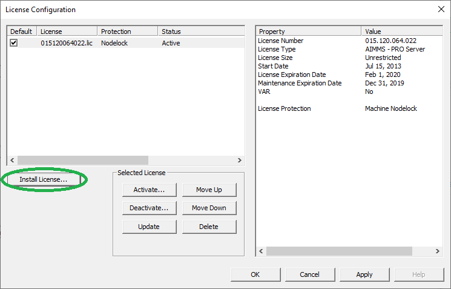

Migrate AIMMS PRO License Server
==================================

.. meta::
   :description: How to migrate your PRO license server to another machine.
   :keywords: PRO, license, server, migrate, move, transfer

This article explains how to transfer AIMMS Licenses to a new server. For instructions to migrate your PRO server, please see :doc:`../308/308-migrate-pro-server-another-machine`.

We will call these servers the original machine (**source host**) and the new machine (**target host**).

We do this in a few steps, detailed in the sections below:

1. Back up the license information.

#. Deactivate the licenses on the original machine.

#. Install the license server on the new machine.

#. Activate the licenses on the new machine.

Backing up the License Information
-------------------------------------

Before deactivating the licenses, carefully copy the information in those licenses for later reference.
You will need to know which license is linked to which profile.

An easy way is to create a screenshot of the license server like the one below.

.. image:: images/LicenseManagerOverview.png
    :align: center

|

For an AIMMS PRO server, you actually have three licenses:

* **PROServer**: The license for the AIMMS PRO system itself, visualized by the portal.

* **PROSession**: The license to start solver sessions. This license limits the number of solver sessions that are handled in parallel.

* **Client**: The license to start client sessions (seats). This license limits the number of users that can be logged on to the AIMMS PRO server at the same time.

Deactivating the Licenses on the Original Machine
---------------------------------------------------

To deactivate the licenses from the original machine:

1. In AIMMS Network License Manager, go to :menuselection:`Maintenance > Maintenance mode`.

.. image:: images/maintenance-mode.png
    :align: center

|

2. Go to :menuselection:`Maintenance > License > License Configuration`.

.. image:: images/license-config.png
    :align: center

|

3. For each of the three licenses, deactivate it by following the dialog started by the :menuselection:`Deactivate` button.

|

Installing and Starting the License Server on the New Machine
------------------------------------------------------------------

Download the `AIMMS Network License Server <https://www.aimms.com/support/downloads/#aimms-other-download>`_. Installing the downloaded ``.msi`` file requires admin rights.

Once installed, start the AIMMS License Manager from the AIMMS application folder (or search for ``license`` from the Windows Start menu icon).

|

Activating the Licenses on the New Machine
----------------------------------------------

Now we can start the license manager to specify the licenses on the new machine.

1. Start to add licenses:

    
|

This will start a dialog where you should enter the activation code as supplied by AIMMS. 
Select :menuselection:`Machine Nodelock` protection:

|

2. The other two licenses can be added by pressing the :menuselection:`Install License...` button:

|

3. After adding the licenses, each is assigned an abstract name. You can rename the profiles:
    
    A. Go to the left panel of the license manager.
    
    B. Open "All Profiles" by clicking on the "+".
    
    C. Click on the profile name, and (a second later) click again on the profile name.     
    
    .. image:: images/RenamingProfile.png
        :align: center

|

You have now migrated your license server!

.. seealso::

    * :doc:`../308/308-migrate-pro-server-another-machine`
    * `AIMMS PRO License Server Installation <https://documentation.aimms.com/pro/license-server.html>`_