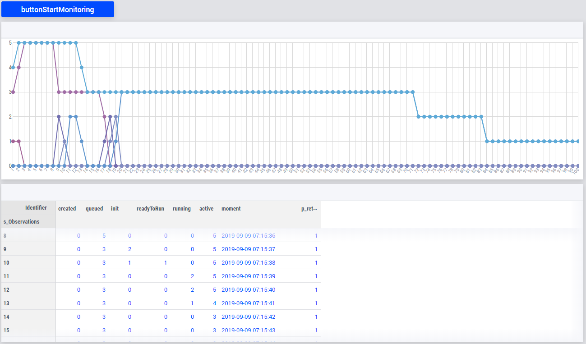

Number of running and pending solver sessions
=============================================

.. meta::
   :description: The number of pending and running jobs may influence the decision to add more jobs.
   :keywords: deployment, AIMMS Cloud, jobs, queue, queueing, solving

.. RetrieveSessionList
.. ListActiveSessions
.. ListSessionByStatus
.. ListSessionSinceDate
.. pro::sessionmanager::ListActiveSessions
.. pro::sessionmanager::ListSessionByStatus
.. pro::sessionmanager::ListSessionSinceDate
.. pro::sessionmanager::RetrieveSessionList
.. 

When starting a new solver session it is useful to know whether there are other server sessions started on the same server. This article explains how to find out the number of sessions running at an AIMMS Cloud.

Scope
----------------

We will discuss two variations on the number of server sessions:

#. The number of AIMMS Cloud sessions actually running.

#. The number of AIMMS Cloud active sessions, i.e., sessions not yet finished.

Obtain number of sessions running
-----------------------------------

To obtain the number of solver session actually running,
you can use ``pro::sessionmanager::ListSessionSinceDate``.

We use the following code, 
where ``p_NoRun`` contains the number of server sessions actually running.

.. code-block:: aimms
    :linenos:

    p_ret := pro::Initialize();
    if not (p_ret) then return 0; endif;

    if pro::GetPROEndPoint() then
        sp_SinceDate :=  fnc_CurrentToStringDelta(-24*60*60); ! Assuming jobs older than a day are no longer interesting.

        p_AllUsers := 1 ;
        if (p_AllUsers) then
            sp_SessionModelId := "";
            sp_SessionModelVersion := "";
        else
            sp_SessionModelId := pro::ModelName; ! Retrieve sessions for all versions of the model
            sp_SessionModelVersion := ""; ! don't restrict to a specific ModelVersion
        endif;

        ! Load raw session list from PROT
        p_ret := pro::sessionmanager::ListSessionSinceDate(
            dateStr           :  sp_SinceDate, 
            SessionList       :  S_SessionList, 
            ClientQueue       :  sp_ClientQueue, 
            WorkerQueue       :  sp_WorkerQueue, 
            CurrentStatus     :  p_CurrentStatus, 
            CreateTime        :  sp_CreateTime, 
            userEnvironment   :  sp_UserEnv, 
            UserName          :  sp_UserName, 
            proj              :  sp_Application, 
            clientRef         :  sp_OriginalCasePath, 
            descr             :  sp_RequestDescription, 
            proc              :  sp_RequestProcedure, 
            timeOut           :  p_RunTimeOut, 
            inputDataVersion  :  sp_VersionID, 
            outputDataVersion :  sp_ResponseVersionID, 
            logFileVersion    :  sp_MessageLogVersionID, 
            ErrorMessage      :  sp_ErrorMessage, 
            modelStatus       :  p_ActiveStatus, 
            ErrorCode         :  p_ErrorCode, 
            AllUsers          :  p_AllUsers, 
            projectID         :  sp_SessionModelId, 
            projectVersion    :  sp_SessionModelVersion);   
        if not (p_ret) then return 0; endif;
        p_NoCreated      := count( i_sess | p_CurrentStatus(i_sess) = pro::PROTS_CREATED      );
        p_NoQueued       := count( i_sess | p_CurrentStatus(i_sess) = pro::PROTS_QUEUED       );
        p_NoInitializing := count( i_sess | p_CurrentStatus(i_sess) = pro::PROTS_INITIALIZING );
        p_NoReadyToRun   := count( i_sess | p_CurrentStatus(i_sess) = pro::PROTS_READY        );
        p_NoRun          := count( i_sess | p_CurrentStatus(i_sess) = pro::PROTS_RUNNING      );
    else
        p_ret := 0 ;
    endif;

    return p_ret ;

Obtaining number of active sessions
----------------------------------------
Next, to find the active sessions we'll aggregate number of unfinished sessions.

Based on the above, aggregating the number of unfinished sessions is simple:

.. code-block:: aimms
    :linenos:

    p_DerivedActiveJobs(ep_obs) := 
        p_ObservedCreatedJobs(      ep_obs ) +
        p_ObservedQueuedJobs(       ep_obs ) +
        p_ObservedInitializingJobs( ep_obs ) +
        p_ObservedReadyToRunJobs(   ep_obs ) +
        p_ObservedRunningJobs(      ep_obs ) ;

Example projects
-------------------

You can download two example apps to try out the code yourself:

* Start several jobs with :download:`FlowShopMultipleSolves <model/FlowShopMultipleSolves.zip>` 

* Show active jobs with :download:`CountRunningJobs <model/CountRunningJobs.zip>` 

To experiment with these apps, you should download and publish them both on AIMMS Cloud. 
Start both apps, and press the start button of both apps.

You'll then see how ``CountRunningJobs`` monitors multiple jobs:

You can copy the procedure ``pr_CountRunningJobs`` (in the app ``CountRunningJobs``) to 
determine the number of running jobs or the number of active jobs in your own application.

.. important:: 

    It is possible that two users *at the same time* query the number of running jobs, which return 0, and then submit a job. In this case, there may still be one job waiting for the other. 
    
    To detect such cases, the number of active jobs is *one more than* the number allowed to run in parallel.
    
    To detect whether the waiting job is your job, you can test for ``pro::session::CurrentSessionStatus``.

    You can cancel the waiting job as explained in :doc:`../34/34-interrupt-server-session`.

