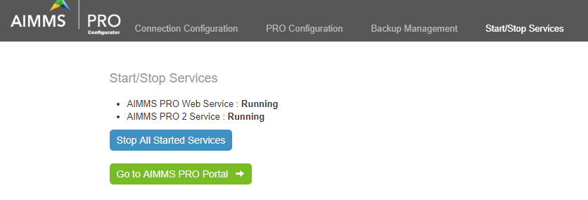
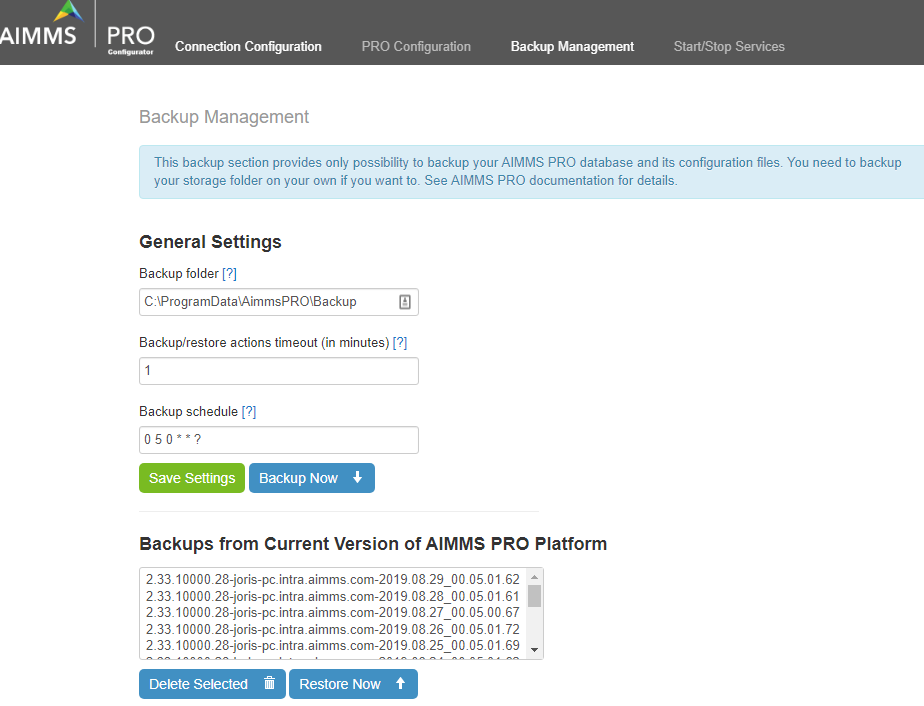
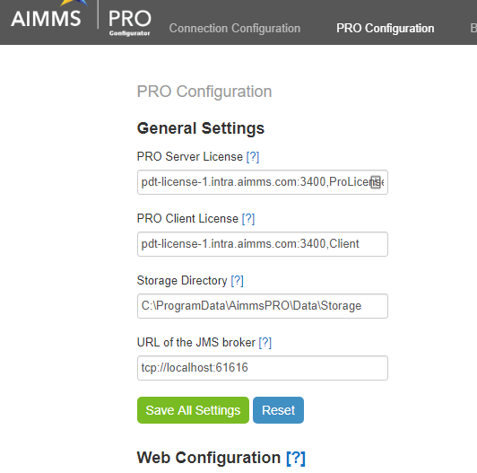
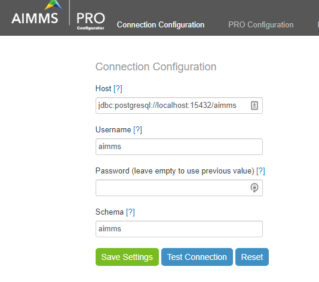

How to migrate your PRO server to another machine in 10 steps
===============================================================

.. meta::
   :description: How to migrate your PRO server to another machine in 10 steps.
   :keywords: PRO, Server, migrate

.. note:: This article does not include migrating the license server

 
1.	Stop the AIMMS PRO Services from within the AIMMS PRO Configurator

2.	Navigate to Backup Management, and press the "Backup Now" button in order to create the backup 

3.	Navigate to the PRO Configuration tab and copy ALL settings in text document, such that during configuration of PRO on the destination new machine, you can enter these settings again.
 

 
4.	On the destination new machine, create the AIMMS PRO data folder at the desired target location; by default, the AIMMS PRO data folder is at ``C:\ProgramData\AimmsPRO``
5.	Copy the subfolders Backup and Data from the source to the destination machine
6.	Install **the exact same version** of PRO onto the destination machine (it is very important that it is the exact same version, because normal upgrades are likely to fail when migrating as well; after the migration is successful you can upgrade to e.g. the latest version of PRO).
7.	Once the installation finishes, you should be redirected to the AIMMS PRO Configurator page. If you changed the username/password/schema for the database user, please enter the same here as well:

8.	On the PRO Configuration tab, enter the values as specified noted at step 3) 
9.	Navigate to the Backup Management tab, select the backup you made at 2) and press the Restore Now button.
10.	Navigate to the Start/Stop Services and start the service

