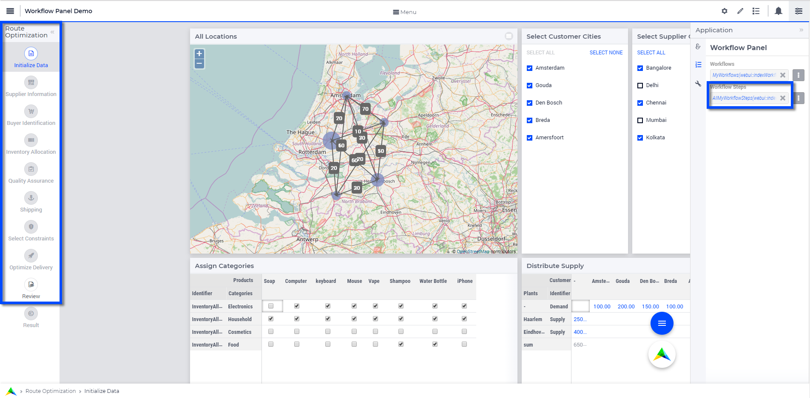

Selecting Pages for Workflow Panels
=======================================================
.. meta::
   :description: How to use element and string parameters to configure Workflows more smoothly.
   :keywords: workflow, parameter, pageId, redirect, work flow, webui, ui

.. important::

   - Workflow panels are available in software versions from AIMMS 4.68 onwards.
   - Starting from AIMMS 4.92, one sub-level of steps can be configured for a workflow step. This makes it easier to apply a hierarchical organization in your workflow(s).

You can use element and string parameters to reduce errors while configuring the steps for Workflows. For example, this helps you avoid entering a wrong ``pageId``, or adding a Side Panel ``pageId`` or Dialog ``pageId``.

The procedure can be summarized as follows:

#. Create the element parameter to select the ``pageId`` and ``redirectpageId``.
#. Create the string parameter to enter values for rest of the properties.
#. Create a string parameter that uses the above element and string parameter in combination to complete the data for the steps of the Workflows.

Below we will discuss these steps in more detail.
 
Selecting pages and redirect pages
---------------------------------------
1. First, let's create the element parameter to select the ``pageId`` and ``redirectpageId``.

a. Create an element parameter, let’s call it ``MyWorkflowStepsPages``, indexed over ``(webui::indexWorkflowOrder,webui::indexNoOfPages,webui::indexWorkflowPageSpec)``.

b. Add a domain condition to index domain::

   (webui::indexWorkflowPageSpec = 'pageId' OR webui::indexWorkflowPageSpec = 'redirectpageId')

So the index domain will look like this:

.. code-block:: aimms

   (webui::indexWorkflowOrder,webui::indexNoOfPages,webui::indexWorkflowPageSpec) | 
   (webui::indexWorkflowPageSpec = 'pageId' OR webui::indexWorkflowPageSpec = 'redirectpageId')

c. Add a range of ``webui::AllRegularPages``.
 
Now, in the data you can only select values for ``pageId`` and ``redirectpageId`` from drop-down menus where values are from the ``AllRegularPages`` set.

 
Adding values for other properties
-------------------------------------
2. Next let's create the string parameter to enter values for rest of the properties:

a. Create a string parameter, let’s call it ``MyWorkflowStepsDetails``, indexed over ``(webui::indexWorkflowOrder,webui::indexNoOfPages,webui::indexWorkflowPageSpec)``.

b. Add domain condition to index domain:

.. code-block:: aimms

   NOT(webui::indexWorkflowPageSpec = 'pageId' OR webui::indexWorkflowPageSpec = 'redirectpageId')

So the index domain will look like this:

.. code-block:: aimms
   
   (webui::indexWorkflowOrder,webui::indexNoOfPages,webui::indexWorkflowPageSpec) | 
   NOT(webui::indexWorkflowPageSpec = 'pageId' OR webui::indexWorkflowPageSpec = 'redirectpageId')
 
c. Go to the data and add values for the rest of the properties. Now you will not be able to add values to the ``pageId`` and ``redirectpageId``.

 
Selecting steps for the Workflow
----------------------------------
3. Finally we will create a string parameter that uses the above element and string parameter in combination to complete the data for the steps of the Workflows.

a. Create a string parameter, ``AllMyWorkflowSteps``, again indexed over ``(webui::indexWorkflowOrder,webui::indexNoOfPages,webui::indexWorkflowPageSpec)``.

b. In the definition, add:

.. code-block:: aimms

   MyWorkflowStepsDetails(webui::indexWorkflowOrder, webui::indexNoOfPages, webui::indexWorkflowPageSpec) + 
   MyWorkflowStepsPages(webui::indexWorkflowOrder, webui::indexNoOfPages, webui::indexWorkflowPageSpec)
 
This is a concatenation of the string and element parameter. It gives the complete data for defining the Workflow steps.

c. Add the ``AllMyWorkflowSteps`` string parameter in the *Workflow Panel > Workflow Steps* field, under *Application Settings*.

Result in WebUI
---------------
After configuring both the string parameters in *Application settings > Workflow Panel*, the Workflow Panel will be displayed on the pages configured in the ``MyWorkflowStepsPages`` element parameter, as shown in the example below.

.. page Route Optimization > Initialize Data in example project 
.. Pratap will update the example project before we make it available for download

Related Topics
---------------

* **AIMMS Documentation**: `Workflow Panel <https://documentation.aimms.com/webui/workflow-panels.html>`_
