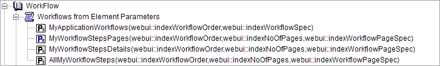

Selecting Pages for Workflow Panels
=======================================================
.. meta::
   :description: How to use element and string parameters to configure Workflows more precisely.
   :keywords: workflow, parameter, pageId, redirect, work flow, webui, ui

You can use element and string parameters to reduce errors while configuring the steps for Workflows.

The procedure can be summarized as follows:

#. Create the element parameter to select the ``pageId`` and ``redirectpageId``.
#. Create the string parameter to enter values for rest of the properties.
#. Create a string parameter that uses the above element and string parameter in combination to complete the data for the steps of the Workflows.

Below we will discuss these steps in more detail.
 
Selecting pages and redirect pages
---------------------------------------
First, let's create the element parameter to select the ``pageId`` and ``redirectpageId``.

#. Create an element parameter, let’s call it ``MyWorkflowStepsPages``, indexed over ``(webui::indexWorkflowOrder,webui::indexNoOfPages,webui::indexWorkflowPageSpec)``.

#. Add a domain condition to index domain::

   (webui::indexWorkflowPageSpec = 'pageId' OR webui::indexWorkflowPageSpec = 'redirectpageId')

So the index domain will look like this::

   (webui::indexWorkflowOrder,webui::indexNoOfPages,webui::indexWorkflowPageSpec) | (webui::indexWorkflowPageSpec = 'pageId' OR webui::indexWorkflowPageSpec = 'redirectpageId')

#. Add a range of ``webui::AllRegularPages``.
 
Now, in the data the user can select values for ``pageID`` and ``redirectpageId`` from drop-down menus where values are from the ``AllRegularPages`` set.

.. the user means the end user or app developer?

 
Adding values for other properties
-------------------------------------
Next let's create the string parameter to enter values for rest of the properties:

#. Create a string parameter, let’s call it ``MyWorkflowStepsDetails``, indexed over ``(webui::indexWorkflowOrder,webui::indexNoOfPages,webui::indexWorkflowPageSpec)``.

#. Add domain condition to index domain::

   NOT(webui::indexWorkflowPageSpec = 'pageId' OR webui::indexWorkflowPageSpec = 'redirectpageId')

So the index domain will look like this::
   
   (webui::indexWorkflowOrder,webui::indexNoOfPages,webui::indexWorkflowPageSpec) | NOT(webui::indexWorkflowPageSpec = 'pageId' OR webui::indexWorkflowPageSpec = 'redirectpageId')
 
#. Go to the data and add values for the rest of the properties. The user will not be able to add values to the ``pageId`` and ``redirectpageId``.

.. the user means the end user or app developer?

 
Selecting steps for the Workflow
----------------------------------
Finally we will create a string parameter that uses the above element and string parameter in combination to complete the data for the steps of the Workflows.

#. Create a string parameter, ``AllMyWorkflowSteps``, again indexed over ``(webui::indexWorkflowOrder,webui::indexNoOfPages,webui::indexWorkflowPageSpec)``.

#. In the definition, add::

   MyWorkflowStepsDetails(webui::indexWorkflowOrder, webui::indexNoOfPages, webui::indexWorkflowPageSpec) + MyWorkflowStepsPages(webui::indexWorkflowOrder, webui::indexNoOfPages, webui::indexWorkflowPageSpec)
 
This is a concatenation of the string and element parameter. It gives the complete data for defining the Workflow steps.

#. Add the ``AllMyWorkflowSteps`` string parameter in the *Workflow Panel > Workflow Steps* field, under *Application Settings*.

Example project download
-----------------------------

You can download an example project containing these parameters from the link below.

* :download:`Workflow_Panel_Demo_with_element_parameters.zip <downloads/Workflow_Panel_Demo_with_element_parameters.zip>`

The identifiers can be found under the Workflows section in the Workflows from Element Parameters declaration.

