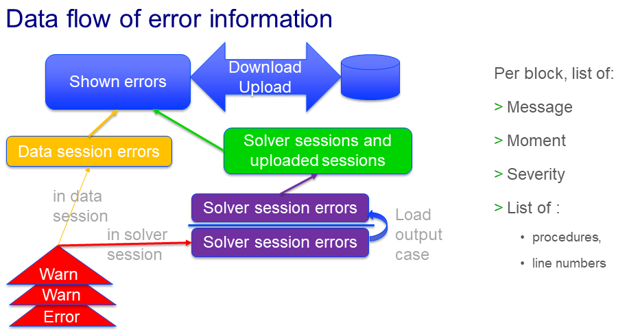

Error and Profiling Results as Data
========================================

This article is a companion article to :doc:`Incident Handling for Organizations<../310/310-incident-handling-for-organizations>`.
Error and profiler data are stored in AIMMS' sets and parameters; then serialized. 
This way, they are shared between the end-users and specialists that use the application at hand.
This article discusses how this information flows through the ``GuardServerSession`` library and which procedures can be used to 
store error information.

Data flow of error information
--------------------------------

The data flow of errors to support this user interface is organized as follows:

    
The red triangles are a stream of warnings and errors. 
These errors move via various steps upwards towards the blue box of errors shown in the User Interface.

There are two paths from "red" to "blue" for this error information, 
depending on whether the errors are generated inside the data session or in a solver session.

Data flow for errors created in a data session
^^^^^^^^^^^^^^^^^^^^^^^^^^^^^^^^^^^^^^^^^^^^^^^^

#.  Data session errors are collected by the error handler ``gss::pr_appendError`` in the orange box "Data session errors" ``gss::dataSessionProfilerErrorData``.

#.  When the WebUI page ``GSS Session History Management`` is opened, the yellow box is copied to the blue box, 
    making the errors visible to the end-user.

Data flow for errors created in a solver session
^^^^^^^^^^^^^^^^^^^^^^^^^^^^^^^^^^^^^^^^^^^^^^^^^^

#.  Solver session errors are collected by the error handler ``gss::pr_appendError`` in the purple box 
    "Solver session errors" ``gss::serverSessionErrorData``.

#.  When the output case is loaded, this error information is loaded in the data session (to identifiers with the same name).

#.  Immediately after, this error information is copied to a slice in the green big box "Solver sessions and uploaded sessions".

#.  When the WebUI page ``GSS Session History Management`` is opened, and the selection drop down selects this solver session, 
    this error information is copied to the blue box (and shown).

Data flow of profiler information
---------------------------------

The profiler information is captured at the end of a solver session, or at the start of opening the ``GSS Session History Management``.
Then it follows the same path as the error information through the application before it is shown.

Identifiers to be used in your app for Errors and Profiling results as data
--------------------------------------------------------------------------------

Both the procedures, the relevant collector is for the data session: `gss::dataSessionProfilerErrorData`, 
for a server session: `gss::serverSessionErrorData`.

#.  The procedure ``pr_appendError(ep_err,sp_prefix)`` appends the error to the open error collector.

    Arguments:

    #.  Input element parameter ``ep_err`` with range ``errh::PendingErrors``.  
        This is a reference to the error to be handled.

    #.  Input string parameter ``sp_prefix``.  
        This can be used to prefix the error message stored from the message of the error referenced by ``ep_err``.

    Throws exceptions: None

    Return value: None.

#.  The procedure ``pr_appendMessage(sp_msg,ep_lev)`` appends the message `sp_msg` to the open error collector.

    Arguments:

    #.  Input string parameter ``sp_msg``.  The message to be stored.

    #.  Input element parameter ``ep_lev`` with range ``gss::s_messageLevels`` and default ``'info'``.  
        The importance level of the message ``sp_msg``.

    Throws exceptions: None

    Return value: None.

