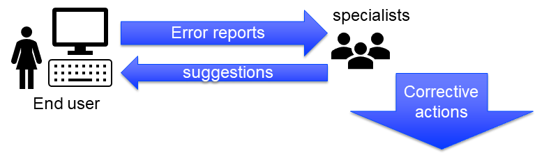

Error and Profiling Results as Data
========================================

The end-user is a specialist in the application domain of the application. 
The application and data are provided by specialists with other skills.
Many error messages can be tackled by the end-user; but not all. 
For the remaining messages these other specialists need to be consulted.
This article is about sharing the error messages between the end-user and the other specialists in that team.

This article discusses the "errors as data" functionality of the GuardServerSession library.  
The prime purpose of this functionality is:

#.  The end-user can view and download error reports, both of data session and of solver sessions.

#.  Specialists can upload these same error reports and inspect them as if they occurred in the AIMMS Developer environment they are running.

User Interface
---------------

The primary user interface for the "errors as data" functionality is shown in the GSS page below:

.. image:: images/gss-page.png
    :align: center

Remarks:

#.  The GSS page opens by clicking the GSS status bar.

#.  The upper table on the left shows the error messages, with severity and creation moment.

#.  The lower table on the left shows, for the selected error message, the stack of procedures that was active at the moment of creation. 

    .. image:: images/right-click-model-explorer.png
        :align: center

    When right-clicking on an entry in that table, with AIMMS Developer, you can open the attribute window of the indicated procedure.
    
#.  The selection drop-down in the green rectangle is used to select the session shown. The collection of sessions to choose from consists of:

    #.  The data session

    #.  The server sessions running

    #.  The uploaded sessions

#.  In the orange rectangles in the lower right there is an upload and a download button for error data.

    #.  The download button is intended to be used by the end-user that wants to share an error report with the data and model specialists in her team.

    #.  The upload button is intended to be used by a data or model specialist that wants to investigate the errors reported by the end-user.

Data flow of error information
--------------------------------

The user interface shows only one of the sessions that can be selected. 
The data flow of errors to support this user interface is organized as follows:

.. image:: images/error-data-flow.png
    :align: center
    
The red triangles are a stream of warnings and errors. 
These errors move via various steps upwards towards the blue box of shown errors. 
The blue box symbolizes the list of errors shown to the user on the `GSS page`.

There are two paths from "red" to "blue" for this error information, depending on whether the errors are generated inside the data session or in a solver session.

Data flow for errors created in a data session
^^^^^^^^^^^^^^^^^^^^^^^^^^^^^^^^^^^^^^^^^^^^^^^^

#.  Data session errors are collected by the error handler `gss::pr_appendError` in the orange box "Data session errors" `gss::dataSessionProfilerErrorData`.

#.  When the WebUI page `GSS page` is opened, the yellow box is copied to the blue box, making the errors visible to the end-user.

Data flow for errors created in a solver session
^^^^^^^^^^^^^^^^^^^^^^^^^^^^^^^^^^^^^^^^^^^^^^^^^^

#.  Solver session errors are collected by the error handler `gss::pr_appendError` in the purple box "Solver session errors" `gss::serverSessionErrorData`.

#.  When the output case is loaded, this error information is loaded in the data session (to identifiers with the same name).

#.  Immediately after, this error information is copied to a slice in the green big box "Solver sessions and uploaded sessions".

#.  When the WebUI page `GSS page` is opened, and the selection drop down selects this solver session, this error information is copied to the blue box (and shown).

Adding the GSS library and using "errors as data" in your application
-------------------------------------------------------------------------

#.  A copy of the library can obtained :download:`GSS Library download <model/GuardServerSession.zip>` .
    See :doc:`how to add a library to your project<../84/84-using-libraries>`

#.  Detailed instructions for adding the user interface for that library can be found :doc:`here<../310/310-install-ui-gss>`

#.  Add the GSS error notification bar to the Application Settings > Application Extensions > status bar: see string parameter `gss::sp_messageStatusBar`

#.  The WebUI provides various ways to invoke AIMMS procedures, including status bar, buttons, upload button, download button, item menus, widget menus, and page open.
    Each such invoked procedure should have the following pattern:

    .. code-block:: aimms
        :linenos:
        
        block
        
            <data checking>
            <business logic>
            
        onerror ep_err do
        
            <procedure specific error handling>
            gss::appendError( ep_err );
            errh::markAsHandled( ep_err );
        
        block ;
    
#.  Protect delegate (see old 310 article)

References
-----------

#.  `Error handling course <https://academy.aimms.com/course/view.php?id=50>`_

