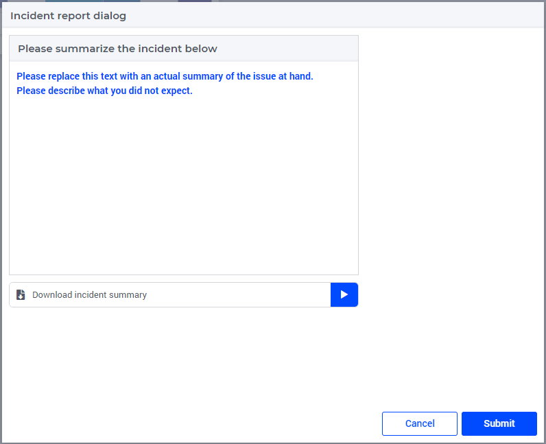

The GSS End User interface for end-users
==========================================

This article is a companion article to :doc:`Incident Handling for Organizations<../310/310-incident-handling-for-organizations>`

An end-user is responsible for sharing what is unexpected but is not responsible for selecting the information that is available to the specialist.
Via the following dialog, the end-user can share a description, 
and the download button will download the session history consisting of incident description, error/profiler data, action log, and case file.

Remarks:

#.  The table titled "Errors and warning encountered" contain the errors and warning encountered in the data session.

#.  The text widget titled "Please summarize the incident below", allows the end-user to enter a multi-line text. 
    However, mark-up and adding images, attaching files is not allowed.

#.  Pressing the download button to create a single file containing the session history.

To create this page, please :doc:`follow this link<../310/310-install-gss-ui-for-end-users>`.