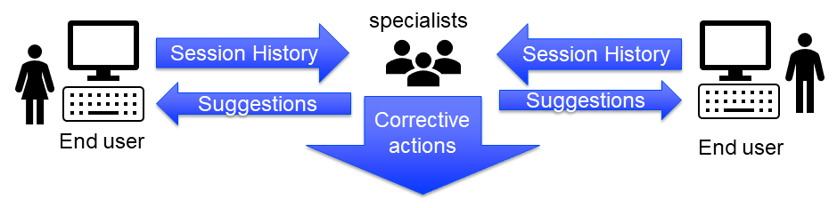

Incident handling for organizations
=============================================

Thanks to extensive checking and clear reporting of incidents; end-users can handle several incidents themselves.
For other incidents, they may need to turn to their colleagues; asking these colleagues questions about the incidents similar to the following:

#.  `Do you know, why I was not able to read the data?`

    The causes are several, for instance: it might be a reconfiguration of the database, a broken internet connection, or something else entirely.

    The colleague that helps the end-user with this question, may very well benefit from clear error messages.

#.  `Do you know, why I had to wait a lot longer before the solution appeared?`

    Again, the causes are several, for instance: slow internet connection used to obtain data, 
    the solution algorithm needed significantly more time for this instance, or something else entirely.

    The colleague that helps the end-user with this question, may very well benefit from profiling information.

#.  `I cannot explain the results I'm now seeing. Can you?`

    Such a question may very well be countered with: 

    #.  What have you done, my friend?

    #.  My friend, would you mind sharing the data?

    The colleague that helps the end-user with this question, may very well benefit from 

    #.  a log of the actions taken by the end-user, or

    #.  a case file containing a copy of the data the end-user sees.

Let's call the error and profiling information, the action log, and the case file together the session history.
The purpose of sharing the session history is to reduce the time and effort for resolving those incidents that occurred during the session and were not handled by the end-user.
.. which the end-user didn't handle.

The information flow around the application now looks as follows:

Guard Server Session Library
------------------------------

The ``GuardServerSession`` library, with prefix ``gss``, is designed, amongst others, to work with session histories.
This library provides the following methods:

The following four articles describe how to modify your application to make of the ``GuardServerSession`` library. 

#.  :doc:`Integration instructions<../310/310-integrate-gss-server-job>`:  to integrate the ``GuardServerSession`` library with your application, in particular how to adapt the delegation to server session.

#.  :doc:`UI for GSS<../310/310-install-ui-gss>`: to build a user interface for the ``GuardServerSession`` library.

#.  :doc:`Error handling<../310/310-errors-as-data>`: how the application needs to be adapted to retrieve this information. 

    The error handling procedures of the ``GuardServerSession`` library turn incidents into data that is stored in AIMMS' sets and parameters.
    The function :aimms:func:`ProfilerCollectAllData` does the same for profiler data.
    This article discusses how the data flow of this information, and how it can be shared.

#.  :doc:`Logging<../310/310-logging>`: to generate logs for the application using ``GuardServerSession`` library

    The action logs are log files with the extension ``.actionLog`` and are stored in AIMMS PRO Storage.

Further Reading
-------------------

* `Error Handling course on AIMMS Academy <https://academy.aimms.com/course/view.php?id=50>`_

 

