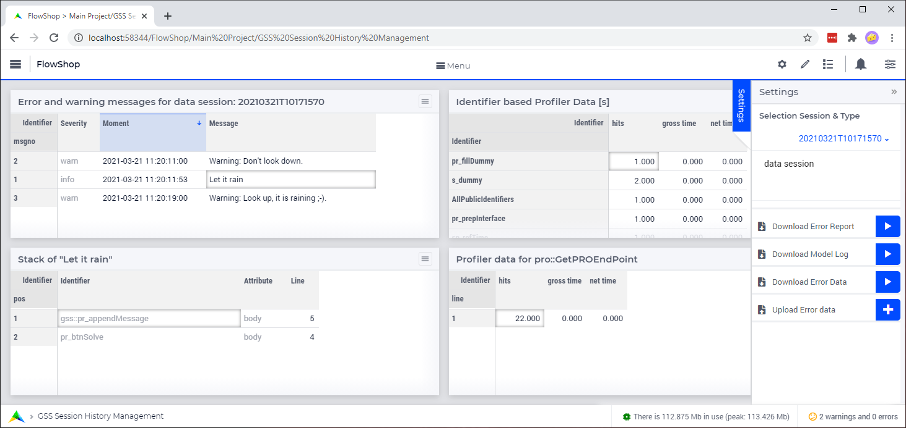

Install UI of GuardServerSession Library
=========================================

This article is a brief set of instructions to create the user interface for working with the ``GuardServerSession`` library. 

After adding the library to your project, you can start building a user interface to that library in WebUI. 

We can use the same example as discussed in the previous article of this series, :doc:`AIMMS How-To: Integrate GuardServerSession <../310/310-integrate-gss-server-job>`. Download here :download:`FlowShop.zip <model/FlowShop.zip>` 

The rest of this article details the WebUI page ``GSS Session History Management`` in this project and how you can replicate this functionality in your application. 

:align: center

The page ``GSS Session History Management`` in the attached example uses a custom grid layout and has ``Action Upon Load`` set to ``gss::pr_openPageErrorWarningProfiler``.
    
.. tip::
    
    If you have a multi page application, you might want to add this page to the group of "developer" or "control" pages in your application.

Status bar of your app should be set to ``gss::sp_messageStatusBar``, or to a string parameter that contains this information.

Widgets
-------------------------

Below are the widgets recommended to build a user interface for the ``GuardServerSession`` library.

#.  Table ``ErrorWarningMessageTable``, titled: ``gss::sp_titleErrorWarningMessagesTable``

    #. Contents: 

        #.  ``gss::ep_shownJobErrorSeverity``
        #.  ``gss::sp_shownJobErrorMoments``
        #.  ``gss::sp_shownJobErrorMessages``

    #. Pivoting: 

        #.  Rows: ``gss::i_jobErrorMessageNumber``
        #.  Cols: ``<Identifiers>``

    #. Store focus: 

        ``gss::i_shownJobErrorMessageNumber`` to ``gss::ep_errorWarningSelectedNessage``

    #. Widget Extensions:

        #. Widget actions: ``gss::sp_widgetActionMessageList``

        #. Item actions: ``gss::sp_itemActionMessageList``

#.  Table ``JobProfilerData``, titled: ``sp_titleProfilerOverview``

    #. Contents: ``gss::p_shownJobProfilerData``

    #. Store Focus:

        ``IndexIdentifiers`` --> ``gss::ep_profilerDataSelectedIdentifier``

    #. Identifier Settings > Set slicing per index

        ``gss::i_lineNumber`` --> fixed element ``'0'``
    
    #. Widget Extensions:

        #.  Widget actions: ``gss::sp_widgetActionIdentifierProfiler``
    
        #.  Item actions: ``gss::sp_itemActionIdentifierProfiler``

#.  Table ``ErrorWarningStack``, titled: ``gss::sp_titleStackMessage``

    #. Contents:

        #.  ``gss::ep_shownJobErrorNodes``
        #.  ``gss::ep_shownJobErrorAttributes``
        #.  ``gss::p_shownJobErrorLines``

    #. Identifier settings:

        For all three, slice type index ``gss::i_jobErrorMessageNumber`` to element parameter ``gss::ep_errorWarningSelectedMessage``

    #. no decimals: 0

    #. Store Focus:

        ``gss::i_stackPosition`` --> ``gss::ep_stackPos``

    #. Widget Extensions:

        #.  Widget actions: ``gss::sp_widgetActionMessageStack``
        #.  Item actions: ``gss::sp_itemActionMessageStack``

#.  Table ``LineBasedProfilerData``, titled: ``gss::sp_titleProfilerDetail``

    #. Contents: 

        ``gss::p_shownJobProfilerData``

    #. Identifier Settings - Set slicing per index

        index ``gss::IndexIdentifiers`` --> element parameter ``gss::ep_profilerDataSelectedIdentifier``

#.  Scalar widget ``shownSession``:

    Contents: ``ep_shownSession``

#.  Upload widget ``UploadErrorWarningData``, titled "Upload Error Warning data":

    procedure: ``gss::pr_uploadErrorData``

#.  Download widget ``DownloadModelLog``, titled ``gss::sp_downloadModelLogTitle``:

    procedure: ``gss::pr_downloadModelLog``

#.  Download widget ``DownloadErrorReport``, titled "Download error report for current session": 

    procedure: ``gss::pr_downloadErrorReport``

    .. title: ``"Download error report shown session"``
    .. what do mean by shown session ? 

#.  Download widget ``DownloadErrorWarningData``, titled "Download error data for current session":

    procedure: ``gss::pr_downloadErrorData``

Testing
-----------
To visually guide the adaption of the width of the columns of the tables, please run:
    
    #.  ``gss::pr_artificialDataGSSPage`` to have an artificial warning message and 
    
    #.  ``gss::pr_openPageErrorWarningProfiler`` to ensure the ``GSS Session History Management`` tables are filled properly.
    
    And then start manually adapting the column widths such that the contents fit neatly.

Further Reading
---------------------

This article is part of the series :doc:`Indicident Handling for Organizations<../310/310-incident-handling-for-organizations>`.

The next article in this series discusses how to use the error handling functionality of the ``GuardServerSession`` library: :doc:`Error Handling as Data<../310/310-errors-as-data>`

