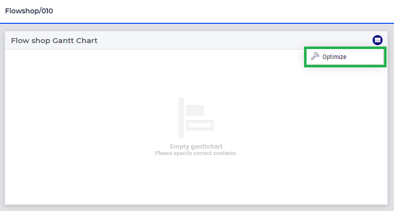

Integrate GSS server Job
=========================

.. todo:: remarks about input case identifier and output case identifiers from GSS.

This article describes how to integrate the delegation of your jobs with the `GuardServerSession` library.

The following needs to be considered:

#.  Change in delegation

#.  Change in identifier sets used for the input and output cases.

#.  Change in actions 

#.  Change in User Interface, see :doc:`instructions<../310/310-install-ui-gss>`

We will use the attached AIMMS project as an example for this section. 

* :download:`FlowShop.zip <model/FlowShop.zip>` 

We assume here that your ``MainInitialization`` procedure, still starts with  ``ProfilerStart();``
In addition, we assume here that delegation is done as follows:

.. code-block:: aimms
    :linenos:
    :emphasize-lines: 8

    if pro::GetPROEndPoint() then
        if pro::DelegateToServer( waitForCompletion  :  1, 
                      completionCallback :  'pro::session::LoadResultsCallBack' ) then  
            return 1;
        endif ;
    endif ;

    pr_WorkSolve();

We change this to:

.. code-block:: aimms
    :linenos:
    :emphasize-lines: 8

    if pro::GetPROEndPoint() then
        if pro::DelegateToServer( waitForCompletion  :  1, 
                      completionCallback :  'pro::session::LoadResultsCallBack' ) then  
            return 1;
        endif ;
    endif ;

    gss::pr_GuardAndProfileServerJob( 'pr_WorkSolve' );

``gss::pr_GuardAndProfileServerJob();`` is defined as:

.. code-block:: aimms
    :linenos:
    :emphasize-lines: 11

    Procedure pr_guardAndProfileServerJob {
        Arguments: (ep_work);
        Body: {
            block
                empty serverSessionErrorData ;
                sp_serverSessionId := sp_thisSession ;
            
                ! Ensure that the error recorded and profiler data are transmitted via the output case:
                pro::ManagedSessionOutputCaseIdentifierSet += s_outputCaseIdentifiers ;
            
                ! Actual work.
                apply( ep_work);
            
                ! Ensure that the definitions of all defined sets and defined parameters in 
                ! output case identifier set are profiled.
                update pro::ManagedSessionOutputCaseIdentifierSet;
            
            onerror ep_err do
            
                pr_appendError( ep_err );
            
                ! Don't let the server job be halted by this error; 
                ! we still want the result case including the profiled data.
                errh::MarkAsHandled(ep_err);
            
            endblock ;
            ProfilerCollectAllData(
                ProfilerData       :  p_jobProfilerData, 
                GrossTimeThreshold :  0, 
                NetTimeThreshold   :  0);
            
            pr_saveModelLogFile();
        }
        ElementParameter ep_err {
            Range: errh::PendingErrors;
        }
        ElementParameter ep_work {
            Range: AllProcedures;
            Default: 'gss::pr_sampleProc';
            Property: Input;
        }
    }

.. note::
     :any:`ProfilerCollectAllData` is available since AIMMS 4.68

In addition, we also set the option ``communicate_warnings_to_end_users`` to ``on``.

Run the optimization via the widget action of the Gantt Chart:

Switch to the profile and error page of the app:

.. image:: images/ErrorProfilerDataServerJob.png
    :align: center

The flow shop project contains a custom library ``GuardServerSession``, which you can download and add to your project. 
See :doc:`add libraries to your project<../84/84-using-libraries>`.

* :download:`GuardServerSession.zip <model/GuardServerSession.zip>` 
