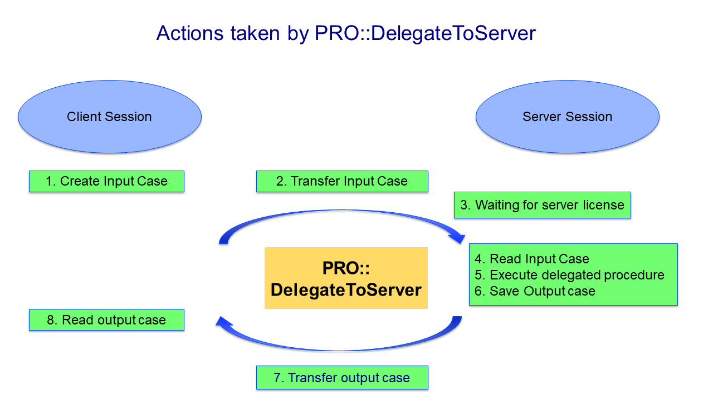
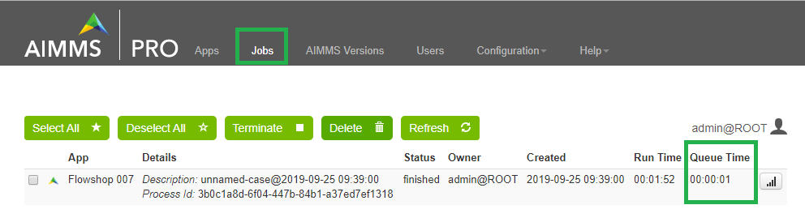
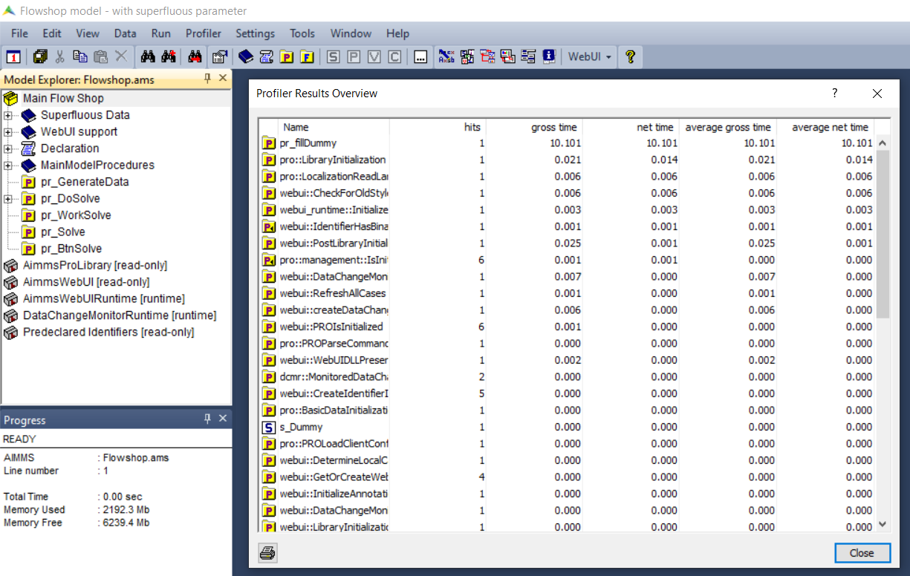

Investigate Behavior of AIMMS PRO Job
==============================================

.. meta::
   :description: Checking execution time and troubleshooting AIMMS PRO jobs.
   :keywords: profiling, AIMMS PRO, deployment, execution time, case management

An AIMMS PRO job may spend more time than the corresponding procedure on the client side. In this article we set out to answer the following questions:

#.  How to reduce the execution time of an AIMMS PRO job?

#.  How to find out what went wrong with an AIMMS PRO job?

.. tip:: A first check is to search for ``: duration`` and for ``transmitted`` in the session log files; this may provide a clue quickly of where a bottleneck might be.

To provide a structural answer for your application, we need to dive into the workings of the procedure ``PRO::DelegateToServer``.

As the AIMMS PRO job realizing the delegated procedure runs **in a different process**, potentially on **a different host**, the necessary actions taken by ``PRO::DelegateToServer`` are illustrated in the picture below:

Actions taken by ``PRO::DelegateToServer``:

#.  Client side: Create a case file to be used as input

#.  Copy the case file to the AIMMS PRO server

#.  On the AIMMS PRO server, wait for a server license

#.  On the AIMMS PRO server, compile and initialize the AIMMS Project

#.  On the AIMMS PRO server, read the input case file

#.  On the AIMMS PRO server, execute the procedure that is invoked by ``pro::DelegateToServer``

#.  On the AIMMS PRO server, create a case file with the results

#.  Client side: read the case file with results

In this article, we will detail for each of the above actions, how to investigate behavior.

.. _sec_client_create_case:

Client side: Create a case file to be used as input
----------------------------------------------------------

.. pro::ManagedSessionInputCaseIdentifierSet
.. pro::ManagedSessionOutputCaseIdentifierSet
.. pro::ManagedSessionRemoveFromCaseIdentifierSet

The more information that is shared between the client session and the solver session, the longer it takes (creating, transmitting, reading). The information is shared in the form of a case file. The amount of information in this case file is determined by the set of identifiers and their cardinalities.

The identifiers of the input case created by ``pro::DelegateToServer`` is defined by ``pro::ManagedSessionInputCaseIdentifierSet``, minus the identifiers in ``pro::ManagedSessionRemoveFromCaseIdentifierSet``. However, the delegated job may only require the data of a subset of the identifiers in ``pro::ManagedSessionInputCaseIdentifierSet``.  To measure how long it takes to create an input case, please execute the procedure ``SaveInputCase``, coded below, with the AIMMS profiler on:

.. code-block:: aimms
    :linenos:

    Procedure SaveInputCase {
        Body: {
            s_InputCaseIdentifierSet := 
                pro::ManagedSessionInputCaseIdentifierSet - 
                pro::ManagedSessionRemoveFromCaseIdentifierSet ;
            CaseFileSave(
                url      :  "testcase.data", 
                contents :  s_InputCaseIdentifierSet);
        }
        Set s_InputCaseIdentifierSet {
            SubsetOf: AllIdentifiers;
        }
    }

Remarks about the above code:

#. ``pro::ManagedSessionInputCaseIdentifierSet`` is initialized to :aimms:set:`AllIdentifiers`

#. ``pro::ManagedSessionRemoveFromCaseIdentifierSet`` is initialized to :any:`AllDefinedParameters`

#. Thus, by default defined parameters are not transferred, but defined sets are. Evaluating the definitions of these sets may still take significant time. If so, the AIMMS profiler will identify the sets that take significant time. Some of these sets can be safely added to ``pro::ManagedSessionRemoveFromCaseIdentifierSet``. For instance, those with dimension 2 or higher, as illustrated by adding the following assignment to ``PostMainInitialization``:

    .. code-block:: aimms
        :linenos:

        pro::ManagedSessionRemoveFromCaseIdentifierSet := AllDefinedParameters + 
                    { indexIdentifiers | indexIdentifiers in AllDefinedSets and 
                        IdentifierDimension(indexIdentifiers) >= 2 };

#. Please see :doc:`reduce client server exchange<../582/582-reduce-client-server-exchange>` on tips for assigning ``pro::ManagedSessionInputCaseIdentifierSet`` to just those that are relevant for the job at hand.

.. note:: *Software evolution*: ``pro::ManagedSessionRemoveFromCaseIdentifierSet`` is applied to reduce the set of identifiers transferred since AIMMS 4.59.2. 

Copy the case file to the AIMMS PRO server
----------------------------------------------------------

To transfer items, transfer speed and item size do matter. To reduce the item size is discussed in the previous section. The transfer speed depends on the connection and distance. Obviously, when the client and server sessions are executed on the same host or the hosts are in the same domain, the transfer speed is high. On the other hand, when these hosts are in different continents, then the transfer speed may very well be low. 

To investigate how much time is spent for the case transfer, we have to look in the session log file of the solver session. This file can be found in the AIMMS PRO data folder, by default ``C:\ProgramData\AimmsPRO``, subfolder ``Log\Sessions``. The name of this log file is a GUID with extension .log. On a test server, the file was named  ``D:\ProgramData\AimmsPRO\Log\Sessions\f9706ac8-841f-4b35-bc74-57863e82e630-1.log``

To determine the time, obtain the session log file for the solver session and search for "CaseLoad : duration":

.. code-block:: none

    2019-09-25 09:39:57,835 0x0000c2d0 [INFO] {AIMMS.DataManagement.DataManager} CaseLoad : duration 38093 ms    
    
and a few lines above that:

.. code-block:: none

    2019-09-25 09:39:19,744 0x0000c2d0 [INFO] {PRO.Common.GenericFileRetriever} GenericReceiveFile( ..., fullPath = 'D:/ProgramData/AimmsPRO/Data/Publishing/MODELS/6cfce02e-9d7a-439f-b1ce-19f936247e77/PROTemp-058DBE41/cases.data', ... ) Transmitted 889248 KB in 1.93 seconds ( 460750 KB/s)

Because of the superfluous identifier, we're transmitting a case of 800+ Mb which takes 38 seconds here.

Anyway, now that we have this log file open, we may want to search for other occurrences of the word "duration", to see if anything interesting pops up.

On the AIMMS PRO server, wait for a server license
---------------------------------------------------

This is also known as wait time or queueing time. This can be obtained from the Jobs tab in the AIMMS PRO Portal as illustrated in the image below:

In the example above, the job didn't have to wait for other jobs. Clearly, the queueing time depends on the load of the AIMMS PRO server, but that falls outside the scope of this article.

On the AIMMS PRO server, compile and initialize the AIMMS Project
-----------------------------------------------------------------------------------

A solver session starts with opening the project, including running initialization procedures of the Main model and running the initialization procedures of each of its libraries.

By adding the code ``ProfilerStart()`` at the top of your ``MainInitialization`` procedure, you can measure how long do these initialization procedures take for your project. After adding this line, close and reopen your AIMMS project. Profiler -> Results Overview will give you the numbers on **client side**.      

Once you are satisfied with the initialization times of your project on client side, you might want to check this on the server side as well. How to check the timings server side is discussed below: see :ref:`profiling_work_procedure`.

.. _sec_server_read_case:

On the AIMMS PRO server, read the input case file
----------------------------------------------------------------------

This action, and subsequently the time it takes, is closely linked to the size of the case file as discussed above.

.. _profiling_work_procedure:

On the AIMMS PRO server, execute the delegated procedure
-----------------------------------------------------------------------------------------------

On the AIMMS PRO server, create a case file with the results
----------------------------------------------------------------------------

This is the same as section :ref:`sec_client_create_case`, except the other way around and the identifier ``pro::ManagedSessionOutputCaseIdentifierSet``

Client side: read the case file with results
-----------------------------------------------------------

This is the same as section :ref:`sec_server_read_case`.

