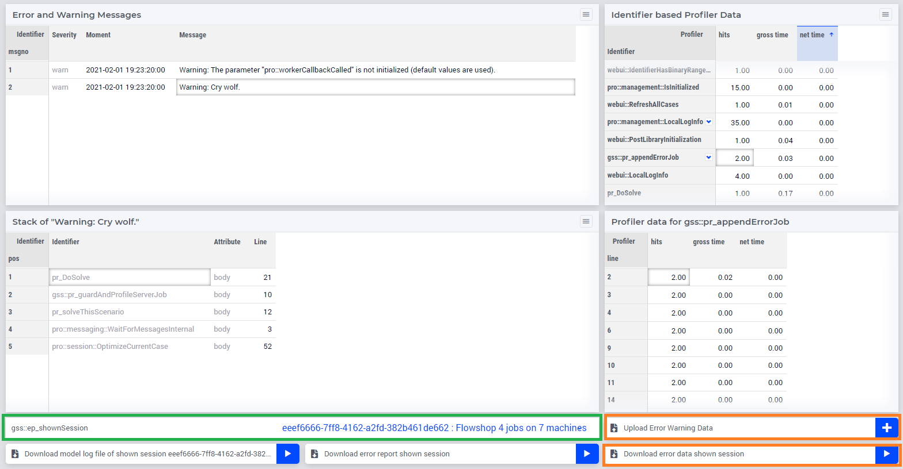

The User Interface to the GSS Library
======================================

The user interface is shown in the `GSS Session History Management` below:

Remarks:

#.  The `GSS Session History Management` opens by clicking the GSS status bar.

#.  The upper table on the left shows the error messages, with severity and creation moment.

#.  The lower table on the left shows, for the selected error message, the stack of procedures that was active at the moment of creation. 

    .. image:: images/right-click-model-explorer.png
        :align: center

    When right-clicking on an entry in that table, with AIMMS Developer, you can open the attribute window of the indicated procedure.
    
#.  The upper table on the right shows the profiler data per identifier.

#.  The lower table on the right shows the profiler data per lines for the selected identifier.

#.  The selection drop-down in the green rectangle is used to select the session shown. 
    The collection of sessions to choose from consists of:

    #.  The data session

    #.  The server sessions running

    #.  The uploaded sessions

#.  In the orange rectangles in the lower right there is an upload and a download button for error data.

    #.  The download button is intended to be used by the end-user that wants to share an error report with the data and model specialists in her team.

    #.  The upload button is intended to be used by a data or model specialist that wants to investigate the errors reported by the end-user.
    
#.  In the blue rectangles, in the left lower, download buttons for logging and state data.
