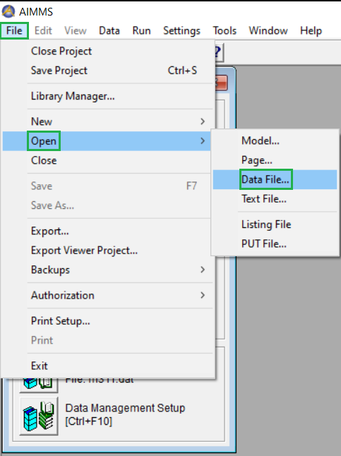
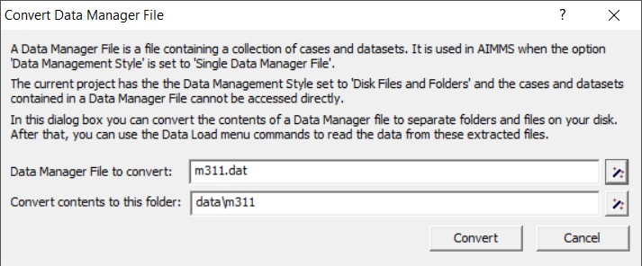

Convert Files from DAT to DATA
======================================
.. meta::
    :description: How to convert a data manager file to a case file.
    :keywords: dat, data, data manager, case

Overview and Comparison of File Types
-----------------------------------

The timeline for replacing ``.dat`` with ``.data`` files is as follows:

#.  AIMMS 3.0 stores cases were in so-called "data manager files".  

#.  AIMMS 3.12 introduced the ``.data`` format as an alternative. 

#.  AIMMS 4.85 is the **last** version of AIMMS that features both ``.dat`` and ``.data`` files.

This change was made for several reasons.

*  Data manager files (``.dat``) became bulky and thereby difficult to manage when maintaining several cases.

*  Case files (``.data``) avoid the risk of data corruption in one case affecting other cases stored in the same file. 

*  The AIMMS WebUI does not support ``.dat`` files.

*  Storing multiple case files in a folder makes it easy to copy cases from multiple users in the same folder, and compare scenarios. (See :doc:`data-management/case-management/managing-multiple-case-selections`)

In projects created with AIMMS version before 3.14, a single data manager file (``.dat``) contains zero, one or more cases. From AIMMS version 3.14, a case file (``.data``) only stores one case, but multiple cases may be stored in the same folder. 

+----------------------------------+----------------------------------------------+
| Before AIMMS 3                   | AIMMS 3.14 and later                         |
+----------------------------------+----------------------------------------------+
| ``.dat``                         | ``.data``                                    |
+----------------------------------+----------------------------------------------+
| Single data manager file         | Disk files and folders                       |
| contains zero, one or more cases | store multiple files, with one case per file |
+----------------------------------+----------------------------------------------+

The default location of ``.data`` files, is the ``data`` subfolder of the project folder. (You can modify this with the project option ``Default data folder``.)

Upgrading an AIMMS Project to a Newer AIMMS Release
---------------------------------------------------

When upgrading AIMMS on a particular project, the data management style persists. 
In other words, using AIMMS 3.12 on a project created using AIMMS 3.11, will still use as "data management style": "Single data manager file". 
This allowed users to use their data in data manager files created with older versions of AIMMS.

For these upgraded projects, the data management style can be changed; it is a setting of the project:

.. image:: images/SwitchDataManagementStyle.png
    :align: center

|

After changing this setting; AIMMS needs to be closed and re-opened before the change takes effect properly. (Just closing and re-opening the project is not sufficient).

After restarting AIMMS, the cases in data manager files can be extracted, by the dialog opened via:

|

but it now looks different:

|

Converting Procedure Calls
---------------------------

The case and other data management procedures are not just renamed, 
they also collect identifiers to be stored in a different way:

#.  The ``Disk files and folders`` interface works with 

    #.  CaseTypes and 
    
    #.  Data categories.

    A case type may include data categories.
    
    More information about these data types can be found in :doc:`ug:index`.

#.  The ``Disk files and folders`` interface works with subsets of :any:`AllIdentifiers`, called ``CaseContentTypes``. 

    A union of two sets results in a new set.  Thus ``CaseContentTypes`` are at least as generic as ``CaseTypes``.

The API for working on cases is changed by changing from ``Single data manager file`` to ``Disk files and folders``.

The functionality of the procedures in the column of the left is roughly, but not exactly, 
the same as the functionality offered by the procedures in the column on the left in the following table:

+--------------------------+-----------------------------------------------------+
| Single data manager file | Disk files and folders                              |
+==========================+=====================================================+
| CaseNew                  | CaseCommandNew                                      |
+--------------------------+-----------------------------------------------------+
| CaseFind                 | CaseFileURLtoElement                                |
+--------------------------+-----------------------------------------------------+
| CaseLoadCurrent          | CaseCommandLoadAsActive                             |
+--------------------------+-----------------------------------------------------+
| CaseMerge                | CaseCommandMergeIntoActive                          |
+--------------------------+-----------------------------------------------------+
| CaseLoadCurrent          | CaseCommandLoadAsActive                             |
+--------------------------+-----------------------------------------------------+
| CaseLoadIntoCurrent      | CaseCommandLoadIntoActive                           |
+--------------------------+-----------------------------------------------------+
| CaseReadFromSingleFile   | CaseFileLoad                                        |
+--------------------------+-----------------------------------------------------+
| CaseWriteToSingleFile    | CaseFileSave                                        |
+--------------------------+-----------------------------------------------------+
| CaseSelect               | CaseDialogSelectForLoad or CaseDialogSelectForSave  |
+--------------------------+-----------------------------------------------------+
| CaseGetCurrent           | ActiveCaseFile                                      |
+--------------------------+-----------------------------------------------------+
| CaseSetCurrent           | CaseFileSetActive                                   |
+--------------------------+-----------------------------------------------------+
| CaseSave                 | CaseCommandSave or CaseFileSave                     |
+--------------------------+-----------------------------------------------------+
| CaseSaveAll              | CaseDialogConfirmAndSave and CaseCommandSave        |
+--------------------------+-----------------------------------------------------+
| CaseSaveAs               | CaseCommandSaveAs                                   |
+--------------------------+-----------------------------------------------------+
| CaseSelectMultiple       | CaseDialogSelectMultiple                            |
+--------------------------+-----------------------------------------------------+
| CaseGetChangedStatus     | DataChangeMonitorHasChanged                         |
+--------------------------+-----------------------------------------------------+
| CaseSetChangedStatus     | DataChangeMonitorCreate or DataChangeMonitorReset   |
+--------------------------+-----------------------------------------------------+
| CaseGetType              | CaseFileGetContents                                 |
+--------------------------+-----------------------------------------------------+

As ``Data categories``, ``Case Types``, ``Data sets``, and ``Data manager file`` 
are no longer relevant when working with ``Disk files and folders``; 
the corresponding API's are not supported with this option setting.

