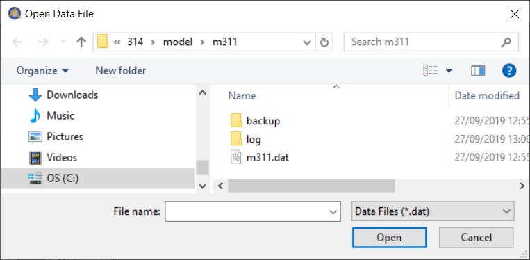

From ``.dat`` files to ``.data`` files
======================================

Cases contain data of AIMMS identifiers, binary, zipped. 

Single data manager file
------------------------

AIMMS 3.0 stores cases were in so-called "data manager files".  
A data manager file has the extension ``.dat``. 
A data manager file contains zero, one or more cases.
An AIMMS project is linked to a single data manager file file at any one time.   
One can switch from data manager file, by opening it from the AIMMS menu - FILE - Open data file dialog.

.. image:: images/OpeningDataFile.png
    :align: center

The dialog that appears is a file select type dialog:

The above described "data management style" is referred to as "Single data manager file".

Disk files and folders
----------------------

AIMMS 3.12 introduced the ``.data`` format as an alternative. 
Only one case is stored in a ``.data`` file. 
The term "data manager file" is dropped, and a ``.data`` file is simply referred to as a case.
The default location of ``.data`` files, is the ``data`` sub folder of the project folder. 
The project option ``Default data folder`` can be used to modify this. 

Upgrading an AIMMS project to a newer AIMMS release
---------------------------------------------------

When upgrading AIMMS on a particular project, the data management style persists. 
In other words, using AIMMS 3.12 on a project created using AIMMS 3.11, will still use as "data management style": "Single data manager file". 
This allowed users to use their data in data manager files created with older versions of AIMMS.

For these upgraded projects, the data management style can be changed; it is a setting of the project:

.. image:: images/SwitchDataManagementStyle.png
    :align: center

After changing this setting; AIMMS needs to be closed and re-opened before the change takes effect properly. (Just closing and re-opening the project is not sufficient).

After restarting AIMMS, the cases in data manager files can be extracted, by the dialog opened via:

.. image:: images/OpeningDataFile.png
    :align: center

but it now looks different:

.. image:: images/ConvertingDatToData.png
    :align: center

