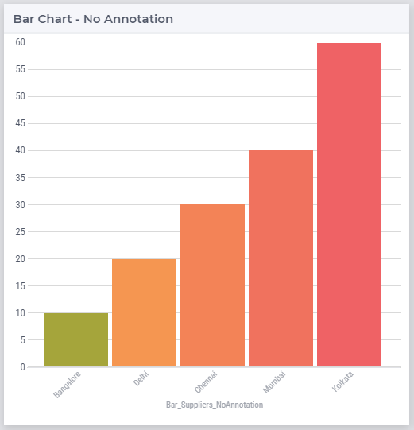
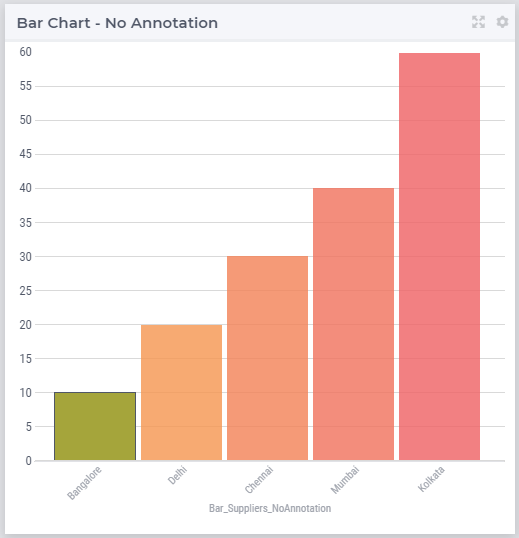
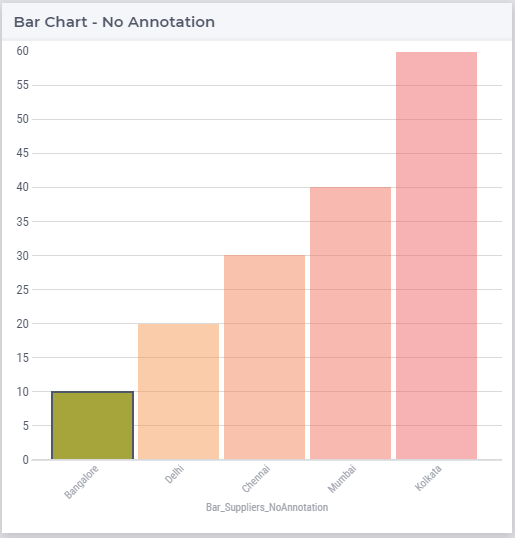
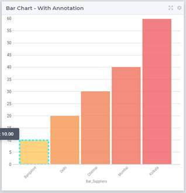
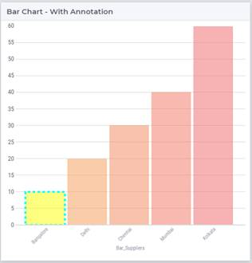

Change Hover and Select Effects for WebUI Charts
===================================================
.. meta::
   :description: Use CSS to specify behavior for hover and select states on objects in WebUI.
   :keywords: css, webui, map, chart, select, hover

This article explains how to use CSS to customize the states of a chart or map widget on hover and on select.

Default Chart Behavior
------------------------
These effects are the same for all the charts types. 

Each chart has 3 states:

* Default state – all bars have the same opacity

* Hover state – hovered bar remains solid, opacity slightly reduced for the other bars

* Selected state – selected bar remains solid, opacity is further reduced for the other bars

.. note:: 
    
    Nodes in the Map widget have a slightly different behavior
    
        * Default - all nodes have same opacity and no border
        * Hover - hovered node has a 1px border 
        * Selected - selected node has a 2px border, opacity reduced for the other nodes

.. Changing the style for selection states
.. ----------------------------------------

To customize the styles for these states, you'll need to add a CSS file in the folder ``MainProject\WebUI\resources\css``.

You can use the chart in `WebUI Annotations - Widget and CSS support <https://documentation.aimms.com/webui/css-styling.html>`_ for a reference of elements and their corresponding CSS properties.

.. topic:: Example CSS

   You can download the file below which contains the code snippets to change styles for the 3 states in charts.

   * :download:`Download AnnotationsCSS.css<downloads/AnnotationsCSS.css>`

In the images below, the first bar on the left has custom styles applied.

.. removed because this is duplication of information
.. Default
.. ^^^^^^^^^^

.. .. code-block:: css
..    :linenos:

..    /* Default state */
..    .annotation-bar_blue{
..       /* fill changes */
..       fill: blue;
..       fill-opacity: .5 !important;
..       /* stroke changes */
..       stroke: aqua !important;
..       stroke-width: 4 !important;
..       stroke-dasharray: 5;
..    }

.. .. image:: images/image01.jpg
..     :align: center

Hover
---------
.. code-block:: css
   :linenos:

   /* Hover State */
   .annotation-bar_blue.chart-item:hover,
   .annotation-bar_blue.chart-item.is-hover {
      /* fill changes  */
      fill: orange;
      fill-opacity: .5 !important;
      /* stroke changes  */
      stroke: aqua !important;
      stroke-width: 4 !important;
      stroke-dasharray: 5;
   }

Selected
-------------
.. code-block:: css
   :linenos:

   /* Selected state */
   .annotation-bar_blue.chart-item:active,
   .annotation-bar_blue.chart-item.is-active {
      /* fill changes  */
      fill: yellow;
      fill-opacity: .5 !important;
      /* stroke changes  */
      stroke: aqua !important;
      stroke-width: 4 !important;
      stroke-dasharray: 5;
   }

