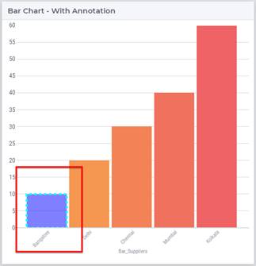

Change Hover and Select Effects for WebUI Charts
===================================================
.. meta::
   :description: Use CSS to specify behavior for hover and select states on objects in WebUI.
   :keywords: css, webui, map, chart, select, hover

This article explains how to use CSS to customize the states of a chart or map widget on hover and on select.

Default behavior
-----------------

Each chart has 3 states:

* Default – All bars have the same color (except the one I have added an annotation and CSS)

* Hover – Slight opacity reduced to the other bars.

.. image:: images/image02.jpg

* Select – More opacity reduced for the other bars, selected bar is solid.

.. image:: images/image03.jpg

Example
--------
These effects are constant for all the charts. The Map widget has a slightly different effect, we add a 1px border when hovered over the node, and a 2px border and reduced opacity for the other nodes when one of the nodes is selected. 

See the example model and also the ``AnnotationsCSS.css`` file in the folder ``MainProject\WebUI\resources\css``.

:download:`downloads/ChartsExample.zip`

Navigate to the Annotations page to see each chart with annotations and the effect as well. The annotations are defined in the Annotation Section of the model.

.. image:: images/image04.jpg

Related Topics
---------------

* **AIMMS Documentation**: `WebUI Annotations - Widget and CSS support <>`_