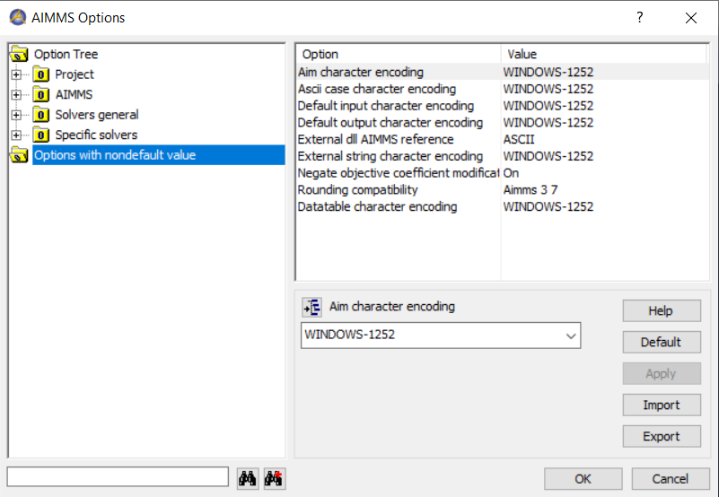

Using UNICODE in maintained AIMMS applications
==============================================

.. meta::
   :description: Converting one-byte per character AIMMS apps deploying UTF8 character sets, including Far East and Emoji's.
   :keywords: evolution, single byte character, two byte character, UNICODE, ASCII, encoding.

Applications created using AIMMS 2 were ASCII based, one byte per character; not allowing for UNICODE. This is in contrast with UTF8, the default character set of AIMMS 4, where all `UNICODE characters <https://en.wikipedia.org/wiki/List_of_Unicode_characters>`_ are allowed. Some older AIMMS applications were developed based on ASCII, and can be upgraded to using ``UTF8``, thus empowering users with texts using the UNICODE character set.

This brief How To article 

#. first starts with some terminology,

#. next provides an overview of the use of character sets in the various AIMMS versions, 

#. then discusses some concerns on changing character sets, and

#. finally details how older AIMMS applications can be upgraded to using ``UNICODE``.

Introducing encoding
--------------------

Roughly speaking:

* Humans interpret small pictures as characters, and a sequence of such small pictures is interpreted as a word, a sentence, a text.

* Texts are stored in files as a sequence of numbers and the pictures corresponding these numbers are viewed as the "text".

The mapping of pictures to numbers is an encoding, and the collection of pictures that can be handled is a character set.

With the introduction of computers, some computer vendors introduced their own character sets and encodings. 
The character set was standardized to an **American** standard, as ASCII.
The dominant character set of 80's and 90's of last century was the ASCII character set, defining pictures for up to value 127.

This was extended by Microsoft to using values up to 255, specialized by region; the so-called code pages. 
This might cause confusion, when a text file was copied from one region to another where a different code page was the norm.

Nowadays, the dominant character set is ``UNICODE``, and the dominant encoding is ``UTF8``. 
Note that this character set and corresponding encoding are still `evolving <https://en.wikibooks.org/wiki/Unicode/Versions>`_.

History on the use of character sets in AIMMS
---------------------------------------------

#.  AIMMS 2, developed in the early 90's, used the ASCII character set as this was the dominant character set at the time. 
    AIMMS 2 used the common implementation of using one byte per character.

#.  AIMMS 3.0 and AIMMS 3.1, developed and released around the turn of the century, also used ASCII as the only character set and encoding supported. 
    The AIMMS projects created with these AIMMS releases were agnostic to the code page at hand.

#.  AIMMS 3.2 introduced the option to use two characters for encoding and supported a 16 bit encoding of UNICODE. 
    Two different installers were available, one for ASCII versions of AIMMS, and one for the so-called UNICODE version of AIMMS. 
    This position was retained until AIMMS 3.13. 
    The ASCII versions of these AIMMS releases were all agnostic to the code page in use.

#.  AIMMS 3.14, released in 2014, introduced the concept of encoding, supporting more than 50 different encodings; 
    different code pages were counted as different encodings. 
    New projects created with AIMMS 3.14 used the ``UTF8`` encoding by default. 
    This is also available in modern versions of AIMMS 4. 

Consequences of choosing a different encoding
---------------------------------------------

See also :doc:`../135/135-UTF8-Encoding`

Options were introduced to handle different encodings for different IO:

#.  Aim character encoding.
    The character encoding used to interpret ``.aim`` files. 
    For AIMMS 3 systems, text copies of the model were stored using the AIM 3 format.
    The current ``.ams`` format always uses ``UTF8``. Therefore, this option is no longer relevant.

#.  ASCII Case character encoding.
    This option determines the encoding used to decode strings stored in a case file constructed by an ASCII AIMMS 3.13 or older release. 
    Cases created using AIMMS 3.14 or later use ``UTF8`` character strings anyway.
    So, if you do not have cases created using AIMMS 3.13 or older, you can safely set this option to its default.

#.  Default input character encoding.
    This option sets the default encoding when a text file is read in.
    Reading data from text files using the Read from File statement.
    File nowadays are often ``UTF8``; so this is only relevant if you use code pages.
    The value of this option is ignored for files whereby the attribute ``encoding`` is specified.

#.  Default output character encoding.
    This option sets the default encoding when a text file is written, for instance using PUT statements or Write to File statements.
    The value of this option is ignored for files whereby the attribute ``encoding`` is specified.

#.  External string character encoding. 
    This option determines the encoding used to communicate the value of a string parameter that is the argument of an external function with the external library.
    Only relevant when external libraries are used that rely on this option.

#.  Datatable character encoding.
    This option is no longer in use and can safely be set to its default.

NB: Possible values for these option are the elements in the predeclared set ``AllCharacterEncodings``.

Converting ASCII based apps to using UTF8
-----------------------------------------

First check which options are at non-default:

For each encoding option not at its default, please check whether the consequences mentioned above are applicable to your project. 
If not, you can safely set it to the default of ``UTF8``; thus enabling all UNICODE characters.
