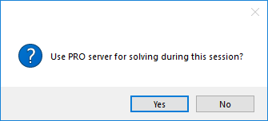

Develop Multi-Platform Applications
====================================

.. meta::
   :description: Tips for developing flexible AIMMS applications for use on both AIMMS PRO and AIMMS IDE.
   :keywords: platform, pro

After publishing an app on the AIMMS PRO On-Premise or AIMMS Cloud, it is common to continue development of that application for updates using the AIMMS IDE. 
When we test our app from within the AIMMS IDE, we get the following dialog:

|

Clicking ``No`` avoids AIMMS PRO On-Premise or AIMMS Cloud, but this soon becomes annoying. 
To avoid this dialog, many developers use the function :any:`ProjectDeveloperMode`. 
This function returns a 0 (false) or 1 (true) for the question - 
"Is the current instance in developer mode (AIMMS IDE) or in end user mode?".

.. code-block:: aimms

   if not ProjectDeveloperMode() then
      if pro::DelegateToServer( 
               waitForCompletion  :  1,
               completionCallback :  'pro::session::LoadResultsCallBack') then 
         return 1;
      endif;
   endif;

The disadvantage of using :any:`ProjectDeveloperMode` is that it disallows the combination of AIMMS PRO On-Premise or AIMMS Cloud and the AIMMS IDE for `AIMMS Portal debugging <https://documentation.aimms.com/pro/debugging-pro.html>`_. 
What we actually want, is to connect to AIMMS PRO On-Premise or AIMMS Cloud, when a connection is available, and otherwise use our own machine to solve the mathematical program.
 
To check whether we are connected to an AIMMS PRO On-Premise or AIMMS Cloud session or not, we use the function ``PRO::GetPROEndPoint()``. 
The function ``PRO::GetPROEndPoint()`` returns the URL, or the 'end point', of the AIMMS PRO On-Premise or AIMMS Cloud the AIMMS instance is running on. 
If the current AIMMS instance is not running on an AIMMS PRO On-Premise or AIMMS Cloud, an empty string is returned.

.. code-block:: aimms

   if pro::GetPROEndPoint() then
      if pro::DelegateToServer( 
               waitForCompletion  :  1,
               completionCallback :  'pro::session::LoadResultsCallBack') then 
         return 1;
      endif;
   endif;

        
The ``pro::DelegateToServer`` statement is executed only if the current AIMMS instance is connected to an AIMMS PRO On-Premise or AIMMS Cloud. 
If not, it is skipped and the remaining procedure is executed in the AIMMS IDE. 
This way, we avoid the annoying dialog mentioned above, but still enable `AIMMS Portal debugging <https://documentation.aimms.com/pro/debugging-pro.html>`_ when needed.

Example
--------

Most examples you will find here use the codes above or similar, below two examples:

`Employee Scheduling <https://how-to.aimms.com/Articles/387/387-employee-scheduling.html>`_ 
~~~~~~~~~~~~~~~~~~~~~~~~~~~~~~~~~~~~~~~~~~~~~~~~~~~~~~~~~~~~~~~~~~~~~~~~~~~~~~~~~~~~~~~~~~~

This example uses a combination of both procedures mentioned. 

.. code-block:: aimms
   :linenos:

   if pro::GetPROEndPoint() or not ProjectDeveloperMode() then
      if pro::DelegateToServer( 
               waitForCompletion  :  1,
               completionCallback :  'pro::session::LoadResultsCallBack' )
      then 
         return 1;
      endif;
   endif;

   solve mp_minimizeCost;

`Contract Allocation <https://how-to.aimms.com/Articles/383/383-contract-allocation.html>`_ 
~~~~~~~~~~~~~~~~~~~~~~~~~~~~~~~~~~~~~~~~~~~~~~~~~~~~~~~~~~~~~~~~~~~~~~~~~~~~~~~~~~~~~~~~~~~

Here is another way to delegate solves to the AIMMS Cloud. 

.. code-block:: aimms
   :linenos:
   
   if pro::GetPROEndPoint() then
      if pro::management::IsRunningOnCloud() then
         pro::solverlease::solveModel(
            mathematicalProgrammingProblem :  'mp_contractAllocation', 
            jobDescription                 :  "Contract Allocation");
      endif;
   else
      solve mp_contractAllocation;
   endif;

.. seealso::
   
   * :doc:`../19/19-remove-veil`

