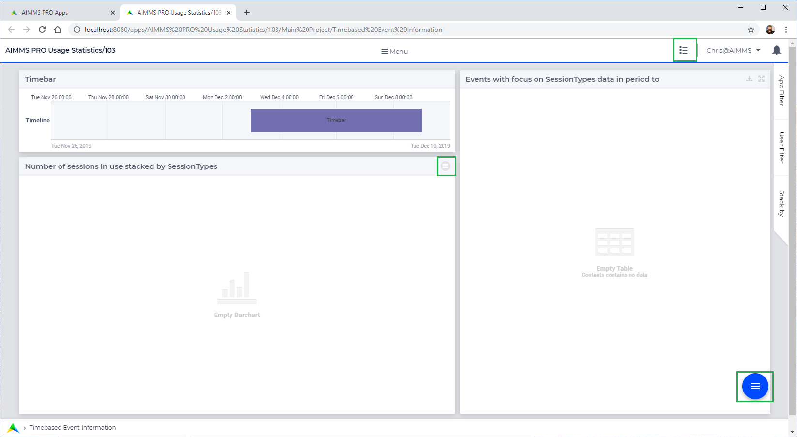

:orphan:

AIMMS PRO Usage Statistics
==========================

.. meta::
   :description: User's guide to the app "AIMMS PRO Usage Statistics"
   :keywords: AIMMS app, WebUI, User's Guide, Statistics

The AIMMS PRO Usage Statistics app, :download:`which can be downloaded here <model/example.zip>`, starts as follows:

From bottom to top, there are three menus that allow you to operate the application:

#.  In the lower right corner, there is a menu of actions available. 
    Normally, there are only two actions available, and they are only available to 
    members of the group ``admin``.
    
    #.  **Track** 
        This action will toggle the session tracking behavior of AIMMS PRO. 
        The default tracking behavior of AIMMS PRO is to not track sessions.
        By pressing this button, you will get a dialog page asking for the password 
        of the database backing AIMMS PRO. 
        By supplying this password you will turn on tracking of sessions by AIMMS PRO.

    #.  **Read**
        Read the database backing AIMMS PRO for tracked sessions. 

#.  The left widget, which will contain bar charts when data is read in, the focus of the data can be switched.  
    The focus can be on:

    #.  The maximum number of sessions running at a given moment
    
    #.  The maximum number of users active at a given moment
    
    #.  The maximum amount of memory in use by the sessions at a given moment

#.  The AIMMS Data manager. Here cases can be saved and read back.  
    This allows an admin to share the data with other users.

.. On Prem: turn toggle on
.. On Cloud: toggle already turned on
.. Generic: read table

.. PostgreSQL ODBC: https://odbc.postgresql.org/
.. Download
.. MSI
.. Scroll down for latest, tested: psqlodbc_12_00_0000-x64.msi

.. Use PostgreSQL Unixode(X64)

.. points to demo / explain:

.. demo

.. Purpose:
.. - Show AIMMS PRO usage of jobs, seats, and memory over time.

.. Three menus and some side panels:
.. - Page menu
.. - Widget menu of bar charts
.. - Data manager

.. Menu 1: Page menu - aka secondary actions.
..         Only active entries for admins, briefly show Theo, logged in via Edge
..         Show dialog page for Track - explain 
..         Press Read button.

..         Show time selection
..         Show selection by filtering
..         Show stacking

.. Menu 2: Widget menu 
..         Show that you can easily switch
..         We have a bar chart for Sessions, Users, and Memory Usage

.. Menu 3: Data manager
..         Save a case, share it.
..         Load it by Theo

.. In begeleidende text:

.. - Stakeholders:
..   o Procurement from customers
..     - Is the current subscription oversized?
..     - Is there an increase in seat / memory / server jobs, and should we increase our subscription?
..   o AIMMS Cloud operations
..     - Which accounts use how much?
..   o AIMMS G2 Market team
..     - Analyze with customer their needs

.. Provided new technology:
..    - pro::sessionmanager::ListSessionsUsage
..    - AIMMS PRO 2.34 is needed.
..    - AIMMS 4.71 is needed.

.. Used existing technology
.. - Side panels
.. - widget menu
.. - data manager
.. - extensive use of time functions

.. Used How To tricks
.. Timebar?
.. Who is the admin?
.

.. * Side panels - filters, stack by, error (dynamic).
.. * bar charts - overlay by menu.
.. * time bar used - probably familiar
.. * Toggle - Update statement
.. * Who is the admin? I am the admin! See PostMainInitialization.
.. * Computation procedure
..   o Data based on sessions
..   o Each session has a start and a finish event (stored as work events)
..   o Ordering events based on moment
..   o Grouping events based on periods in bars (and bar naming based on length of period)
..   o Stacking based on ep_BarchartColumnValueType
..     - s_ValueSubset, subset of s_ValueMasterSet, constructed by all values on which we can filter.

.. monitoring : use 

