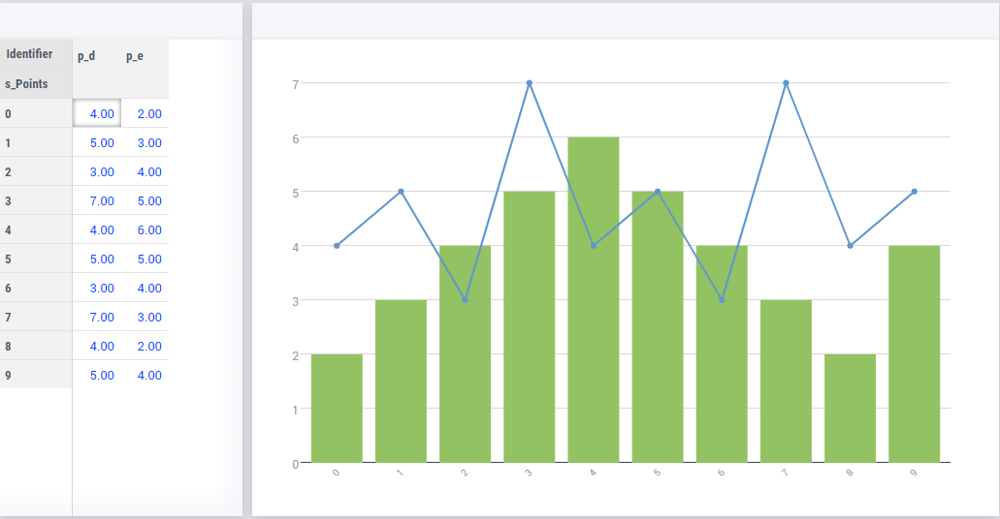

The Blinechart - overlay of the bar chart with a line chart
=============================================================

.. meta::
   :description: The Blinechart is a combo of linechart and barchart
   :keywords: linechart, barchart, widget, WebUI, Application Specific Resource

Above a blinechart is shown; a combination of a bar and linechart in one widget. This version has a single y-axis.

The blinechart is provided "as is"; there is no support on it.

It is an example on how to use Application Specific Resources (ASR).

This widget has a number of assumptions regarding the data, and a couple of configurations as outlined below.

Usage
----------

The blinechart assumes you have two identifiers in your contents, in a specific order:

1. linechart identifier
2. barchart identifier

The first item in your contents will be rendered to a linechart, and the second to a barchart. 
Any additional contents will not be displayed in the chart.

The linechart will always overlay the barchart.

.. note:: Changes to the data are reflected inmediately on the blinechart, but you cannot change values in the blinechart itself.

Pivoting
^^^^^^^^
^
For this widget, it is required to have "<IDENTIFIER-SET>" in the layers; make sure the pivoting respects this.

Any other indexes can be ordered freely in the "headers".

Configuration
-------------

The blinechart has two configurations you can make in the code.

Changing the colors
^^^^^^^^^^^^^^^^^^^^

The colors in the blinechart are not based on the ordinals and palette that AIMMS WebUI provides. Instead, the bars are always green and the line is always blue.

On line 5 and 6 of jquery.blinechart.js you can set the bar and line colors in hexadecimal notation. 
This is the default format for colors on the web.

Updating margins
^^^^^^^^^^^^^^^^^^^^

The axis labels do not automatically size to their contents. 
If your indexes have long names, they might not fit inside the widget as a result. 
To change, this, update the "b" (for bottom) value on line 15 of jquery.blinechart.js to a higher number.

The above example can be :download:`AIMMS project download <model/blineTest.zip>`  