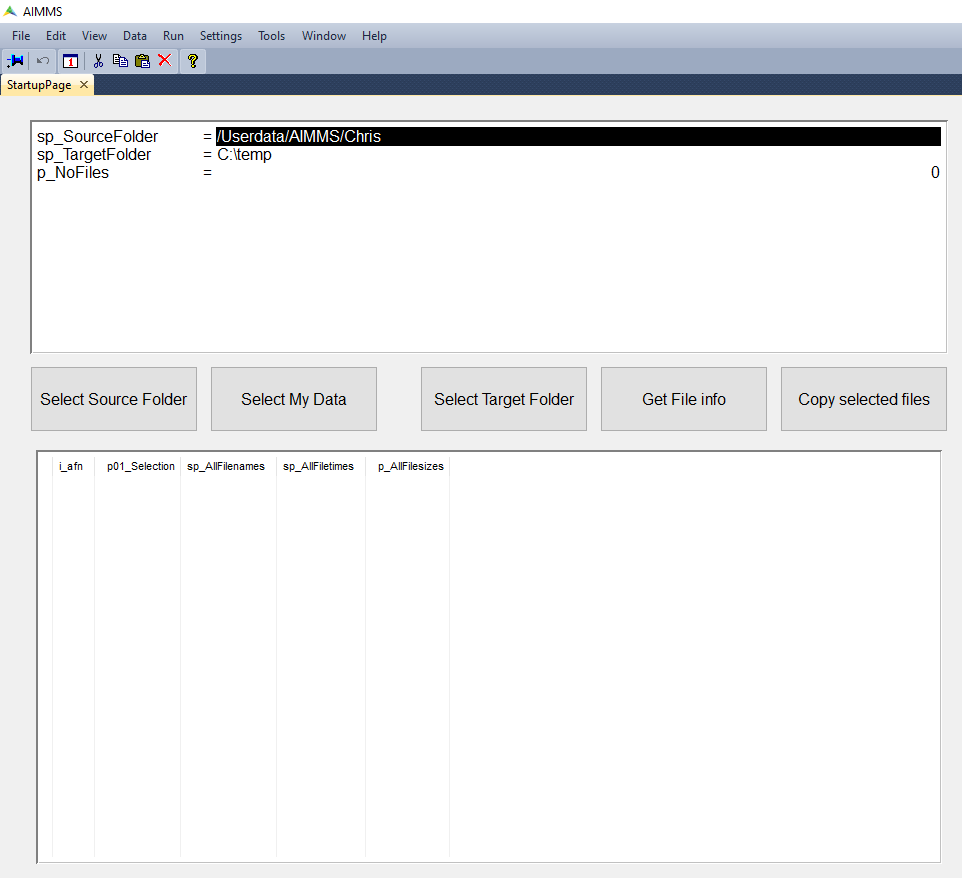
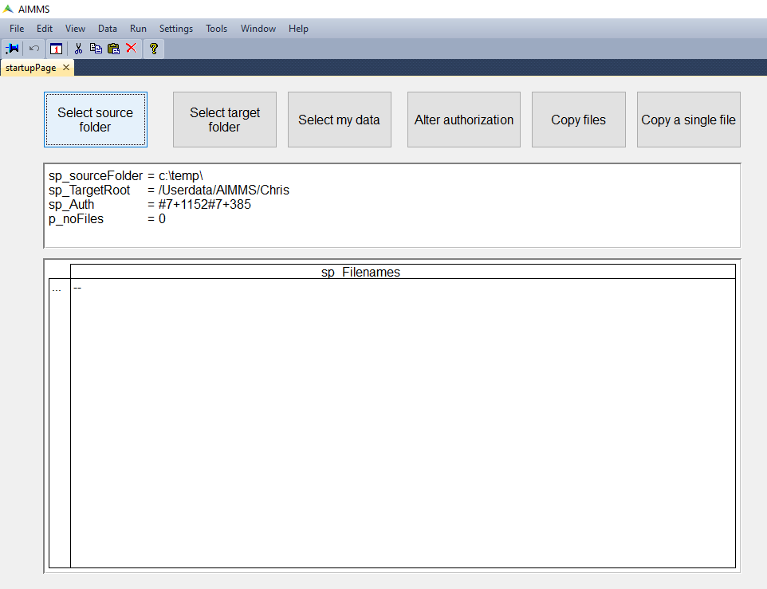

Copy Folder Operations in PRO Storage
=========================================

.. meta::
   :description: Utility apps for AIMMS PRO Storage, available for download including a brief user guide.
   :keywords: AIMMS PRO storage, deployment, utility

This article provides for the source of four utility apps to operate on AIMMS PRO Storage.

To access the apps, create an ``.aimmspack`` from these sources and publish them on your AIMMS Cloud.

The app sources are available for download in the sections below:

#. Copy a PRO Storage folder to a Windows folder on laptop/desktop: 323-copy-files-from-server_ 

#. Copy files or folders to AIMMS PRO Storage: 323-copy-files-to-server_ 

.. _323-copy-files-from-server:

Copy Files From Server
------------------------

.. topic:: Download

    :download:`Copy a PRO Storage folder to a Windows folder on laptop/desktop <model/CopyFilesFromServer.zip>`

This is a WinUI app that copies a folder from AIMMS PRO Storage to a folder on your Windows laptop or desktop; it starts with the following screen:

You can use the following buttons to operate this app:

#.  ``Select Source Folder`` This dialog behind this button is similar to the ``Select Target Folder`` of the ``AlterAuthorization`` app.

#.  ``Select My Data`` Directly select the folder ``/Userdata/<env>/<username>`` to be used as source.

#.  ``Select Target Folder`` The dialog behind this button is a Windows dialog to select a folder.

#.  ``Get File Info`` This will scan the selected ``source folder`` and will fill the lower table with file overview information. 
    You can use the p01_selection column to select/unselect files for copying.

#.  ``Copy selected files`` This will copy all selected files.

.. _323-copy-files-to-server:

Copy Files To Server
----------------------

.. topic:: Download

    :download:`Copy files to a pro storage folder <model/CopyFilesToServer.zip>`

This is a WinUI app that copies a folder from your Windows laptop or desktop to AIMMS PRO Storage. It starts with the following screen:

You can use the following buttons to operate this app:

#.  ``Select source folder`` Behind this button is a Windows folder selection dialog.

#.  ``Select target folder`` Behind this button is a PRO Storage folder selection dialog, similar to the ``Select Target Folder`` button of ``AlterAuthorization``.

#.  ``Select my data`` This will set the folder selected to the data folder of the user.

#.  ``Alter authorization`` Specify the authorization to be used for the files copied to AIMMS PRO Storage.

#.  ``Copy files`` Actually copy all the files and use the authorization selected.

#.  ``Copy a single file`` This will alter the selection of buttons, now you will need to select a single file instead of a folder.

