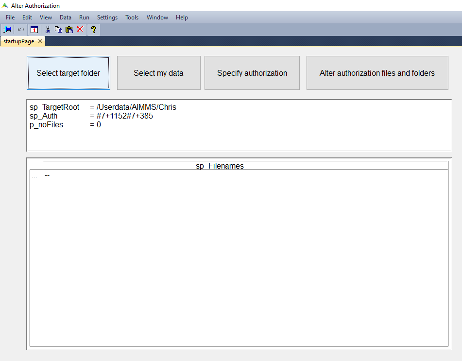

Folder operations in PRO Storage
=================================

.. meta::
   :description: Utility apps for AIMMS PRO Storage, available for download including a brief user guide.
   :keywords: AIMMS PRO storage, deployment, utility

This article provides for the source of four utility apps to operate on AIMMS PRO storage.

Download for the apps are available:

#. :download:`Alter authorization and/or delete individual files and folders <model/ControlPanel.zip>`

#. :download:`Alter authorization of files in a pro storage folder <model/AlterAuthorization.zip>`

#. :download:`Copy a PRO Storage folder to a Windows folder on laptop/desktop <model/CopyFilesFromServer.zip>`

#. :download:`Alter authorization of files in a pro storage folder <model/CopyFilesToServer.zip>`

To make these apps available, you will need to create an .aimmspack from these sources and subsquently publish them on your AIMMS PRO system.

``ControlPanel``
-----------------

This is a WinUI app, and when you select the storage tab, the screen looks as follows:

.. image:: images/ControlPanelStorageTab.png
    :align: center

For individual files (called objects) and folders (called buckets) you can alter the authorization, add them or delete them.
If you delete a folder (bucket), then all its files and sub folders will be deleted as well.
If you change the authorization of a folder (bucket), then you only change the authorization of that folder, not of its files, or of its sub folders.

.. note:: The default setup is such that users that are not members of the group Admin, ordinary users for short, cannot read the folder ``/userdata``.  To provide them with this access, a user that is the admin, or a member of the group Admin, can provide Read access to all of the folder ``/userdata`` and of the direct sub folders corresponding to the environments. Note that the consequence of this action is that a user sees which other users are on the AIMMS PRO system.  This may, or may not, be a violation of the security protocols; and is therefore not provided by default.

``AlterAuthorization``
-----------------------

``AlterAuthorization`` is a WinUI app that starts with the following screen:

There are four buttons that allow you to operate this app:

#.  ``Select Target Folder``.  This will bring up the following dialog:

    .. image:: images/AlterAuthorizationSelectTargetFolderDialog.png
        :align: center

    In this dialog you can click on:
    
    #. A number, then you will get in the indicated subfolder.
    
    #. The button ``up``; then you will go up one level in the directory structure.
    
    #. The button ``cancel``, ignore changes made in the dialog.
    
    #. The button ``ok``, accept changes made in the dialog.
    
#.  ``Select my data``. Directly select the folder ``/Userdata/<env>/<username>``
    The reason for this button is, as explained above, that ordinary users cannot read the folder ``/Userdata``. 
    They can, however, browse through it. This button does just that to land at one own's files.
    
#.  ``Specify Authorization``. In this dialog you can specify an authorization to be used.

    .. image:: images/AlterAuthorizationSelectTargetFolderDialog.png
        :align: center

    To select a new authorization, you should:
    
    #.  Select the environment, in the example ``AIMMS`` is selected.
    
    #.  Select a user, or a group of users.  In the example, the user ``Chris`` is selected.
    
    #.  A new entry appears in the table ``Current Authorization``. Here you can check/uncheck tick marks as required.
    
#.  ``Alter authorization files and folders``. Pressing this button will apply the authorization specified to the target folder specified and all files and folders therein.

``CopyFilesFromServer``
------------------------

This is a WinUI app that copies a folder from AIMMS PRO Storage to a folder on your Windows laptop or desktop; it starts with the following screen:

.. image:: images/CopyFilesFromServer.png
    :align: center

You can use the following buttons to operate this app:

#.  ``Select Source Folder`` This dialog behind this button is similar to the ``Select Target Folder`` of the ``AlterAuthorization`` app.

#.  ``Select My Data`` Directly select the folder ``/Userdata/<env>/<username>`` to be used as source.

#.  ``Select Target Folder`` The dialog behind this button is a Windows dialog to select a folder.

#.  ``Get File Info`` This will scan the selected ``source folder`` and will fill the lower table with file overview information. 
    You can use the p01_selection column to select/unselect files for copying.

#.  ``Copy selected files`` This will copy all selected files.

``CopyFilesToServer``
----------------------

This is a WinUI app that copies a folder from your Windows laptop or desktop to AIMMS PRO Storage. It starts with the following screen:

.. image:: images/CopyFilesToServer.png
    :align: center

You can use the following buttons to operate this app:

#.  ``Select source folder`` Behind this button is a Windows folder selection dialog.

#.  ``Select target folder`` Behind this button is a PRO Storage folder selection dialog, similar to the ``Select Target Folder`` button of ``AlterAuthorization``.

#.  ``Select my data`` This will set the folder selected to the data folder of the user.

#.  ``Alter authorization`` Specify the authorization to be used for the files copied to AIMMS PRO Storage.

#.  ``Copy files`` Actually copy all the files and use the authorization selected.

#.  ``Copy a single file`` This will alter the selection of buttons, now you will need to select a single file instead of a folder.

