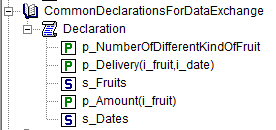

Write and Read AIMMS Data in Text Format
=======================================================

.. meta::
   :description: An easy and practical way of sharing persisting AIMMS data is via text files.
   :keywords: write, read, persist, data, comparison

When two AIMMS apps communicate with each other using the same identifiers, you may want to use the text format.

Here we'll provide a brief example of sharing persisting AIMMS data with text files. 

Example description
-------------------
The declaration order is as follows.

These identifiers are initialized in ``PostMainInitialization`` like this:

.. code-block:: aimms
    :linenos:

    Procedure PostMainInitialization {
        Body: {
            s_Fruits := data { orange, pear };
            s_Dates := data { day1, day2 };
            p_amount := data { orange:3.4567891234, pear:4.7654321987 };
            p_delivery := data table
                    day1 day2
            orange   1    1
            pear     2    1    ;
        }
        Comment: {
            "Add initialization statements here that require that the libraries are already initialized properly,
            or add statements that require the Data Management module to be initialized."
        }
    }

The first identifier, ``p_NumberOfDifferentKindOfFruit``, has a definition, and it not logical to write that to a text file which is also used as an input file.

So to write all identifiers in the section ``CommonDeclarationsForDataExchange`` that can also be used as input, we construct a subset of :any:`AllIdentifiers`, say ``s_outputSet`` as follows:

.. code-block:: aimms

    s_outputSet := CommonDeclarationsForDataExchange * CurrentInputs ;

Writing to text file
----------------------------

To write the identifiers in that set to a text file, you can specify the write statement as follows:

.. code-block:: aimms

    write s_outputSet to file sp_ExchangeFilename ;

Then the output looks like this:

.. code-block:: none

    p_Delivery := data { ( orange, day1 ) : 1,  ( orange, day2 ) : 1,  ( pear, day1 ) : 2,  ( pear, day2 ) : 1 } ;

    s_Fruits := data { orange, pear } ;

    p_Amount := data { orange : 3.457,  pear : 4.765 } ;

    s_Dates := data { day1, day2 } ;

Adjusting output
-----------------
You may want to change the output somewhat, e.g.:

* Sets are read in before they are used

* Retain precision of the data

* One data entry per line

You can do this by setting the options for data writing, and by using the ``in backup mode`` clause of the ``write`` statement. 
More on the preferred way of setting options can be found :doc:`in this article<../208/208-setting-options>`.

Thus the code becomes:

.. code-block:: aimms
    :linenos:

    Procedure MainExecution {
        Body: {
            block where 
                    single_column_display := 1, 
                    listing_page_width := 32000,
                    listing_number_width := 20,
                    listing_number_precision := 12 ;
                s_outputSet := CommonDeclarationsForDataExchange * CurrentInputs ;
                write  s_outputSet
                to file sp_ExchangeFilename 
                in backup mode ;
            endblock ;
        }
    }

and the output file becomes:

.. code-block:: none
    :linenos:

    s_Fruits := data 
    { orange,
      pear  } ;

    s_Dates := data 
    { day1,
      day2 } ;

    p_Amount := data 
    { orange : 3.456789123400,
      pear   : 4.765432198700 } ;

    p_Delivery := data 
    { ( orange, day1 ) : 1,
      ( orange, day2 ) : 1,
      ( pear  , day1 ) : 2,
      ( pear  , day2 ) : 1 } ;

As you can see in the above text file, the sets are filled before they are used, and the parameter data keeps its precision.

To subsequently read in that text file in another model sharing the declaration of the mentioned identifiers, you can simply do the following:

.. code-block:: none
    :linenos:

    Procedure MainExecution {
        Body: {
            read from file sp_ExchangeFile ;
        }
    }

This will read in such a text file.

Example project
----------------

Both AIMMS projects can be downloaded below:

* :download:`model.zip` 
