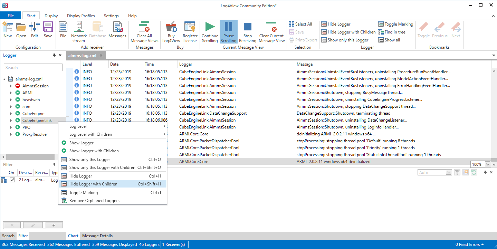
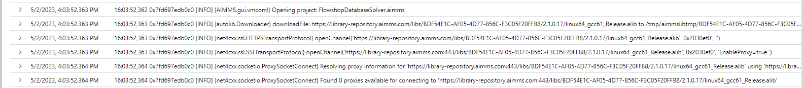

Get More Log Information
=========================

.. meta::
   :description: This article explains how to increase the amount of log information.
   :keywords: log, troubleshoot

As a modeler, you can find :doc:`detailed logs <../313/313-get-log-files>` to analyze an issue before reporting it to `AIMMS User Support <https://www.aimms.com/support/>`_ or on the `AIMMS Community <https://community.aimms.com/>`_.

When desired or needed, AIMMS can provide more logging information. For this purpose, AIMMS comes with loggers.
This logging feature is somewhat similar to the `log4j <https://logging.apache.org/log4j/2.x/>`_ technology.

The hereby described logging feature includes adding a LoggerConfig.xml file to your project so that the logging in certain areas can be increased for analysis or troubleshooting purposes. 
:download:`A zip file containing a logger config template can be downloaded here <LoggerConfig.zip>`.
This zip file contains the ``LoggerConfig.xml`` file.

.. note:: 

    Security notice, see:  `Apache log4j vulnerability does not affect AIMMS software <https://community.aimms.com/aimms-pro-cloud-platform-43/apache-log4j-vulnerability-does-not-affect-aimms-software-1123>`_

This article will:

#.  introduce terminology regarding logging, 

#.  explain, how to control the logging,

#.  inform, how to start logging,

#.  share how the created logs can be inspected, and 

#.  provide some hints on further reading.

Terminology
-------------

#.  **Logger** A logger is a tracing facility built in a software component.

#.  **Logger naming** A logger is usually named after the component in which it is built. 
    For sub-components, the logger is usually named ``<main component>.`` and so on.

#.  **Log level** Both a logger and a message have a level associated with it. 
    When the message level is equal to or greater than the level of the logger, it is written to file.
    Here is the list of log levels used (from low to high):

    #.  *Trace* Typically intermediate results, and indications of where execution is.
        This output typically requires detailed knowledge of the AIMMS implementation to make sense.

    #.  *Debug* Typically input echoing and computed results

    #.  *Info* Summaries of what is computed, such as a matrix size overview.

    #.  *Warn* Exceptions that can be continued from

    #.  *Error* Exceptions that should be handled, by a higher layer in the program, by the modeler, or by the user

    .. note:: Levels Trace and Debug can significantly decrease application performance and fill up your disk, and do not provide much use to the modeler. Therefore we don't recommend to enable them unless instructed by AIMMS Staff.

#.  **Appender** There are four ``appenders`` available:

    #.  to generate output for server sessions and WebUI data session on AIMMS PRO on Premise,

    #.  to generate output to AIMMS Cloud,
    
    #.  to generate text output, and
    
    #.  to generate XML output.

    In the configuration file provided, the text output is activated; but explained how to reconfigure for the other outputs.

Next we will discuss how to control the logging, both where it goes, and how much is written.

Control of the Logging
--------------------------

The sample ``LoggerConfig.xml`` file which this article provides, configures how much output several loggers produce during an AIMMS session.

There are three sections in the file ``LoggerConfig.xml``
We will cover their purpose below as well as if and how to modify them accordingly before we start logging.

#.  **Appenders** This section defines how and where the output can be sent to.

    Depending on what you would like to log there are different possible outputs:

    #.  For logging of sessions on AIMMS Cloud -> ``stdout`` - this means that the cloud logs for a certain component will be increased (please note that cloud logs are accessible for AIMMS only),

    #.  For logging of activities in AIMMS Developer there are two options:
    
    - a TXT output, which allows you to inspect the results using your favorite text editor.
    
        *MyFileAppender* - a plain text file appender, which sent output to the local file ``log/aimms-log.txt``.

    - an XML output, which allows you to make selections of the log after the fact using a suitable viewer.
    
        *MyXMLFileAppender* An XML text file appender, which sends its output to the file ``log/aimms-log.xml``

    #.  For logging of sessions of AIMMS PRO on premise -> to the folder AimmsPRO/Log/Sessions (for a solver session or for a WebUI data session, not for a WinUI session)

    Unless instructed specifically by the AIMMS team please leave these as they are. The one(s) you choose to use will be defined in Section 3.

#.  **Loggers**

    There are various loggers, and each logger has its own default level. 
    The most typical loggers are presented in the template ``LoggerConfig.xml``.

    Please make the changes only to the logger relevant to your issue leaving the rest of the loggers as they are.

    If you are already in communication with the AIMMS team you will receive a request from AIMMS for modifying a particular logger to a certain level or adding a logger to the file.

#.  **Final configuration**

    This section is used to select the appenders to be applied (as previously defined in Section 1). Normally, you'll just use one, and comment out the others, further to your needs or the instructions of the AIMMS team.

    With the accordingly tailored LoggerConfig file you are ready for deeper logging for a certain component.

Start Logging
-------------

For logging in AIMMS Developer
^^^^^^^^^^^^^^^^^^^^^^^^^^^^^^^^^^^^^^^^^^^^^^^^^^^^^^^^^^^^^^^^^^

#.  Make sure that the line containing ``<appender-ref ref="MyFileAppender"/>`` in Section 3 of the ``LoggerConfig.xml`` file is the only uncommented line (without ``<!--`` in front). Usually this is how you download the file; 

#.  Modify any of the log levels if needed or instructed by the AIMMS team and save the file;  

#.  Place the ``LoggerConfig.xml`` file in the AIMMS Project folder;  

    As you may know, the AIMMS project folder is the folder that contains the ``.aimms`` file of the AIMMS project.

#.  To start the logging you will need to start AIMMS by either:

    - start AIMMS by double clicking the ``.aimms`` file, or

    - by right-clicking the ``.aimms`` file and selecting the AIMMS Developer release of choice.

#.  Reproduce the issue at hand so the relevant lines can be printed in the log.

To configure the Windows explorer with this default action on ``.aimms`` files, and the adding of the context menu item, the `AIMMS Launcher <https://download.aimms.com/aimms/download/data/AIMMSLauncher/AIMMSLauncher-latest.exe>`_ needs to have been run once.

.. note:: 

    Evolution: With AIMMS 4.80 and newer the above is sufficient to start logging.
    When are you are using AIMMS 4.79 or older, please check :doc:`dated logging technology <../329/329-vintage-more-logging>` to obtain similar logging, just less detailed and less conveniently activated and configurable.

For logging of WebUI and solver sessions in AIMMS Cloud
^^^^^^^^^^^^^^^^^^^^^^^^^^^^^^^^^^^^^^^^^^^^^^^^^^^^^^^^^^^^^^^

#.  Make sure that the line containing ``<appender-ref ref="stdout"/>`` in Section 3 of the ``LoggerConfig.xml`` file is the only uncommented line (without ``<!--`` in front);  

#.  Modify any of the log levels if needed or instructed by the AIMMS team and save the file; 

#.  Export the model in an .aimmspack file, with the amended LoggerConfig file included in the project folder (as described in the section For logging in AIMMS Developer);

#.  Publish the .aimmspack in the portal; 

#.  Run the app and reproduce the issue in question;

#.  Please provide the relevant information to the AIMMS team so they can access the logs for you.

For logging of WinUI sessions in AIMMS Cloud or in AIMMS PRO on premise
^^^^^^^^^^^^^^^^^^^^^^^^^^^^^^^^^^^^^^^^^^^^^^^^^^^^^^^^^^^^^^^^^^^^^^^^^^^^^^^^^^^^

#.  Make sure there is a ``C:/temp`` folder on the user’s local machine. If not, create one manually;

#.  Amend the ``LoggerConfig.xml`` file the following way:

- in Section 1 of the ``LoggerConfig.xml`` file: for ``<appender name = MyFileAppender>`` set ``value="C:\temp\aimms-log.txt"`` 
- in Section 3 of the ``LoggerConfig.xml`` file: find the line ``<appender-ref ref="MyFileAppender" />`` and remove the comments in front of it. Make sure that this is the only uncommented line from Section 3. 

#.  Upload the ``LoggerConfig.xml`` file locally in the folder of the app. In my case it will look like this: ``C:\Users\Desislava\AppData\Local\AIMMS\PRO\dessie-test2.aimms.cloud\Tunnel app 40181\42ead7a8-0a46-4436-9092-4e86490380ee``;

#.  Run the app on PRO or Cloud;

#.  A file named ``aimms-log.txt`` will get created in ``C:\temp\`` containing logs from running the app. It will contain the log lines for the whole WinUI session.

Inspecting Logging Information
------------------------------

.. note:: 

    The AIMMS log files are created by AIMMS staff and designed to be interpreted by AIMMS staff. 
    The meaning of log entries may not be obvious. 
    An error or warning message in the log file does NOT necessarily indicate a problem in the application. 

A good tactic for analyzing these logs is to scan for ``[ERROR]`` or ``[WARN]``. 
When an error or warning is related to the issue you are analyzing, check the lines just above it.
In case you are unsure please seek help from the AIMMS team with the logs interpretation.

Using a Text Editor to Analyze TXT Log Files
^^^^^^^^^^^^^^^^^^^^^^^^^^^^^^^^^^^^^^^^^^^^^^^^^^^^^^^^^^^^^^^^^^

Use a text editor to open the log file ``log/aimms-log.txt``. 

Some example text:

.. code-block:: none
    :linenos:

    2019-12-23 10:12:28,689 0x0000598c [WARN] {AIMMS.Compiler.ceattr.AimmsBCIncidentHandler} "guipro::progress::NextCheck" is not present in the interface of its containing library and therefore cannot be referenced from outside this library.
    2019-12-23 10:15:28,986 0x00006358 [DEBUG] {AIMMS.Trace.Procedure} Starting Procedure  MainInitialization
    2019-12-23 10:15:28,986 0x00006358 [DEBUG] {AIMMS.Trace.Procedure} Starting Procedure  gss::pr_SeenErrorsAreHandled
    2019-12-23 10:15:29,010 0x00006358 [DEBUG] {AIMMS.Trace.Procedure} Finishing Procedure gss::pr_SeenErrorsAreHandled
    
Selected remarks:

*   Line 1: I referenced the procedure ``guipro::progress::NextCheck`` outside the library ``AimmsProGUI``.
    This error message appeared in the AIMMS IDE as well.

*   Lines 2-4 I have set the level of the logger ``AIMMS.Trace.Procedure`` to info. 
    Putting that logger to trace will show all procedure calls.
    You can see the message pattern ``Date{yyyy-MM-dd HH:mm:ss,SSS} ExecutionThread [MessageLevel] {Logger} Message``.  

 
Using ``Log4View`` to Analyze ``.xml`` Log Files
^^^^^^^^^^^^^^^^^^^^^^^^^^^^^^^^^^^^^^^^^^^^^^^^^^^^^^^^^^^^^^^^^^

.. available at `log4view.com <https://www.log4view.com/download-en>`_.

``Log4View`` is a utility to analyze XML log files. 
The community edition of ``Log4View`` is sufficient to analyze one XML log file at a time.

With the Log4View utility you can filter the output of selected loggers, as shown in the image below.

|

Using Azure to Inspect Logs Created on the AIMMS Cloud
^^^^^^^^^^^^^^^^^^^^^^^^^^^^^^^^^^^^^^^^^^^^^^^^^^^^^^^^^^^^^^^^^^

The Azure logging information is only accessible to AIMMS staff.
Please find a snapshot of the information below.

|

Further Reading
---------------

* Get log files :doc:`The parent article<../313/313-get-log-files>`

* Guard solver session :doc:`Investigating behavior solver session<../310/310-investigate-behavior-pro-job>`

* Save state  `Data state solver session <https://documentation.aimms.com/guardserversession/state-server-session.html>`_

* The AIMMS Debugger, see :doc:`creating-and-managing-a-model/debugging-and-profiling-an-aimms-model/index`

* Command-line options, see :any:`miscellaneous/calling-aimms/index`

