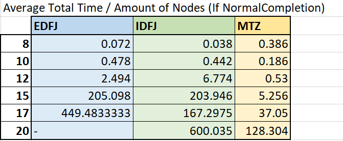
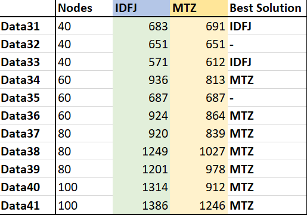

Testing the Library
===================

The CVRP Library can solve Capacitated Vehicle Routing Problems (CVRP). There are four different options of formulations. One of them is called **Time Windows** and will naturally only be used for a CVRP with time windows. All the other formulations can be used for problems without time windows; the **Explicit Dantzig-Fulkerson-Johnson**, the **Implicit Dantzig-Fulkerson-Johnson** and the **Miller-Tucker-Zemlin** formulation. In this article these three formulations will be tested and compared. 

Creating Datasets
-----------------

There are a lot of examples of CVRP’s available on the internet (for example on this website: https://neo.lcc.uma.es/vrp/vrp-instances/). 
However, these data sets mostly contain more than 20 nodes. The Explicit Dantzig-Fulkerson-Johnson formulation isn’t capable of solving problems that big. 
So, in AIMMS you will find a procedure which creates 30 datasets with 8 to 20 nodes.  
The datasets contain **8 nodes, 10 nodes, 12 nodes, 15 nodes, 17 nodes or 20 nodes**. 
There are 5 files for each amount of nodes. The following data is randomly generated: the amount of vehicles, the x-coordinates and y-coordinates of the nodes, 
the demand of the nodes and the capacity of the vehicles. The function :any:`Uniform(min,max)` is used and will choose a random number between two values. The data is selected as follows:

-	``p_NumberOfVehicles``: A random number between 2 and 1/3 of the amount of nodes. 
-	``p_XCoordinate`` and ``p_YCoordinate``: Random numbers between -50 and 50.
-	``p_Demand``: Random numbers between 10 and 20. 
-	``p_Capacity``: The sum of all Demands divided by the number of vehicles. Then this number is multiplied by 1.25 to create some slack.
-	``ep_Depot``: The coordinates of the depot are (0,0) and the demand is also 0. 

Testing the Datasets/Results 
------------------------------

The data sets were tested for the three different formulations. A maximum of an hour was set to solve the problem. There are three important things when looking at the results:

•	**Solver/Program status**: Did the program complete finding an optimal solution?
•	**Solver/Program time**: How long was the program running?
•	**Total distance**: What is the distance of the best route that has been found?

Solver/Program Status
^^^^^^^^^^^^^^^^^^^^^^

**Explicit Dantzig-Fulkerson-Johnson:** 

-	The solver status for the datasets with 20 nodes is: ``TerminatedBySolver``. This is probably due to the fact that datasets with 20 nodes are already too big for the Explicit Dantzig-Fulkerson-Johnson formulation. 
-	The solver status for two datasets (both with 17 nodes) is: ``ResourceInterrupt``. They both have a solving time of an hour, which means that an hour wasn’t enough to find an optimal solution. 
-	The solver status of the remaining 23 datasets is: ``NormalCompletion``. This means that an optimal solution has been found within an hour. 

**Implicit Dantzig-Fulkerson-Johnson**

-	The solver status for four datasets (one with 17 nodes and three with 20 nodes) is: ``ResourceInterrupt``. For these datasets an hour wasn’t enough to find an optimal solution.
-	The Remaining 26 datasets were completed normally.

**Miller-Tucker-Zemlin**

-	All datasets were completed normally. 

Solver/Program Time
^^^^^^^^^^^^^^^^^^^^

Most of the datasets were completed normally and an optimal solution was found. Comparing the distance of the best solutions would therefore not be useful (because they are all the same). It is however possible to compare the time it took to find that solution. 

The average time it took to find an optimal solution for a dataset with a certain amount of nodes is calculated and shown in the table below. Only the results that have NormalCompletion as Solver Status are included. 
 

|

It's easy to see that Miller Tucker Zemlin is generally the fastest formulation. Especially for the datasets with larger numbers of nodes.

S
Creating Larger Datasets
------------------------

It is also interesting to compare results of larger datasets. The Explicit Dantzig-Fulkerson-Johnson formulation isn’t capable of solving problems of larger datasets, but the Implicit Dantzig-Fulkerson-Johnson formulation and the Miller-Tucker-Zemlin formulation can be compared. 
This time the same procedure to create 12 datasets with 40 to 100 nodes was used. 
The datasets contain **40 nodes, 60 nodes, 80 nodes or 100 nodes**. There are 3 files for each amount of nodes. The data is generated in the same way except for the number of vehicles. This time it is a random number between 2 and 1/10 of the amount of nodes. 

Testing the Datasets/Results
----------------------------

The solver status for almost all the datasets was ResourceInterrupt and the program status was IntegerSolution. This means that an hour wasn’t enough to find an optimal solution, but a feasible integer solution is found. The solver time can therefore not be compared with each other (they are all an hour). However, you can see which formulation found a better solution within an hour by comparing the distance of the best found solution.
The result of the last dataset (with 100 nodes) of the Implicit Dantzig-Fulkerson-Johnson formulation had a program status of IntermediateInfeasible. This means that it wasn’t possible to find a feasible solution. So this data file shall not be taken into account in the comparisons.
In the table below the distances are shown for the best solutions of both the formulations. In the last column it says which formulation has found the best solution. 

|

The Implicit Dantzig-Fulkerson-Johnson formulation found better solutions for the datasets with 40 nodes. But the Miller-Tucker-Zemlin formulation found better solutions for all the other datasets. 

Conclusions
-----------

- 	For really small datasets (up until 10 nodes) it doesn’t really matter what formulation is used while the solving time isn’t significantly different for each of the formulations.
- 	For datasets from 12 to 20 nodes the Miller-Tucker-Zemlin formulation is the best formulation to use. It had a solution for every example and was significantly the fastest. 
- 	For datasets from 40 nodes both the Implicit Dantzig-Fulkerson-Johnson and the Miller-Tucker-Zemlin formulation can be used. Both of the formulations didn’t find an optimal solution within an hour, but they did find a good feasible solution. However, the solutions of the Implicit Dantzig-Fulkerson-Johnson formulation were slightly better. 
- 	For datasets from 60 to 100 nodes using the Miller-Tucker-Zemlin formulation is advised. While it found the best solutions within an hour. 
