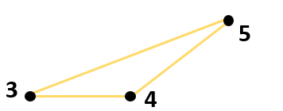
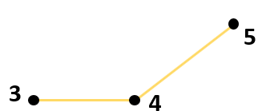
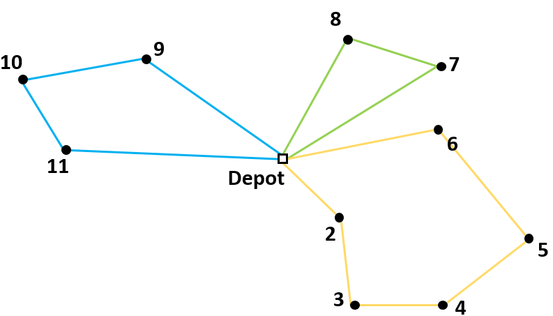
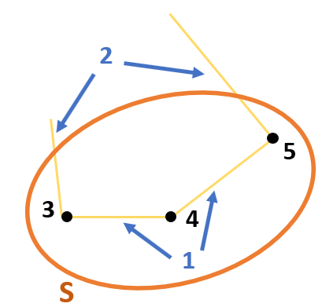

Explicit Dantzig-Fulkerson-Johnson formulation
==============================================
The library in AIMMS that solves a **Capacitated Vehicle Routing Problem** (**CVRP**) contains  different formulation options. The formulations have different methods of eliminating subtours. In this article the Explicit Dantzig-Fulkerson-Johnson formulation is discussed. 
This is an example of a subtour in a route for a CVRP:

.. image:: images/subtour.png
   :scale: 35%
   :align: center

Idea behind the formulation
---------------------------
The Dantzig Fulkerson Johnson (DFJ) formulation uses subsets to eliminate subtours. The set of all nodes is V = {1, 2, 3, 4, 5, 6, 7, 8, 9, 10, 11}. The set of nodes that makes a subtour is S = {3, 4, 5} and is a subset of V. 

This subset contains three nodes. The number of arcs between the nodes in this subset is also three, which is why it makes a subtour. If the number of arcs should be less than three, one arc should be removed. For example, the arc between node 3 and node 5.

   
Now one arc has to go from node 3 to a node outside of the subset and another arc has to go from node 5 to a node outside of the subset. The following route can then be formed:

   
There are two ways of explaining this way of eliminating subtours:

1.	The number of arcs between nodes in the subset should be less than the number of nodes in that subset. 
2.	The number of arcs that connect a node from the subset to a node outside of the subset should be at least 2. 

   
The second explanation is used for the CVRP Library. To eliminate all possible subtours, it should apply to every subset that could be a subtour. 
Subsets containing the depot cannot be subtours, for example S = {1, 9, 10, 11}. This is just a regular tour for one of the vehicles. A subset with 0 or 1 element can also not be a subtour. 
So it should apply to every possible subset of V that has at least two elements and does not contain the depot. 

Subtour elimination constraints
-------------------------------
The binary variable :math:`x_{ijk}` has a value of 1 if vehicle k drives from node i to node j. The constraint can be formulated as follows:

.. math:: \sum_{i \in S, j \notin S}{x_{ijk}} \geq 2 \qquad S \subset V \setminus \{1\}, \enspace 2 \leq |S| \leq n - 2

AIMMS 
-----
In the CVRP library this formulation is implemented in the section: ``Explicit Dantzig Fulkerson Johnson Section``. In order to create constraints about subsets, the subsets should be generated first. This happens in the procedure ``Create_Subsets``. The body of this procedure is as follows:

.. code-block:: aimms
	:linenos:

	empty s_CostumerSubset, s_SubsetNumber, p01_Subsets;
	
	
	repeat
			!add subset (if it contains at least two cities)
			if card(i_selectedCostumer) >= 2 and card(i_selectedCostumer) <= 
			card(s_Nodes) - 2 then
				s_SubsetNumber += card(s_SubsetNumber ) + 1 ;
				ep_LastSubsetNumber := last(s_SubsetNumber);
				p01_Subsets( i_SelectedCostumer, ep_LastSubsetNumber ) := 1;
			endif;
	
			break when s_CostumerSubset = s_Costumers;
	
		block !generate next subset (using binary counting)
			ep_lastUnselectedCostumer := last( i | not ( i in s_CostumerSubset ) );
			for i | i > ep_lastUnselectedCostumer do
				s_CostumerSubset -= i ;
			endfor ;
			s_CostumerSubset += ep_lastUnselectedCostumer ;
		endblock ;
	
	endrepeat ;

Every possible subset of ``s_Nodes`` is checked using binary counting. All subsets without the depot and with a minimum of two nodes will be created. A number is then added to the set ``s_SubsetNumber``. The binary parameter ``p01_Subsets`` indicates which nodes are in that subset. 

- **line 15 - line 21**: 	The next subset (``s_CostumerSubset``) is generated using binary counting.
- **line 6  - line 11**: 	If ``s_CostumerSubset`` contains at least two nodes, then that subset is added.
- **line 13**: 				The procedure should stop when ``s_CostumerSubset`` contains all costumers. Because with binary counting, all the following subsets would contain the depot. 

