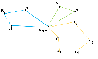

Explicit Dantzig-Fulkerson-Johnson Formulation
==============================================
The library in AIMMS that solves a **Capacitated Vehicle Routing Problem** (**CVRP**) contains  different formulation options. The formulations have different methods of eliminating subtours. In this article the Explicit Dantzig-Fulkerson-Johnson formulation is discussed. 
This is an example of a subtour in a route for a CVRP:

.. image:: images/Subtour.png
   :scale: 50%
   :align: center

Idea Behind the Formulation
---------------------------
The Dantzig Fulkerson Johnson (DFJ) formulation uses subsets to eliminate subtours. The set of all nodes is :math:`V = {1, 2, 3, 4, 5, 6, 7, 8, 9, 10, 11}`. 
The set of nodes that makes a subtour is :math:`S = {3, 4, 5}`` and is a subset of :math:`V`. 

.. image:: images/EDFJ1.png
   :scale: 50%
   :align: center

This subset contains three nodes. The number of arcs between the nodes in this subset is also three, which is why it makes a subtour. If the number of arcs should be less than three, one arc should be removed. For example, the arc between node 3 and node 5.

.. image:: images/EDFJ2.png
   :scale: 50%
   :align: center
   
Now one arc has to go from node 3 to a node outside of the subset and another arc has to go from node 5 to a node outside of the subset. The following route can then be formed:

   
There are two ways of explaining this way of eliminating subtours:

1.	The number of arcs between nodes in the subset should be less than the number of nodes in that subset. 
2.	The number of arcs that connect a node from the subset to a node outside of the subset should be at least 2. 

.. image:: images/EDFJ4.png
   :scale: 50%
   :align: center
   
The second explanation is used for the CVRP Library. To eliminate all possible subtours, it should apply to every subset that could be a subtour. 
Subsets containing the depot cannot be subtours, for example :math:`S = {1, 9, 10, 11}`. This is just a regular tour for one of the vehicles. A subset with 0 or 1 element can also not be a subtour. 
So it should apply to every possible subset of :math:`V` that has at least two elements and does not contain the depot. 

Subtour Elimination Constraints
-------------------------------
The binary variable :math:`x_{ijk}` has a value of 1 if vehicle k drives from node :math:`i` to node :math:`j`. The constraint can be formulated as follows:

.. math:: \sum_{i \in S, j \notin S}{x_{ijk}} \geq 2 \qquad S \subset V \setminus \{1\}, \enspace 2 \leq |S| \leq n - 2

AIMMS 
-----
In the CVRP library this formulation is implemented in the section: ``Explicit Dantzig Fulkerson Johnson Section``. 
In order to create constraints about subsets, the subsets should be generated first. This happens in the procedure ``Create_Subsets``. The body of this procedure is as follows:

.. code-block:: aimms
	:linenos:

	empty s_CostumerSubset, s_SubsetNumber, p01_Subsets;
		
	repeat
		!add subset (if it contains at least two cities)
		if card(i_selectedCostumer) >= 2 and card(i_selectedCostumer) <= card(s_Nodes) - 2 then
			s_SubsetNumber += card(s_SubsetNumber) + 1 ;
			ep_LastSubsetNumber := last(s_SubsetNumber);
			p01_Subsets( i_SelectedCostumer, ep_LastSubsetNumber ) := 1;
		endif;

		break when s_CostumerSubset = s_Costumers;

		block !generate next subset (using binary counting)
			ep_lastUnselectedCostumer := last(i | not (i in s_CostumerSubset));
			for i | i > ep_lastUnselectedCostumer do
				s_CostumerSubset -= i;
			endfor;
			s_CostumerSubset += ep_lastUnselectedCostumer;
		endblock;
	
	endrepeat;

Every possible subset of ``s_Nodes`` is checked using binary counting. All subsets without the depot and with a minimum of two nodes will be created. A number is then added to the set ``s_SubsetNumber``. The binary parameter ``p01_Subsets`` indicates which nodes are in that subset. 

- **line 13 - line 19**: 	The next subset (``s_CostumerSubset``) is generated using binary counting.
- **line 5  - line 9**: 	If ``s_CostumerSubset`` contains at least two nodes, then that subset is added.
- **line 11**: 				The procedure should stop when ``s_CostumerSubset`` contains all costumers. Because with binary counting, all the following subsets would contain the depot. 

Generating the Constraints
-----------------------------

Using the Explicit Dantzig-Fulkerson-Johnson, for every subset, a constraint is generated. It uses subsets to eliminate subtours. 
The idea behind the formulation is that, for every subset that could form a subtour, at least two arcs should connect nodes from the subsets to nodes outside of the subset. 
This article (EDFJ) elaborates on this formulation.

:math:`V` is the set of all nodes from 1 to :math:`n` (depot is :math:`n = 1`). :math:`S` is a subset of :math:`V`. 
The binary variable :math:`x_{ijk}` has a value of 1 if vehicle :math:`k` drives from node :math:`i` to node :math:`j`. The constraint can be formulated as follows:

.. math:: \sum_{i \in S, j \notin S}{x_{ijk}} \geq 2 \qquad S \subset V \setminus \{1\}, \enspace 2 \leq |S| \leq n - 2

Note that there are as there are an exponential number of subsets, there are also an exponential number of constraints generated. 
For instance: All subsets with at least two elements, that do not contain the depot, should be generated. 
The number of subsets of a set with 10 elements = :math:`2^{10}`. The number of subsets thereof that contain 0 elements or all elements = 2. 
The number of subsets thereof that contain 1 element (or all but 1) = 20. So the number of generated subtour elimination constraints is :math:`2^{10} – 2 – 20 = 1002`.

