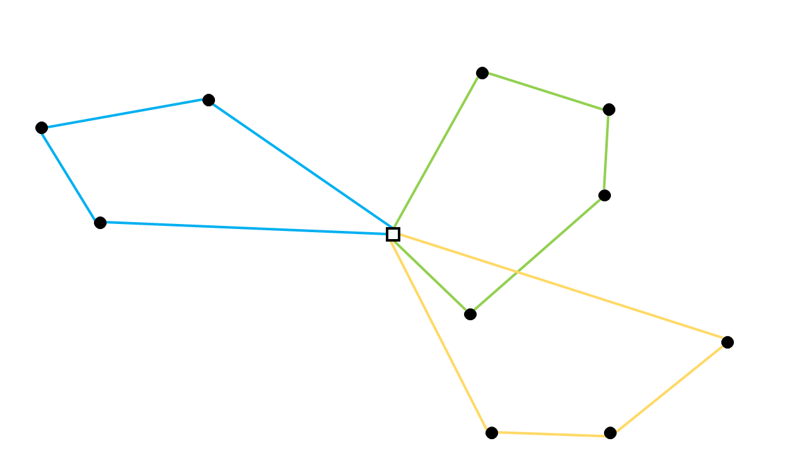
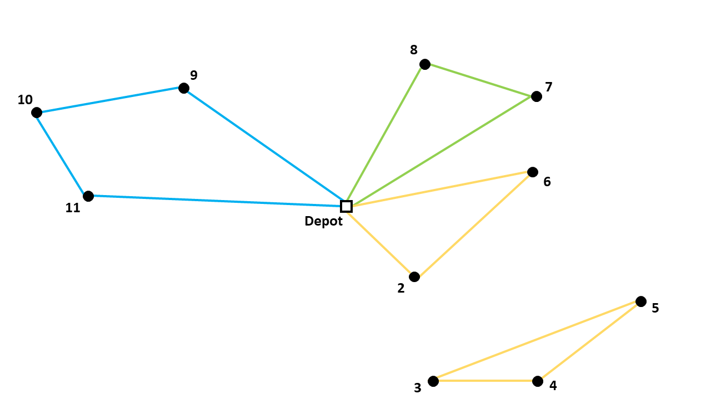

Capacitated Vehicle Routing Problem formulation
===============================================

There is a library in AIMMS that solves a **Capacitated Vehicle Routing Problem** (**CVRP**). It contains different options of formulating the problem. The difference between these articles is how subtours are eliminated. The objective function and most of the constraints are the same for all four options and will be explained in this article.

Linear Integer Programming Model
--------------------------------

A CVRP can be formulated as a linear integer programming model. The total distance of the route, where all costumers demands are met, should be minimized. 

The binary variable :math:`x_{ijk}` has a value of :math:`1` if the arc from node :math:`i` to node :math:`j` is in the optimal route and is driven by vehicle :math:`k`. 

.. math:: x_{ijk} \in \{0,1\} \qquad \forall k \in \{1,...,p\},\enspace i,j \in \{1,...,n\} 

Whereby, there is no travel from a node to itself:

.. math:: x_{iik} = 0  \qquad \forall k \in \{1,...,p\},\enspace i \in \{1,...,n\}

The parameter :math:`d_{ij}` describes the distance from node :math:`i` to node :math:`j`. There are :math:`n` nodes (depot = 1) and :math:`p` vehicles. The objective function can be formulated as follows:

.. math:: Min \sum_{k = 1}^{p}{\sum_{i = 1}^{n}{\sum_{j = 1}^{n}{d_{ij}x_{ijk}}}}

Every node should be entered and left once (expect for the depot) and by the same vehicle. The depot should be left and entered once by each vehicle. :math:`q_{i}` describes the demand of each costumer and :math:`Q` is the capacity of the vehicles. The sum of the demands of all costumers that vehicle :math:`k` will serve, should not exceed the capacity of vehicle :math:`k`. All these constraints can be formulated as follows:

1. Vehicle Leaves Node that it Enters
^^^^^^^^^^^^^^^^^^^^^^^^^^^^^^^^^^^^^^^^

Ensure that the number of times a vehicle enters a node is equal to the number of times it leaves that node:

.. math:: \sum_{i = 1}^{n}{x_{ijk}} = \sum_{i = 1}^{n}{x_{jik}} \qquad \forall j \in \{1,...,n\}, \enspace k \in \{1,...,p\}

2. Ensure that Every Node is Entered Once
^^^^^^^^^^^^^^^^^^^^^^^^^^^^^^^^^^^^^^^^^^^

.. math:: \sum_{k = 1}^{p}{\sum_{i = 1}^{n}{x_{ijk}}} = 1  \qquad \forall j \in \{2,...,n\}

Together with the first constraint, it ensures that the every node is entered only once, and it is left by the same vehicle.

3. Every Vehicle Leaves the Depot
^^^^^^^^^^^^^^^^^^^^^^^^^^^^^^^^^^^^^^^

.. math:: \sum_{j = 2}^{n}{x_{1jk}} = 1 \qquad \forall k \in \{1,...,p\}

Together with constraint 1, we know that every vehicle arrives again at the depot.

4. Capacity Constraint
^^^^^^^^^^^^^^^^^^^^^^^^^^^

Respect the capacity of the vehicles. Note that all vehicles have the same capacity.

.. math:: \sum_{i = 1}^{n}{\sum_{j = 2}^{n}{q_{j} x_{ijk}}} \leq Q \qquad \forall k \in \{1,...,p\}

The above constraints are formulated in the ``Common Constraints and Variables`` section in the CVRP Library.

Eliminating Subtours 
-------------------------------

However, a solution that satisfies the above constraints can still be infeasible to the actual problem; namely when the solution contains a subtour, as illustrated by the subtour through nodes 3, 4, and 5 below: 

|

The different formulations in the library are different ways of eliminating these subtours, and are discussed in detail in the following articles:

#.  :doc:`332-Explicit-Dantzig-Fulkerson-Johnson-formulation`

#.  :doc:`332-Implicit-Dantzig-Fulkerson-Johnson`

#.  :doc:`332-Miller-Tucker-Zemlin-formulation`

#.  :doc:`332-Time-Windows` (provided non-zero travel times)
