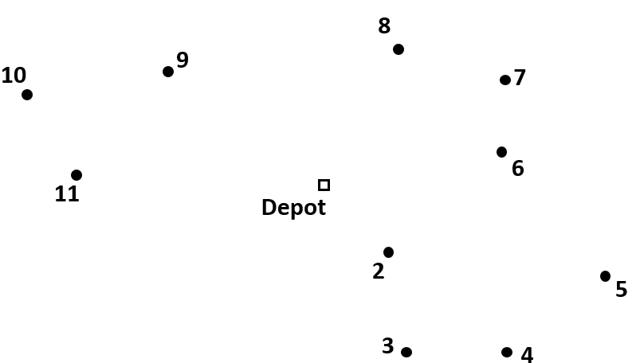

Implicit Dantzig-Fulkerson-Johnson formulation
==============================================

The library in AIMMS that solves a **Capacitated Vehicle Routing Problem** (**CVRP**) contains  different formulation options. They have different methods of eliminating subtours. In this article the Implicit Dantzig-Fulkerson-Johnson formulation is discussed. 

The implicit Dantzig Fulkerson Johnson formulation is almost the same as the explicit one. The difference is that the subtour elimination constraints are not generated upfront.

Lazy constraints
----------------

The implicit formulation starts with the basic formulation, so without any subtour elimination constraints.
During the MIP search, the solver will find solutions that satisfy these constraints, but may have a subtour, for instance as follows.

In the implicit formulation the constraints The Explicit DFJ formulation generates all subsets that could be subtours, in advance. This way, a constraint can be formulated about all these subsets to eliminate any possible subtour. So for example, we have the following set of nodes:

.. However, most of these subtours are unlikely to be formed when looking for an optimal solution. For example, subset S = {10, 8, 4} is not likely to form a subtour. So most of the subsets generated beforehand are unnecessary.

It is possible to search for an optimal solution without any subtour elimination constraints. 
During the MIP search, integer feasible nodes are found for the basic formulation.   
Such a feasible node, can be visualized as follows:

.. image:: images/Subtour.png
   :scale: 35%
   :align: center
   
This route should then be checked for subtours. 
If a subtour is found, a constraint (lazy constraint) about that subset is formulated and added to the problem.
Now, when the search for an optimal solution is continued, this subtour cannot be formed again.
This continues until an optimal solution without subtours is found. 
This way, compared to the explicit formulation, far less subsets need to be generated which saves a lot of space and time. 

In the CVRP Library, these lazy constraints are implemented in the section ``Implicit Dantzig Fulkerson Johnson section``.

