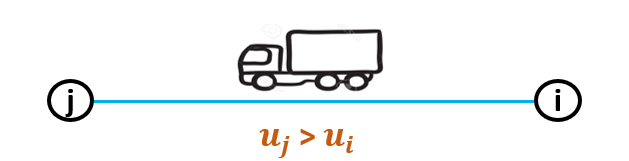
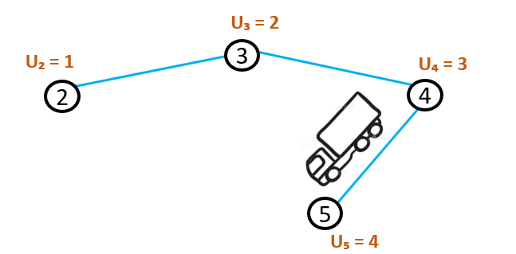
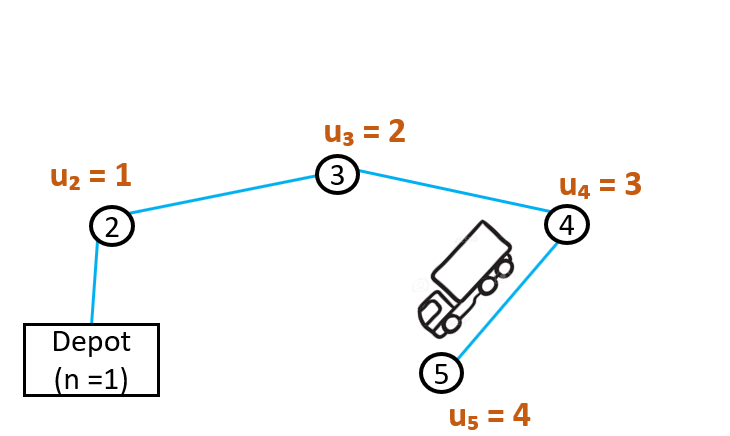

Miller-Tucker-Zemlin formulation
================================
The :doc:`332-routing-interface` contains four different formulation options. Those formulations use different methods for eliminating subtours. In this article, the Miller-Tucker-Zemlin formulation is discussed. 
Herein below an example of a subtour within a route for a CVRP:

.. image:: images/Subtour.png
   :scale: 35%
   :align: center

Idea behind the formulation
---------------------------
The Miller-Tucker-Zemlin (MTZ) formulation uses an extra variable. The variable is called :math:`u_{i}` and gets a value for each node, except for the depot. If a vehicle drives from node i to node j, the value of :math:`u_{j}` has to be bigger than the value of :math:`u_{i}`.

So each time a new node is being visited, the value for :math:`u_{i}` increases. 

The node that the vehicle will visit after node 5, should again have a larger value of :math:`u_{i}`. It would not be possible to go from node 5 to node 2, because that node already has a lower value of :math:`u_{i}`. This ensures that a vehicle will not drive in a circle. Since that would make it impossible for every value of :math:`u_{i}` to be larger than the previous one.  
Since the depot does not get a value of :math:`u_{i}`, it is possible to drive in a circle if the vehicle starts and ends at the depot. 

The vehicle can now drive from node 5 back to the depot and :math:`u_{j}` is always larger than :math:`u_{i}`.
So the only circles permitted to be driven are the ones passing the depot. All the other circles would be subtours and are eliminated by this formulation. 

Subtour Elimination Constraints
-------------------------------
The binary variable :math:`x_{ijk}` has a value of 1 if vehicle k drives from node i to node j. :math:`Q` is the capacity of the vehicles and :math:`q_{i}` is the demand of node i. :math:`V` is a set containing all the nodes, and the depot is n=1. The constraints can be formulated as follows:

.. math:: u_{j} - u_{i} \geq q_{j} - Q (1 - x_{ijk}) \qquad \forall i,j \in V \setminus \{1\} \enspace i \neq j \qquad (1)

.. math:: \qquad \qquad q_{i} \leq u_{i} \leq Q \qquad \forall i \in V \setminus \{1\} \qquad \qquad \qquad (2)

If vehicle k drives from node i to node j, :math:`x_{ijk}` = 0 and constraint (1) can be rewritten to :math:`u_{j} \geq u_{i} + q_{j}`. This ensure that the value of :math:`u_{j}` is at least :math:`q_j` more than :math:`u_i`. So the value of :math:`u_j` is greater than the value of :math:`u_i`

If vehicle k does not drive from node i to node j, the constraint is still valid. Constraint (1) could then be rewritten to :math:`u_{j} - q_{j} \geq u_i - Q`. Constraint (2) states that :math:`q_j` is the lowest possible value of :math:`u_j` and :math:`Q` is the greatest possible value of :math:`u_i`. So :math:`u_j-q_j` will at least be 0 and :math:`u_i-Q` will at most be 0. So :math:`u_j-q_j` is greater than or equal to :math:`u_i-Q`

In the :doc:`332-routing-interface`, the constraints are implemented in the section ``Miller Tucker Zemlin Section``.

