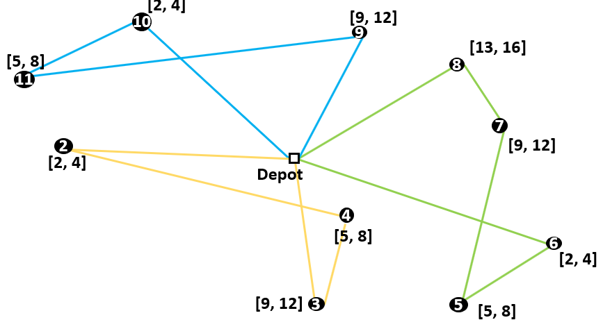

Time Windows
============
The library in AIMMS that solves a Capacitated Vehicle Routing Problem (CVRP) has four different formulation options. One of them is called Time Windows and is an extension of the CVRP. Every costumer then has a different time frame in which the goods have to be deliverd. The constraints for this formulation automatically eliminate subtours. That is why is isn't nessecary to formulate any Subtour Elimination Constraints for a Vehicle Routing Problem with Time Windows (VRPTW). This article discusses the constraints for a VRPTW.

Constraints
-----------
To formulate a VRPTW, some extra variables are needed. :math:`[a_i, b_i]` is the time window of costumer i. A vehicle must arrive at costumer i at least at :math:`a_i` and at most at :math:`b_i`. The time it takes to deliver the goods is irrelevant. :math:`t_{ij}` denotes the time is takes to get from costumer i to costumer j. Any service time at costumer i is included. The variable :math:`s_i` denotes the time that a vehicle starts serving costumer i (which must be between :math:`a_i` and :math:`b_i`). 
These constraints can be formulated as follows:

.. math:: s_i + t_{ij} - M * (1 - x_{ijk}) \leq s_j \qquad (\forall i \in V, \enspace j \in V \setminus \{1\}, \enspace k \in \{1,...,p\} \qquad (1)

.. math:: \qquad \qquad \qquad \qquad a_i \leq s_i \leq b_i \qquad (\forall i \in V) \qquad \qquad \qquad \qquad \qquad \qquad \qquad (2)

.. math:: * M = max \{b_i + t_{ij} - a_i\} \qquad i,j \in \{1,...,n\}

Constraints (2) ensures that a vehicle can start serving a costumer in the time window of that costumer. Constraint (1) keeps track of the duration of the routes. If the arc :math:`x_{ijk}` is in the route, the constraint can be rewritten to :math:`s_i + t_{ij} \leq s_j`. The start of the service time at costumer j must be at least :math:`t_{ij}` later than the start of the service time at costumer i.  
If the arc :math:`x_{ijk}` is not in the route, constraint (1) is still valid. The constraint can then be rewritten to :math:`s_i + t_{ij} \leq s_j + M`. The value of M is the maximum value of :math:`b_i + t_{ij} - a_i`, which is most amount of time possible between :math:`s_i` and :math:`s_j`.  
These constraints are slightly similar to the constraints of the Miller-Tucker-Zemlin formulation. It is also not possible to return to a previously served costumer. That’s because the time a costumer is being served is always later than the previously served costumers. So for a VRPTW it isn’t necessary to formulate subtour elimination constraints, while the time window constraints eliminate subtours automatically. 

In the CVRP Library, the constraints are implemented in the section ``Time Windows Section``.

